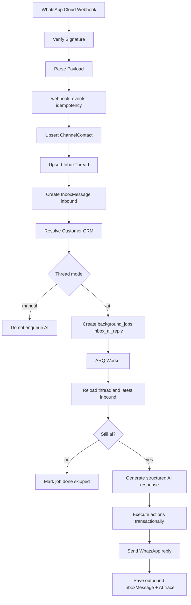
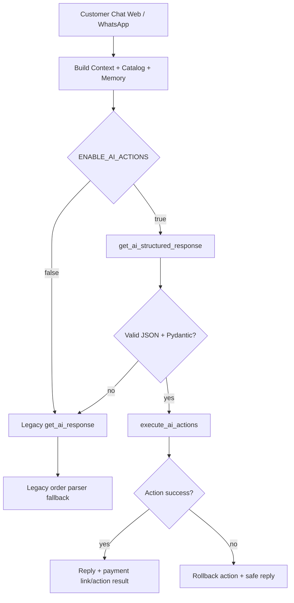
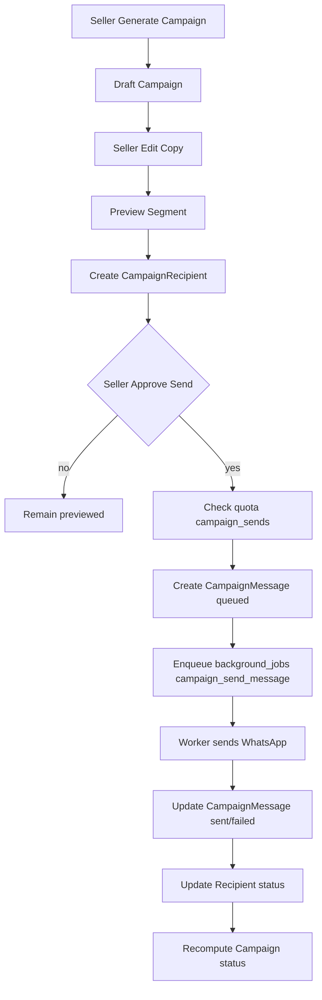
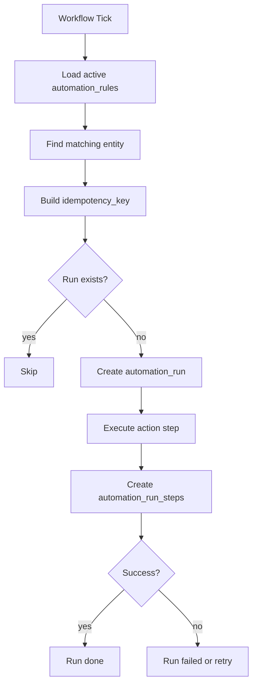
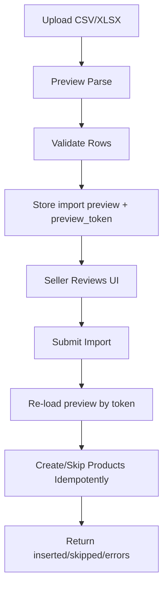

# Dua Plan Lanjutan JUALIN.AI

## Cara Pakai
Kerjakan berurutan. Agen 1 mengerjakan **Plan 1** sampai commit dan semua test pass. Agen 2 baru mengerjakan **Plan 2** dari commit hasil Plan 1. Jangan mengerjakan Plan 2 sebelum worker, structured AI, dan WhatsApp inbox di Plan 1 stabil.

---

# PLAN 1: Production Foundation, Worker, WhatsApp Inbox AI, Structured Actions

## Summary
Plan 1 mengubah scaffold inti menjadi sistem production-ready: Alembic migration nyata, service ARQ worker aktif, follow-up tidak lagi jalan dobel di web worker, WhatsApp webhook masuk diproses idempotent, inbox mode `ai/manual` benar-benar mengontrol balasan AI, dan structured AI action mulai dipakai untuk order/payment/handoff/tag dengan fallback legacy parser.

## Flow Utama





## Implementation Changes

### 1. Alembic dan DB Startup
- Buat migration baru setelah `20260604_0001_scale_up_foundation.py`; jangan edit migration baseline yang sudah committed.
- Migration baru wajib membuat tabel yang saat ini hanya dibuat via `create_all`: `webhook_events`, `background_jobs`, `audit_logs`, `integration_accounts`, `channels`, `channel_contacts`, `inbox_threads`, `inbox_messages`, `customers`, `customer_profiles`, `customer_events`, `customer_tags`, `ai_traces`, `ai_tool_calls`, `ai_retrieval_logs`, `ai_feedback`, `ai_eval_cases`, `ai_eval_runs`, `campaigns`, `campaign_recipients`, `campaign_messages`, `automation_rules`, `automation_runs`, `automation_run_steps`, `plans`, `subscriptions`, `usage_counters`, `billing_events`.
- Migration juga wajib menambahkan kolom order payment yang masih dipatch di startup: `payment_invoice_id`, `payment_access_token`, `payment_qr_data`, `payment_va_number`, `payment_expires_at`, dan index terkait.
- Tambah env `AUTO_CREATE_TABLES`.
- Ubah `backend/models/database.py`: `create_all()` hanya jalan kalau `settings.AUTO_CREATE_TABLES=true`.
- Default `.env.example`: `AUTO_CREATE_TABLES=true` untuk dev.
- Default `docker-compose.yml`: `AUTO_CREATE_TABLES=false` untuk production-like compose.
- Acceptance: fresh DB bisa dibuat dengan `alembic upgrade head`; app tetap bisa start.

### 2. Docker Worker Service
- Tambah service `worker` di `docker-compose.yml`.
- Command worker: `arq worker.WorkerSettings`.
- Worker env sama dengan backend.
- Tambah env `ARQ_MAX_JOBS=2`.
- Worker depends_on `db` dan `redis`.
- Backend tetap expose port `8000`; worker tidak expose port.
- Update `backend/worker.py` agar membaca `ARQ_MAX_JOBS`.

Worker contract:

```python
class WorkerSettings:
    functions = [process_recorded_job]
    max_jobs = settings.ARQ_MAX_JOBS
    redis_settings = {...}
```

### 3. Worker Dispatcher
- Refactor `process_recorded_job(ctx, job_id)` supaya dispatch berdasarkan `job.job_type`.
- Implement handler minimal:
  - `handle_inbox_ai_reply(db, job)`
  - `handle_pending_payment_followup(db, job)`
- Handler lain boleh return `{"success": False, "error": "not implemented"}` di Plan 1, karena campaign/workflow dikerjakan di Plan 2.
- Job status contract:
  - Jika job tidak ada: return `success=false`.
  - Jika job sudah `done`: return `success=true, skipped=true`.
  - Saat mulai: set `running`, increment `attempts`, set `started_at`.
  - Saat sukses: set `done`, set `finished_at`.
  - Saat gagal dan attempts < max: set `queued`.
  - Saat gagal dan attempts >= max: set `failed`.
- Jangan menjalankan side effect jika job sudah `done`.

Pseudocode wajib:

```python
async def process_recorded_job(ctx, job_id: int):
    async with async_session() as db:
        job = await load_job(job_id)
        if not job or job.status == "done":
            return {"success": True, "skipped": True}

        job.status = "running"
        job.started_at = now()
        job.attempts += 1
        await db.commit()

        try:
            if job.job_type == "inbox_ai_reply":
                result = await handle_inbox_ai_reply(db, job)
            elif job.job_type == "pending_payment_followup":
                result = await handle_pending_payment_followup(db, job)
            else:
                result = {"success": False, "error": f"unknown job_type: {job.job_type}"}

            job.status = "done" if result.get("success") else "failed"
            job.error_message = "" if result.get("success") else result.get("error", "")
            job.finished_at = now()
            await db.commit()
            return result
        except Exception as exc:
            job.status = "failed" if job.attempts >= job.max_attempts else "queued"
            job.error_message = str(exc)
            await db.commit()
            raise
```

### 4. Follow-Up Scheduler Dipindah ke Worker
- Jangan menjalankan scheduler follow-up di semua web worker.
- Set production default `SCHEDULER_ENABLED=false`.
- Buat job `pending_payment_followup` yang memproses satu order.
- Buat cron/scheduler ARQ yang mencari order pending dan enqueue job follow-up dengan idempotency key:
  `pending_payment_followup:{order_id}:{followup_number}`.
- `mark_followup_sent` hanya dipanggil setelah message provider sukses atau setelah fallback logging yang memang dipilih.
- Untuk Plan 1, jika belum ada channel WhatsApp pada seller, job boleh hanya log dan mark sent seperti behavior lama, tapi harus jelas di result.

### 5. WhatsApp Inbox AI Reply
- Implement `handle_inbox_ai_reply(db, job)`.
- Payload wajib:
  ```json
  {"thread_id": 1, "message_id": "wamid.xxx"}
  ```
- Handler wajib:
  - Load `InboxThread`, `Channel`, `ChannelContact`, inbound `InboxMessage`.
  - Validasi `thread.mode == "ai"` tepat sebelum generate dan tepat sebelum send.
  - Jika manual: mark success skipped tanpa send.
  - Decrypt channel config.
  - Build history dari last 20 `InboxMessage`.
  - Resolve `Customer`.
  - Generate AI response.
  - Execute structured actions jika enabled.
  - Kirim WhatsApp message.
  - Save outbound `InboxMessage` role `ai`.
  - Update `thread.last_message_preview`, `last_message_at`.
  - Record `AITrace`.
- Jika `WhatsAppCloudProvider.send_message` gagal:
  - Save outbound message dengan `status="failed"`.
  - Job result `success=false`.
  - Jangan retry jika error credential missing; boleh failed permanen.
  - Retry untuk network/5xx.

### 6. Structured AI Response
- Tambah function di `backend/ai/agent.py`:
  `get_ai_structured_response(message, seller_id, conversation_history, seller_style, db, memory_context="") -> tuple[AIStructuredResponse, str, str]`
- Gunakan `AIStructuredResponse` dari `backend/ai/actions.py`.
- Prompt wajib menginstruksikan output JSON saja, tanpa markdown.
- Parsing wajib:
  - `json.loads`.
  - Pydantic validate.
  - Jika gagal, raise `ValueError` agar caller fallback.
- Structured schema wajib:
  ```json
  {
    "reply": "string",
    "stage": "discovering|recommending|ready_to_order|payment_pending|paid|post_sale|handoff",
    "actions": [
      {"type": "create_order|send_payment_link|handoff|tag_customer", "payload": {}}
    ],
    "confidence": 0.0
  }
  ```

### 7. Integrasi Structured Actions ke Chat Lama
- Di `backend/api/routes_chat.py`, setelah user message tersimpan:
  - Jika `ENABLE_AI_ACTIONS=true`, panggil `get_ai_structured_response`.
  - Jalankan `execute_ai_actions` dalam transaksi.
  - Gabungkan `structured.reply` dengan payment link/action result yang aman.
  - Jika structured gagal, fallback ke `get_ai_response` dan legacy parser.
- Legacy parser `maybe_create_order_from_ai_response` tidak boleh dihapus.
- Jika `create_order` gagal karena stok/product mismatch, response harus aman:
  `Maaf kak, order belum bisa dibuat otomatis karena stok/produk perlu dicek. Admin akan bantu cek ya.`
- Jangan mengurangi stok jika order gagal.

### 8. Manual Takeover dan Feedback API
- Tambah endpoint:
  - `PATCH /api/inbox/messages/{message_id}/feedback`
  - Body: `{ "rating": "up|down|neutral", "reason": "string", "note": "string" }`
  - Simpan ke `ai_feedback`.
- Tambah endpoint:
  - `POST /api/inbox/threads/{thread_id}/assign-customer`
  - Body: `{ "customer_id": int }`
  - Update thread/customer link jika model mendukung; jika belum ada kolom, tambah migration `customer_id` nullable di `inbox_threads`.
- UI `/dashboard/inbox`:
  - Tambah tombol feedback pada AI message.
  - Tampilkan status message `sent/failed`.
  - Mode toggle harus refresh detail setelah update.

## Tests Plan 1
- Tambah `backend/tests/conftest.py` untuk async test DB atau minimal isolated SQLite-compatible unit where possible. Jika pgvector/Postgres sulit, pisahkan pure unit dan integration marker.
- Unit tests:
  - `AIStructuredResponse` valid.
  - Invalid JSON structured response fallback.
  - `execute_ai_actions.create_order` sukses mengurangi stok.
  - `execute_ai_actions.create_order` gagal stok kurang dan rollback.
  - `tag_customer` tidak duplicate.
- Integration tests:
  - WhatsApp webhook duplicate tidak membuat duplicate inbox message/job.
  - Invalid WhatsApp signature ditolak saat `WHATSAPP_APP_SECRET` aktif.
  - `thread.mode=manual` membuat worker skip AI reply.
  - Worker retry tidak duplicate outbound message.
  - Seller A tidak bisa membaca thread seller B.
- Commands wajib:
  - `python -m compileall .`
  - `python -m pytest tests -q`
  - `npm run lint`
  - `npm run build`
  - `docker compose config --quiet`
  - `git diff --check`

## Commit Plan 1
- Commit message:
  `Activate worker-driven WhatsApp AI autopilot`
- Jangan lanjut Plan 2 sebelum Plan 1 pass semua command.

---

# PLAN 2: Campaign Delivery, Workflow Automation, Billing Quota, Import Final, Admin Ops

## Summary
Plan 2 dikerjakan setelah Plan 1 commit. Targetnya membuat fitur growth dan monetisasi benar-benar usable: campaign segment real dan terkirim via worker, workflow automation jalan idempotent, billing quota diterapkan ke semua surface berbiaya, import produk tidak berhenti di preview, dan admin system bisa melihat provider health serta worker heartbeat.

## Flow Campaign



## Flow Workflow



## Flow Product Import



## Implementation Changes

### 1. Campaign Segments Real
- Refactor segment selection out of route into service:
  `backend/services/campaign_segments.py`
- Implement:
  - `repeat_buyer`: customers with `total_orders >= 2`.
  - `abandoned_payment`: customers with at least one `Order.status == pending`.
  - `asked_not_ordered`: customers with chat/customer events and `total_orders == 0`.
  - `bought_category`: customers whose order item category matches campaign metadata `category`.
  - `inactive_customer`: `last_seen_at < now - 30 days`.
- `POST /api/campaigns/{id}/preview` must clear stale recipients if campaign content/segment changed after preview.
- Prevent duplicates with unique constraint or app-level check: `(campaign_id, customer_id)`.

### 2. Campaign Send Worker
- Update `send_campaign`:
  - Requires campaign status `previewed`.
  - Checks quota.
  - Creates `CampaignMessage` per recipient.
  - Enqueues `background_jobs` with job type `campaign_send_message`.
  - Idempotency key: `campaign_send_message:{campaign_message_id}`.
  - Campaign status becomes `queued`.
- Implement `handle_campaign_send_message(db, job)`:
  - Load `CampaignMessage`, `CampaignRecipient`, `Campaign`, seller channel.
  - If message already `sent`, skip.
  - Send via WhatsApp Cloud provider.
  - Update `provider_message_id`, `sent_at`, `status`.
  - If all messages sent: campaign `sent`.
  - If some failed: campaign `failed` or `partial_failed`.
- UI `/dashboard/campaigns`:
  - Show recipient count.
  - Show sent/failed count.
  - Disable edit after queued.
  - Add refresh button.

### 3. Workflow Runner
- Add `backend/services/workflow_runner.py`.
- Implement matching:
  - `pending_payment_2h`: orders `pending`, created more than 2 hours ago.
  - `low_stock_alert`: products `stok < 3`, active.
  - `repeat_buyer_bundle`: customers `total_orders >= 2`.
  - `paid_processing_message`: orders changed/created with status `paid`.
- Every run gets deterministic key:
  - `workflow:{rule_id}:{entity_type}:{entity_id}:{period_key}`
- `period_key` rules:
  - pending payment: current hour bucket.
  - low stock: current date.
  - repeat buyer: current date.
  - paid processing: order id only.
- Add worker job type `workflow_run`.
- Each run writes `automation_runs` and `automation_run_steps`.
- Add endpoints:
  - `GET /api/workflows/runs`
  - `GET /api/workflows/runs/{run_id}`
- UI `/dashboard/workflows`:
  - Add run history table.
  - Show status, entity, step count, error.

### 4. Billing Quota Enforcement
- Apply quota checks:
  - Public chat send: `chat_month`.
  - Inbox AI reply worker: `chat_month`.
  - Product create: `products`.
  - WhatsApp connect: `whatsapp_channels`.
  - Campaign send: `campaign_sends`.
- Use `core/quota.py`.
- Product quota should count active products before create, not increment monthly usage.
- Monthly counters apply to chat and campaign sends.
- Add admin endpoints:
  - `POST /api/billing/admin/sellers/{seller_id}/plan`
  - `POST /api/billing/admin/sellers/{seller_id}/reset-usage`
  - `POST /api/billing/admin/sellers/{seller_id}/override-quota`
- Add models/migration if needed:
  - `subscriptions.plan_code`
  - `subscriptions.override_limits`
- UI admin:
  - Add billing section in admin seller detail or separate page.
  - Show current tier, usage, reset button.

### 5. Product Import Final
- Add model if needed:
  `product_import_batches`
- Minimum columns:
  `id`, `seller_id`, `preview_token`, `filename`, `rows_json`, `errors_json`, `status`, `created_at`, `expires_at`.
- `POST /api/marketplace/products/preview`:
  - Parse CSV.
  - Parse XLSX if dependency added.
  - Store parsed rows and errors with `preview_token`.
  - Return preview token.
- `POST /api/marketplace/products/import`:
  - Body: `{ "preview_token": "string", "mode": "skip_duplicates|update_duplicates" }`
  - Reject expired token.
  - Reject if preview has fatal errors unless mode explicitly skips invalid rows.
  - Create products idempotently.
  - Generate embedding and summary same as product create.
  - Invalidate product cache.
- UI `/dashboard/import`:
  - After preview, show Import button.
  - Show inserted/skipped/error counts.
  - Keep export orders/customers.

### 6. Admin Provider Health dan Worker Heartbeat
- Add worker heartbeat:
  - Worker writes heartbeat every 60s.
  - Store in `background_jobs` metadata or new table `system_heartbeats`.
  - Recommended: new table `system_heartbeats` with `service`, `status`, `last_seen_at`, `metadata_json`.
- Add endpoint:
  `GET /api/admin/provider-health`
- Must return:
  - database status.
  - redis status.
  - worker heartbeat: alive if `last_seen_at < 90s`.
  - WhatsApp configured/healthy.
  - payment providers configured.
  - LLM reachable or degraded.
- UI `/dashboard/admin/system`:
  - Show worker alive/degraded/offline.
  - Show provider cards.
  - Do not expose secrets.

### 7. Security and Tenant Isolation
- Every query must filter by `seller_id` when reading seller-owned data.
- Webhook public endpoints must not expose stack traces.
- Integration configs remain encrypted.
- Campaign send must only use channel owned by campaign seller.
- Import must only create products for current user.
- Admin-only endpoints must check `UserRole.ADMIN`.

## API Contracts Plan 2

Campaign send response:

```json
{
  "message": "Campaign queued",
  "campaign_id": 1,
  "recipient_count": 25,
  "queued_messages": 25
}
```

Workflow run list response:

```json
[
  {
    "id": 1,
    "rule_id": 1,
    "template_key": "pending_payment_2h",
    "status": "done",
    "entity_type": "order",
    "entity_id": 10,
    "started_at": "2026-06-05T10:00:00Z",
    "finished_at": "2026-06-05T10:00:05Z",
    "error_message": ""
  }
]
```

Import final response:

```json
{
  "batch_id": 1,
  "inserted": 10,
  "updated": 0,
  "skipped": 2,
  "errors": []
}
```

Provider health response:

```json
{
  "database": {"status": "ok"},
  "redis": {"status": "ok"},
  "worker": {"status": "alive", "last_seen_at": "2026-06-05T10:00:00Z"},
  "whatsapp": {"status": "configured"},
  "payment": {"midtrans": "configured", "cashi": "missing_config"},
  "llm": {"status": "ok"}
}
```

## Tests Plan 2
- Campaign:
  - preview segment returns correct customers.
  - repeated preview does not duplicate recipients.
  - send without preview returns 400.
  - quota exceeded returns 403.
  - worker retry does not send duplicate provider message.
- Workflow:
  - pending payment creates one run per order per hour bucket.
  - low stock alert creates one run per product per day.
  - paid processing sends once per paid order.
  - inactive/paused rule does nothing.
- Billing:
  - chat quota blocks public chat.
  - product limit blocks product create.
  - WhatsApp channel limit blocks extra connect.
  - campaign quota increments once per approval.
- Import:
  - preview detects invalid price/stok.
  - final import inserts valid rows.
  - final import skips duplicates.
  - expired preview token rejected.
- Admin:
  - seller cannot access provider health admin endpoint.
  - admin sees worker degraded when heartbeat stale.
- Commands wajib:
  - `python -m compileall .`
  - `python -m pytest tests -q`
  - `npm run lint`
  - `npm run build`
  - `docker compose config --quiet`
  - `git diff --check`

## Commit Plan 2
- Commit message:
  `Complete campaigns workflows billing import and ops health`
- Setelah commit, jalankan smoke test VPS:
  - `docker compose up -d --build`
  - `docker compose ps`
  - `docker compose logs backend --tail=100`
  - `docker compose logs worker --tail=100`
  - `curl http://127.0.0.1:8000/ready`
