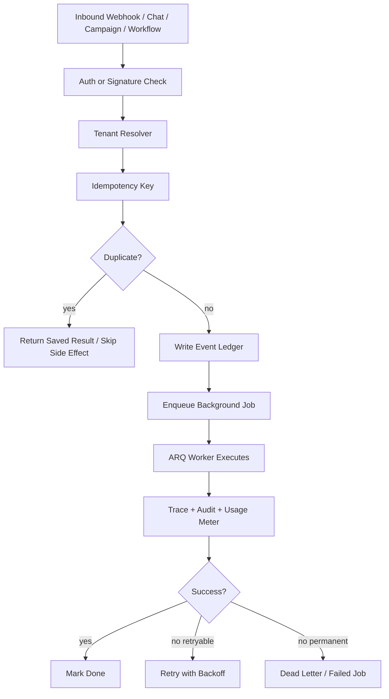
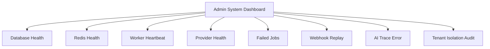
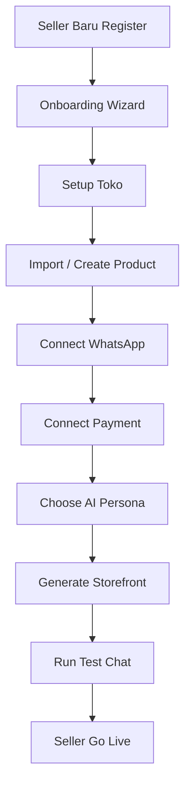
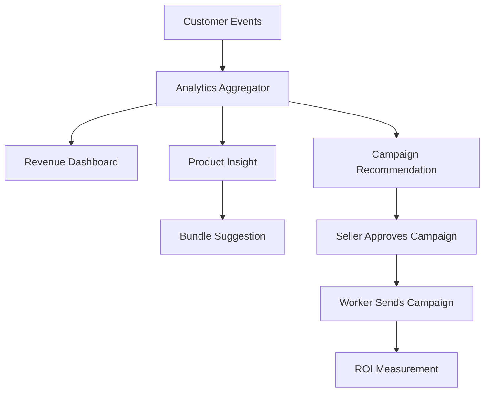
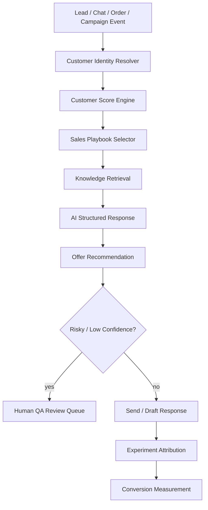
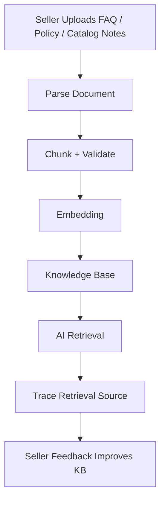

# Roadmap Implementasi Lanjutan JUALIN.AI: Prioritas 1-24

## Summary
Repo saat ini sudah punya fondasi FastAPI + Next.js, worker ARQ, WhatsApp inbox, CRM, campaign, workflow, billing, import, AI quality, admin health, dan feature flag. Roadmap ini memecah pekerjaan lanjutan menjadi 3 plan besar agar agen berikutnya bisa eksekusi berurutan tanpa bingung:

- **Plan A: Prioritas 1-8** = stabilitas, keamanan, observability, dan kontrol operasional.
- **Plan B: Prioritas 9-16** = product growth, analytics, onboarding, campaign, storefront, dan katalog pintar.
- **Plan C: Prioritas 17-24** = moat AI, scoring, dynamic offer, RAG, QA review, dan experimentation.

Aturan wajib semua agen:
- Jangan hapus fitur lama: chat publik, product CRUD, order, payment, dashboard lama harus tetap jalan.
- Semua fitur besar pakai env flag baru atau existing flag.
- Semua endpoint seller-owned wajib filter `seller_id`.
- Semua background side effect wajib idempotent.
- Jangan membuat dummy fallback data di UI; tampilkan empty/error state jujur.
- Setiap plan harus selesai dengan commit sendiri dan semua test/check pass.

---

## Plan A: Prioritas 1-8 — Stability, Security, Ops Foundation

### Target
Membuat platform aman, tahan retry, mudah diawasi admin, dan siap menerima traffic awal tanpa bug fatal.

Prioritas:
1. Reliability Core  
2. AI Quality Upgrade  
3. Inbox Productization  
4. Workflow Engine V2  
5. Billing Metering  
6. Performance/VPS Optimization  
7. Security & Tenant Isolation Hardening  
8. Ops Dashboard & Admin Control Center  

### Flow Utama





### Backend Changes
- Reliability:
  - Tambah status job yang lebih tegas: `queued`, `running`, `done`, `failed`, `dead_letter`, `skipped`.
  - Tambah `next_run_at`, `locked_at`, `locked_by`, `last_error_code`, `retryable` pada `background_jobs`.
  - Worker hanya boleh menjalankan job yang belum `done/dead_letter`.
  - Semua job side effect memakai idempotency key deterministik:
    - `inbox_ai_reply:{thread_id}:{inbound_message_id}`
    - `campaign_send:{campaign_message_id}`
    - `workflow:{rule_id}:{entity_type}:{entity_id}:{period_key}`
    - `webhook:{provider}:{provider_event_id_or_hash}`
  - Tambah endpoint admin:
    - `GET /api/admin/jobs?status=&type=`
    - `POST /api/admin/jobs/{id}/retry`
    - `POST /api/admin/webhooks/{id}/replay`
    - `GET /api/admin/audit-logs?seller_id=&entity_type=`

- AI Quality:
  - Trace semua LLM call dengan `seller_id`, `conversation_id/thread_id`, `prompt_version`, `model`, `latency_ms`, `status`, `error`, `confidence`, `actions`.
  - Tambah prompt registry sederhana di DB atau file versioned: `prompt_key`, `version`, `content`, `is_active`.
  - Eval runner membaca dataset dari `backend/ai/evals/*.json`, menjalankan case, menyimpan hasil ke `ai_eval_runs`.
  - Tambah endpoint:
    - `GET /api/ai-quality/prompts`
    - `POST /api/ai-quality/evals/run`
    - `GET /api/ai-quality/evals/runs/{id}`

- Inbox Productization:
  - Tambah assignment, label, unread count, internal note, canned reply, dan search.
  - Model tambahan minimal: `inbox_thread_labels`, `inbox_internal_notes`, `canned_replies`.
  - Endpoint:
    - `PATCH /api/inbox/threads/{id}/assign`
    - `POST /api/inbox/threads/{id}/labels`
    - `POST /api/inbox/threads/{id}/notes`
    - `GET /api/inbox/canned-replies`
    - `POST /api/inbox/canned-replies`
  - AI tetap tidak boleh reply jika thread mode `manual`.

- Workflow V2:
  - Tetap template-based, bukan canvas bebas.
  - Tambah parameter schema per template, misalnya `delay_hours`, `stock_threshold`, `message_template`.
  - Rule execution harus menulis `automation_runs` dan `automation_run_steps`.
  - Tambah dry-run endpoint:
    - `POST /api/workflows/rules/{id}/dry-run`
  - Dry-run tidak boleh kirim pesan atau ubah data.

- Billing Metering:
  - Jangan hanya counter; tambah event ledger agar usage bisa diaudit.
  - Model baru: `usage_events`.
  - Field minimal: `seller_id`, `metric`, `quantity`, `source`, `source_id`, `idempotency_key`, `period`, `created_at`.
  - Counter `usage_counters` direbuild dari event ledger jika perlu.
  - Metric wajib:
    - `chat.sent`
    - `ai.reply`
    - `whatsapp.message.sent`
    - `campaign.message.sent`
    - `product.active`
    - `ai.trace.stored`
  - Quota middleware/helper dipakai di chat, inbox AI reply, campaign send, product create, WhatsApp connect.

- Performance/VPS:
  - Tambah index DB untuk query panas:
    - inbox thread by `seller_id,last_message_at`
    - messages by `thread_id,created_at`
    - orders by `seller_id,status,created_at`
    - usage by `seller_id,metric,period`
    - jobs by `status,next_run_at`
  - Pagination wajib untuk inbox, customers, orders, traces, jobs.
  - Batasi response default: max 50 rows, hard max 200.
  - Jangan self-host tool berat seperti Langfuse/PostHog/n8n di VPS 4GB; cukup internal lightweight.

- Security:
  - Audit semua route seller-owned dan pastikan filter `seller_id`.
  - Admin endpoint wajib `UserRole.ADMIN`.
  - Webhook signature wajib untuk WhatsApp production.
  - Integration secret tidak pernah dikirim ke frontend.
  - Error public endpoint tidak boleh leak stack trace.
  - Rate limit per IP untuk public chat, login, webhook.

- Ops Dashboard:
  - Admin dashboard menampilkan worker alive/degraded/offline, failed jobs, provider health, webhook event count, AI error rate, quota usage top sellers.
  - Tambah tombol retry job dan replay webhook dengan confirmation modal.
  - Semua retry/replay menulis audit log.

### Frontend Changes
- `/dashboard/inbox`:
  - Thread search, label, assignment, unread marker, notes, canned replies, feedback AI.
  - Mobile responsive: list dan detail harus bisa dipakai di layar HP.
- `/dashboard/ai-quality`:
  - Trace list, failed action, low confidence, eval runs, prompt version.
- `/dashboard/admin/system`:
  - Provider cards, worker heartbeat, failed jobs, webhook replay.
- `/dashboard/billing`:
  - Usage by metric, limit, period, near-limit warning.
- Semua page wajib punya loading, empty, error, retry state.

### Acceptance Criteria
- Duplicate webhook tidak menggandakan pesan, order, campaign send, atau workflow action.
- Worker retry tidak menggandakan side effect.
- Seller A tidak bisa akses data Seller B.
- Admin bisa melihat dan retry failed job.
- AI trace tersimpan untuk call sukses dan gagal.
- Inbox manual takeover menghentikan AI reply.
- Semua list besar sudah pagination.
- VPS 4GB bisa menjalankan backend, worker, frontend, db, redis tanpa memory runaway.

### Test Plan
- Backend:
  - `pytest` untuk idempotency job dan webhook replay.
  - Tenant isolation untuk inbox, customers, orders, campaigns, workflows, billing.
  - Quota event ledger tidak double increment saat retry.
  - Invalid WhatsApp signature rejected.
  - Admin-only endpoint rejected untuk seller.
- Frontend:
  - Empty/error/loading states.
  - Manual takeover blocks AI.
  - Admin retry button calls correct endpoint.
  - Pagination/search tidak merusak filter.
- Commands wajib:
  - `python -m compileall backend`
  - `python -m pytest backend/tests -q`
  - `npm run lint`
  - `npm run build`
  - `docker compose config --quiet`
  - `git diff --check`

### Commit
Commit message:
`Harden reliability security ops and metering`

---

## Plan B: Prioritas 9-16 — Growth Productization

### Target
Mengubah JUALIN.AI dari platform otomasi chat menjadi produk SaaS yang mudah dipakai UMKM, punya dashboard bisnis, onboarding kuat, campaign autopilot, storefront, dan katalog pintar.

Prioritas:
9. Analytics & Revenue Intelligence  
10. Template Marketplace  
11. Plugin/Integration Expansion  
12. Mobile/PWA Seller Experience  
13. Onboarding Wizard Seller  
14. AI Storefront Builder  
15. Smart Product Catalog  
16. AI Campaign Autopilot  

### Flow Utama





### Backend Changes
- Analytics & Revenue Intelligence:
  - Tambah aggregated analytics service harian agar dashboard tidak query mentah terus.
  - Model baru: `daily_seller_metrics`.
  - Metric minimal:
    - chats masuk
    - AI replies
    - orders created
    - orders paid
    - revenue paid
    - pending payment value
    - campaign sent
    - campaign conversion
    - top products
    - repeat buyer count
  - Endpoint:
    - `GET /api/analytics/revenue?period=7d|30d|90d`
    - `GET /api/analytics/funnel?period=`
    - `GET /api/analytics/campaign-roi?campaign_id=`
    - `GET /api/analytics/product-insights`

- Template Marketplace:
  - Template bukan marketplace publik dulu; v1 adalah internal curated template.
  - Model: `templates`.
  - Field: `type`, `name`, `description`, `category`, `content_json`, `tags`, `is_public`, `created_by`, `usage_count`.
  - Type:
    - `campaign`
    - `workflow`
    - `prompt`
    - `storefront_section`
    - `canned_reply`
  - Endpoint:
    - `GET /api/templates?type=`
    - `POST /api/templates/{id}/install`
    - `POST /api/templates/{id}/duplicate`
  - Installed template harus disalin ke seller workspace, bukan diedit global.

- Plugin/Integration Expansion:
  - Perkuat contract plugin existing: `payment`, `messaging`, `shipping`, `llm`, `export`.
  - Tambah provider health standard:
    ```json
    {"status":"ok|degraded|disabled|missing_config","latency_ms":123,"message":""}
    ```
  - Tambah shipping plugin v1 dummy-safe:
    - manual shipping cost
    - no API external dulu
  - Tambah Google Sheets export plugin hanya jika credentials ada; jika tidak, UI tampil disabled.
  - Semua plugin disabled via env tidak boleh crash app.

- Mobile/PWA:
  - Tambah manifest, service worker minimal, responsive dashboard shell.
  - Mobile-first screens:
    - inbox
    - orders
    - products
    - campaign approval
    - onboarding
  - Jangan cache data sensitif di service worker.
  - Push notification bisa ditunda; v1 cukup PWA installable.

- Onboarding Wizard:
  - Model: `seller_onboarding`.
  - Step:
    - profile toko
    - produk pertama/import
    - payment config
    - WhatsApp config
    - AI style/persona
    - test chat
    - go-live checklist
  - Endpoint:
    - `GET /api/onboarding`
    - `PATCH /api/onboarding`
    - `POST /api/onboarding/test-chat`
    - `POST /api/onboarding/complete`
  - Completion tidak boleh dipalsukan jika required step belum valid.

- AI Storefront Builder:
  - Generate halaman katalog publik yang lebih kuat dari chat page lama.
  - Model: `storefronts`, `storefront_sections`.
  - Endpoint:
    - `GET /api/storefront/public/{slug}`
    - `PATCH /api/storefront`
    - `POST /api/storefront/generate`
  - Public storefront harus read-only, SEO-friendly, cepat, dan tidak butuh login.
  - Storefront minimal:
    - hero toko
    - kategori produk
    - produk unggulan
    - testimoni/manual highlight
    - CTA WhatsApp/chat/order
  - AI generate hanya draft; seller bisa edit sebelum publish.

- Smart Product Catalog:
  - Tambah auto-category, product health score, duplicate detection, stock alert.
  - Field tambahan atau model metadata:
    - `category`
    - `tags`
    - `seo_title`
    - `seo_description`
    - `catalog_score`
    - `bundle_candidates`
  - Endpoint:
    - `POST /api/products/{id}/ai-enrich`
    - `POST /api/products/bulk-enrich`
    - `GET /api/products/insights`
  - AI enrich tidak boleh overwrite manual seller fields tanpa preview/approval.

- AI Campaign Autopilot:
  - Autopilot hanya memberi rekomendasi, tidak broadcast otomatis.
  - Model: `campaign_recommendations`.
  - Trigger:
    - abandoned payment tinggi
    - inactive customers
    - repeat buyer
    - product overstock
    - new product launch
  - Endpoint:
    - `GET /api/campaigns/recommendations`
    - `POST /api/campaigns/recommendations/{id}/create-draft`
  - Seller wajib approve send.

### Frontend Changes
- `/dashboard/analytics`:
  - Funnel, revenue trend, campaign ROI, product insights.
- `/dashboard/templates`:
  - Browse template, install, duplicate.
- `/dashboard/onboarding`:
  - Stepper setup toko sampai go-live.
- `/dashboard/storefront`:
  - Generate, edit sections, preview, publish toggle.
- `/dashboard/products`:
  - AI enrich preview, health score, category/tag.
- `/dashboard/campaigns`:
  - Recommendations tab, create draft from recommendation.
- Mobile:
  - Sidebar berubah jadi bottom nav atau drawer.
  - Inbox/order/campaign approval harus nyaman di layar kecil.

### Acceptance Criteria
- Seller baru bisa register sampai go-live lewat onboarding tanpa edit manual DB.
- Dashboard analytics memakai data nyata, bukan hardcoded.
- Template bisa di-install tanpa merusak template global.
- Storefront publik bisa dibuka tanpa login.
- Product AI enrich butuh approval sebelum menimpa data.
- Campaign autopilot tidak pernah mengirim otomatis tanpa approval seller.
- PWA installable dan tidak cache token/data sensitif.

### Test Plan
- Backend:
  - Aggregated metrics benar untuk order paid/pending/cancelled.
  - Template install membuat copy seller-owned.
  - Onboarding complete gagal jika required step belum valid.
  - Storefront public tidak leak data seller lain.
  - Product enrich preview tidak langsung update product.
  - Campaign recommendation create draft tidak mengirim pesan.
- Frontend:
  - Onboarding step validation.
  - Storefront preview/publish.
  - Mobile layout inbox/orders/campaigns.
  - Empty analytics untuk seller baru.
- E2E:
  - Register seller baru → onboarding → tambah produk → generate storefront → test chat → complete.
  - Campaign recommendation → create draft → preview → approve send.
- Commands wajib sama seperti Plan A.

### Commit
Commit message:
`Add growth onboarding storefront analytics and templates`

---

## Plan C: Prioritas 17-24 — AI Commerce Moat

### Target
Membuat JUALIN.AI punya pembeda kuat: AI bukan hanya membalas chat, tapi memahami customer, memilih strategi penjualan, memberi offer yang relevan, memakai knowledge base seller, dan bisa diuji lewat A/B testing.

Prioritas:
17. Referral & Reseller System  
18. Lead Capture System  
19. Sales Playbook Engine  
20. Customer Scoring  
21. Dynamic Offer Engine  
22. Knowledge Base/RAG Builder  
23. Human QA Review Queue  
24. Experimentation System  

### Flow Utama





### Backend Changes
- Referral & Reseller:
  - Model:
    - `referral_codes`
    - `referral_events`
    - `reseller_profiles`
    - `commission_rules`
    - `commission_events`
  - Endpoint:
    - `POST /api/referrals/codes`
    - `GET /api/referrals/summary`
    - `POST /api/public/referrals/track`
    - `GET /api/resellers`
  - V1 hanya tracking dan laporan komisi; payout manual.
  - Referral attribution harus punya expiry window default 30 hari.

- Lead Capture:
  - Model:
    - `lead_forms`
    - `lead_submissions`
  - Endpoint:
    - `POST /api/lead-forms`
    - `GET /api/public/lead-forms/{slug}`
    - `POST /api/public/lead-forms/{slug}/submit`
  - Submission masuk ke CRM sebagai customer/lead event.
  - Public form wajib rate limited dan spam protected sederhana.

- Sales Playbook Engine:
  - Model:
    - `sales_playbooks`
    - `sales_playbook_rules`
  - Playbook v1 curated:
    - first-time buyer
    - price-sensitive
    - repeat buyer
    - abandoned payment
    - complaint recovery
    - product education
  - AI prompt menerima `selected_playbook`.
  - Endpoint:
    - `GET /api/ai/playbooks`
    - `PATCH /api/ai/playbooks/{id}`
  - Seller boleh enable/disable playbook, tapi tidak menjalankan arbitrary code.

- Customer Scoring:
  - Model:
    - `customer_scores`
  - Score:
    - `purchase_likelihood`
    - `repeat_likelihood`
    - `churn_risk`
    - `value_score`
    - `support_risk`
  - Score dihitung dari event nyata: chat recency, order history, paid status, campaign response, tags.
  - Endpoint:
    - `GET /api/customers/{id}/score`
    - `POST /api/customers/recompute-scores`
  - Score harus explainable: response menyertakan reason codes.

- Dynamic Offer Engine:
  - Model:
    - `offers`
    - `offer_recommendations`
    - `offer_redemptions`
  - Offer v1:
    - fixed discount
    - free shipping manual label
    - bundle recommendation
    - limited stock urgency
  - AI hanya boleh merekomendasikan offer; seller approval wajib untuk campaign/broadcast.
  - Saat chat one-to-one, offer boleh disarankan jika rule seller mengizinkan.
  - Endpoint:
    - `POST /api/offers`
    - `GET /api/offers/recommendations`
    - `POST /api/offers/recommendations/{id}/approve`

- Knowledge Base/RAG Builder:
  - Model:
    - `knowledge_sources`
    - `knowledge_chunks`
  - Source type:
    - manual text
    - FAQ
    - policy
    - product note
    - CSV/XLSX import note
  - Endpoint:
    - `POST /api/knowledge/sources`
    - `GET /api/knowledge/sources`
    - `POST /api/knowledge/sources/{id}/reindex`
    - `DELETE /api/knowledge/sources/{id}`
  - Retrieval wajib trace source ke `ai_retrieval_logs`.
  - AI tidak boleh mengarang policy jika source tidak ada; jawab aman dan handoff.

- Human QA Review Queue:
  - Model:
    - `qa_review_items`
  - Masuk queue jika:
    - confidence rendah
    - action gagal
    - customer complaint
    - seller feedback down
    - payment/order conflict
    - AI ingin memberi diskon sensitif
  - Endpoint:
    - `GET /api/qa-review`
    - `POST /api/qa-review/{id}/approve`
    - `POST /api/qa-review/{id}/reject`
    - `POST /api/qa-review/{id}/edit-and-send`
  - Approval/reject harus audit logged.

- Experimentation System:
  - Model:
    - `experiments`
    - `experiment_variants`
    - `experiment_assignments`
    - `experiment_events`
  - Experiment v1:
    - prompt variant
    - campaign CTA
    - storefront CTA
    - offer wording
  - Assignment deterministic per customer/session.
  - Endpoint:
    - `POST /api/experiments`
    - `GET /api/experiments`
    - `POST /api/experiments/{id}/start`
    - `POST /api/experiments/{id}/stop`
    - `GET /api/experiments/{id}/results`
  - Jangan lakukan auto-winner dulu; admin/seller yang memilih.

### Frontend Changes
- `/dashboard/referrals`:
  - Referral code, attribution, reseller list, commission report.
- `/dashboard/leads`:
  - Form builder sederhana, submissions, convert to customer.
- `/dashboard/ai-playbooks`:
  - Enable/disable playbook, preview behavior.
- `/dashboard/customers/{id}`:
  - Score, reason codes, recommended next action.
- `/dashboard/offers`:
  - Create offer, recommendation list, approve.
- `/dashboard/knowledge`:
  - Add source, reindex, source status, chunk count.
- `/dashboard/qa-review`:
  - Review queue, approve/reject/edit-send.
- `/dashboard/experiments`:
  - Create experiment, variants, start/stop, result table.

### Acceptance Criteria
- Lead form submission membuat customer event dan tidak leak data seller lain.
- Customer scoring explainable dan bisa dihitung ulang.
- Sales playbook masuk ke AI trace agar bisa diaudit.
- Offer engine tidak memberi diskon di luar rule seller.
- Knowledge retrieval menyimpan source dan tidak mengarang jika source kosong.
- QA review bisa mencegah pesan/action berisiko.
- Experiment assignment deterministic dan conversion event tercatat.
- Referral/reseller tracking bisa dihitung tanpa payout otomatis.

### Test Plan
- Backend:
  - Referral attribution expiry 30 hari.
  - Lead form public rate limit.
  - Customer score reason codes benar dari fixture event.
  - Playbook selector memilih playbook sesuai customer state.
  - Offer recommendation menghormati rule seller.
  - Knowledge retrieval tenant-isolated.
  - Low confidence AI response masuk QA queue.
  - Experiment assignment stabil untuk customer/session yang sama.
- Frontend:
  - Knowledge source upload/manual text state.
  - QA approve/reject/edit-send.
  - Experiment result empty/running/stopped.
  - Customer score UI untuk seller baru tanpa data.
- E2E:
  - Lead form → CRM → score → playbook → AI reply trace.
  - Knowledge source → chat question → answer cites internal source in trace.
  - Experiment prompt A/B → campaign/chat event → result update.
- Commands wajib sama seperti Plan A.

### Commit
Commit message:
`Build AI commerce intelligence and experimentation moat`

---

## Global Release Gates

Setelah setiap plan:
- Semua feature flag default aman untuk production.
- Migration fresh install dan upgrade dari DB lama harus berhasil.
- Tidak ada secret muncul di response API, logs, atau frontend.
- Semua endpoint baru punya auth guard yang jelas.
- Semua worker side effect punya idempotency.
- Semua UI baru punya loading, empty, error state.
- Semua command wajib pass:
  - `python -m compileall backend`
  - `python -m pytest backend/tests -q`
  - `npm run lint`
  - `npm run build`
  - `docker compose config --quiet`
  - `git diff --check`

Urutan kerja wajib:
1. Kerjakan **Plan A** sampai commit dan deploy smoke test.
2. Baru kerjakan **Plan B** dari hasil commit Plan A.
3. Baru kerjakan **Plan C** dari hasil commit Plan B.
4. Jangan paralelkan migration besar di beberapa agen tanpa branch terpisah.
5. Jika ada konflik dengan fitur lama, fitur lama menang sampai migrasi selesai dan test membuktikan kompatibel.
