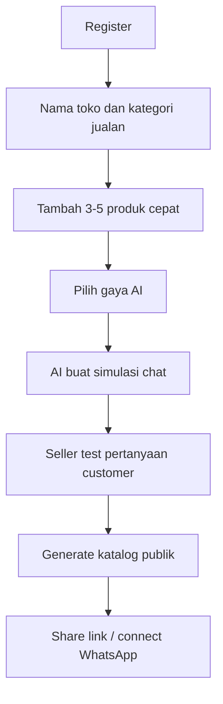
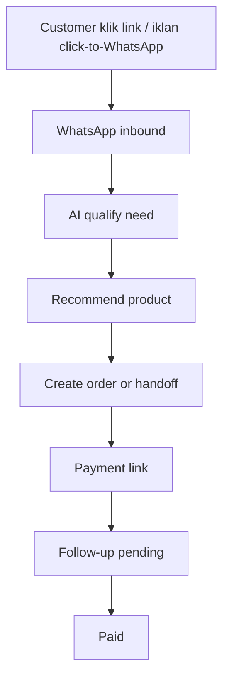

# PLAN MARKET ACCEPTANCE JUALIN.AI

## Summary
Plan ini dikerjakan setelah Prioritas 1-24 stabil. Fokusnya bukan menambah fitur besar lagi, tetapi membuat JUALIN.AI lebih cepat diterima pasar UMKM: seller harus melihat manfaat dalam 10 menit, gampang setup dari HP, merasa AI aman dikontrol, dan bisa membuktikan AI membantu closing order.

Positioning produk:

> Asisten jualan WhatsApp untuk UMKM yang bisa membuat katalog, membalas chat, follow-up pembayaran, dan bantu closing dalam 10 menit.

North Star Metric:

> Paid orders assisted by AI per active seller per month.

Aturan wajib:
- Jangan broadcast otomatis tanpa approval seller.
- Jangan tampilkan angka palsu di dashboard.
- Jangan menambah tool self-hosted berat di VPS 4GB.
- Semua fitur baru tetap feature-flagged.
- Semua flow harus mobile-first.
- Semua action AI yang berdampak uang, diskon, order, dan broadcast harus bisa diaudit.

---

## Sprint 1: Aha Moment 10 Menit

### Goal
Seller baru bisa register sampai test AI jualan dalam satu sesi pendek tanpa bantuan teknis.

### Flow

### Backend
- Tambah endpoint onboarding cepat:
  - `POST /api/onboarding/quick-start`
  - `POST /api/onboarding/sample-products`
  - `POST /api/onboarding/simulate-chat`
- `quick-start` menerima:
  - `store_category`
  - `seller_goal`
  - `tone`
  - `top_products`
- Jika seller belum punya produk, sistem boleh membuat draft produk dari input seller, tetapi status harus jelas `draft`.
- Simulasi chat tidak mengurangi quota production jika `source=onboarding_simulation`.

### Frontend
- Buat `/dashboard/onboarding/quick-start`.
- Step maksimal 5 layar.
- Setiap step harus bisa selesai dari HP.
- Tambah progress indicator: `Toko`, `Produk`, `AI`, `Preview`, `Go Live`.
- Setelah selesai tampilkan:
  - link katalog
  - tombol test chat
  - tombol connect WhatsApp
  - checklist payment

### Acceptance
- Seller baru bisa sampai test chat tanpa membuka settings.
- Produk draft bisa diedit sebelum publish.
- Jika LLM gagal, UI menampilkan error jujur dan fallback template statis.

---

## Sprint 2: Template Niche UMKM

### Goal
Seller tidak perlu menulis prompt/campaign/workflow dari nol.

### Niche V1
- Kuliner rumahan
- Fashion
- Skincare/kosmetik
- Frozen food
- Hampers/kado
- Digital product
- Jasa lokal
- Reseller/dropship

### Backend
- Seed curated templates untuk setiap niche:
  - AI persona
  - campaign welcome
  - abandoned payment follow-up
  - repeat buyer offer
  - FAQ umum
  - storefront section
  - canned replies
- Tambah field `niche` ke `templates`.
- Endpoint:
  - `GET /api/templates/niches`
  - `GET /api/templates/recommended?niche=`
  - `POST /api/templates/install-pack`
- `install-pack` harus idempotent per seller dan template pack.

### Frontend
- `/dashboard/templates` tambah tab `Paket Niche`.
- Seller bisa install 1 paket lengkap.
- Tampilkan preview isi template sebelum install.

### Acceptance
- Install pack dua kali tidak membuat duplikasi.
- Seller bisa memilih niche saat onboarding.
- Template global tidak bisa diedit seller.

---

## Sprint 3: WhatsApp Growth Funnel

### Goal
JUALIN.AI menang di channel yang paling dekat dengan UMKM: WhatsApp.

### Flow

### Backend
- Tambah tracking source untuk inbound:
  - `wa_link`
  - `storefront_cta`
  - `campaign`
  - `click_to_whatsapp_ads`
  - `manual`
- Tambah model `growth_links`:
  - `seller_id`
  - `code`
  - `source`
  - `campaign_name`
  - `target_url`
  - `click_count`
  - `metadata_json`
- Endpoint:
  - `POST /api/growth-links`
  - `GET /api/growth-links`
  - `GET /api/growth-links/{code}/redirect`
- Tambah attribution ke CRM customer event dan order jika source diketahui.

### Frontend
- `/dashboard/growth-links`:
  - buat link WhatsApp
  - buat link katalog
  - copy link
  - lihat click/order/paid attribution
- Tambah helper copy caption promosi.

### Acceptance
- Link click tercatat.
- Chat/order dari link bisa dikaitkan ke source.
- Tidak perlu integrasi Meta Ads API di V1.

---

## Sprint 4: WhatsApp Template Assistant

### Goal
Seller bisa membuat message template WhatsApp yang aman untuk campaign di luar 24 jam.

### Backend
- Model `whatsapp_message_templates`:
  - `seller_id`
  - `name`
  - `category`
  - `language`
  - `body`
  - `variables_json`
  - `status`
  - `provider_template_id`
  - `rejection_reason`
- Endpoint:
  - `POST /api/whatsapp/templates/generate`
  - `GET /api/whatsapp/templates`
  - `POST /api/whatsapp/templates/{id}/submit`
  - `POST /api/whatsapp/templates/{id}/sync-status`
- Generate template harus mengikuti rule:
  - utility untuk order/payment/status
  - marketing untuk promo/broadcast
  - tidak menjanjikan klaim palsu
  - variable jelas seperti `{{customer_name}}`, `{{product_name}}`

### Frontend
- `/dashboard/whatsapp-templates`.
- Wizard:
  - pilih tujuan
  - AI draft
  - edit
  - preview variables
  - submit/simpan
- Campaign send harus memakai template approved jika di luar service window.

### Acceptance
- Template bisa dibuat tanpa kirim broadcast.
- Status rejected tampil jelas.
- Secret/token WhatsApp tidak pernah tampil di frontend.

---

## Sprint 5: Money Dashboard

### Goal
Dashboard menunjukkan uang dan dampak AI, bukan metrik teknis.

### Metrics
- AI assisted paid orders
- Revenue assisted by AI
- Pending payment value
- Recovered payment from follow-up
- Campaign revenue
- Top customer segments
- Product with high demand but low stock
- AI handoff rate

### Backend
- Tambah attribution fields bila belum ada:
  - `orders.source`
  - `orders.assisted_by_ai`
  - `orders.campaign_id`
  - `orders.growth_link_id`
- Endpoint:
  - `GET /api/analytics/money`
  - `GET /api/analytics/ai-impact`
  - `GET /api/analytics/recovery`
- Data boleh dihitung dari event ledger harian agar ringan.

### Frontend
- `/dashboard` hero metric:
  - `AI bantu closing Rp X bulan ini`
  - `Y order dibantu AI`
  - `Rp Z payment pending`
- Tambah CTA action:
  - follow-up pending
  - buat campaign repeat buyer
  - tambah stok produk laris

### Acceptance
- Tidak ada angka dummy.
- Seller baru mendapat empty state yang menjelaskan langkah berikutnya.
- Query tetap cepat untuk seller dengan ribuan chat.

---

## Sprint 6: Trust Layer

### Goal
Meningkatkan kepercayaan customer dan seller.

### Backend
- Model `store_trust_profile`:
  - refund policy
  - shipping policy
  - support hours
  - verified phone flag
  - payment enabled flag
  - testimonial snippets
- Endpoint:
  - `GET /api/trust-profile`
  - `PATCH /api/trust-profile`
  - `GET /api/public/trust-profile/{slug}`
- AI prompt harus mengambil trust profile untuk menjawab refund/shipping/support.

### Frontend
- `/dashboard/trust`.
- Storefront publik tampilkan:
  - payment aman
  - jam layanan
  - kebijakan refund/shipping
  - testimoni pilihan

### Acceptance
- AI tidak boleh mengarang refund/shipping policy jika seller belum mengisi.
- Public trust profile hanya tampil untuk toko published.

---

## Sprint 7: Referral Growth Loop

### Goal
Setiap seller bisa membawa seller lain tanpa iklan besar.

### Backend
- Gunakan/refine referral system yang sudah ada.
- Tambah referral reward:
  - free chat quota
  - campaign credit
  - subscription discount manual
- Endpoint:
  - `GET /api/referrals/my-link`
  - `POST /api/referrals/claim`
  - `GET /api/referrals/rewards`
- Attribution harus idempotent per referred seller.

### Frontend
- `/dashboard/referrals` tampilkan:
  - link ajak seller
  - total signup
  - reward pending/approved
  - copy caption ajakan
- Tambah badge optional di storefront:
  - `Dibantu JUALIN.AI`
  - bisa dimatikan untuk paid plan.

### Acceptance
- Satu seller tidak bisa klaim referral dirinya sendiri.
- Referral tidak memberi reward sebelum referred seller aktif sesuai aturan.

---

## Sprint 8: Concierge Setup Mode

### Goal
Karena banyak UMKM tidak punya waktu belajar dashboard, admin bisa membantu setup cepat.

### Backend
- Admin endpoint:
  - `POST /api/admin/sellers/{seller_id}/concierge-start`
  - `PATCH /api/admin/sellers/{seller_id}/setup-checklist`
  - `POST /api/admin/sellers/{seller_id}/impersonation-token`
- Impersonation wajib:
  - admin only
  - short lived
  - audit logged
  - visible banner di frontend

### Frontend
- Admin seller detail tambah checklist:
  - products imported
  - WhatsApp connected
  - payment connected
  - storefront published
  - first campaign draft
- Saat impersonation aktif, tampilkan banner:
  - `Admin mode aktif`
  - tombol keluar.

### Acceptance
- Semua aksi admin tercatat audit.
- Admin tidak bisa melihat secret token plain.
- Impersonation token expire otomatis.

---

## Test Plan Global

### Backend
- Quick-start creates seller draft products without duplicating.
- Template pack install is idempotent.
- Growth link attribution survives redirect and order creation.
- WhatsApp template submit does not leak token.
- Money dashboard numbers match order fixtures.
- Trust profile prevents AI hallucinating policy.
- Referral self-claim rejected.
- Concierge impersonation audit logged.

### Frontend
- Onboarding quick-start mobile layout.
- Template pack preview/install.
- Growth link copy and empty state.
- Money dashboard empty and populated state.
- Trust profile edit/public preview.
- Referral page reward state.
- Admin concierge banner and exit.

### Commands Before Merge
- `python -m compileall backend`
- `python -m pytest backend/tests -q`
- `npm run lint`
- `npm run build`
- `docker compose config --quiet`
- `git diff --check`

## Release Order
1. Sprint 1: Aha Moment 10 Menit.
2. Sprint 2: Template Niche UMKM.
3. Sprint 5: Money Dashboard.
4. Sprint 6: Trust Layer.
5. Sprint 3: WhatsApp Growth Funnel.
6. Sprint 4: WhatsApp Template Assistant.
7. Sprint 7: Referral Growth Loop.
8. Sprint 8: Concierge Setup Mode.

Jangan mulai Sprint 3/4 sebelum onboarding, template niche, dan money dashboard terasa stabil. Fitur growth akan lebih mudah diterima jika seller sudah melihat manfaat finansial lebih dulu.
