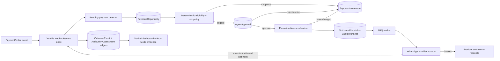

# JUALIN.AI — Super Implementation & Execution Blueprint

> Dokumen kerja utama untuk stabilisasi lanjutan dan pembangunan **JUALIN SANTAI: Safe Revenue Recovery Loop + Proof Mode**.
>
> Status: **PROPOSED — belum diimplementasikan**
>
> Tanggal baseline: 12 Juli 2026 (Asia/Jakarta)
>
> Baseline kode: `d1598e0` (`docs: record stabilization audit and operating guide`)
>
> Baseline stabilisasi: `1f8f3ef` (`fix: stabilize runtime security and deployment`)

---

## 0. Cara menggunakan dokumen ini

Dokumen ini bukan daftar ide bebas. Dokumen ini adalah kontrak eksekusi untuk agen atau engineer berikutnya. Kerjakan berurutan, kecil, dapat dibuktikan, dan berhenti pada setiap gate yang gagal.

### 0.1 Hierarki kebenaran

Jika ada konflik, gunakan urutan berikut:

1. Perilaku aman dan requirement eksplisit pengguna.
2. Bukti runtime dan test yang benar-benar dijalankan.
3. Model, migration, route, serta konfigurasi aktual di repository.
4. Kontrak dan invariant di dokumen ini.
5. Dokumentasi framework/provider versi yang benar-benar terpasang.
6. Komentar kode, README lama, atau dugaan.

Jangan mengubah implementasi hanya karena contoh pseudocode di dokumen ini berbeda dari API library aktual. Periksa versi dependency, baca dokumentasi resmi, lalu catat penyesuaian kecil yang diperlukan.

### 0.2 Aturan wajib agen pelaksana

Sebelum setiap task:

1. Jalankan `git status --short --branch`.
2. Pastikan file lokal pengguna tidak ikut diubah. Pada baseline, `AGENTS.md` adalah file untracked milik pengguna dan **tidak boleh ditambah, diedit, dihapus, atau di-commit**.
3. Baca seluruh simbol yang akan diubah dan seluruh call site-nya.
4. Tulis regression test yang gagal karena bug atau behavior yang hendak diubah.
5. Terapkan patch terkecil yang koheren.
6. Jalankan test terfokus, lalu test kelompok terkait.
7. Tinjau `git diff --check`, `git diff --stat`, dan diff aktual.
8. Commit hanya jika gate task lulus. Satu commit tidak boleh mencampur domain yang tidak terkait.

Jangan:

- memakai `try/except: pass` untuk “menyelesaikan” error;
- mengembalikan angka nol palsu saat data gagal diambil;
- menandai pesan terkirim ketika provider menolak atau statusnya belum diketahui;
- mempercayai `seller_id`, `order_id`, recipient, amount, URL, atau status dari request tanpa lookup tenant-scoped;
- mengizinkan LLM menentukan penerima, harga, diskon, izin kontak, waktu kirim, atau keputusan finansial;
- melakukan network call di dalam transaksi database yang masih terbuka;
- mengklaim exactly-once untuk side effect eksternal;
- mengubah test agar hijau ketika implementasi masih salah;
- melakukan refactor kosmetik repository-wide;
- menambah dependency sebelum membuktikan kebutuhan dan kompatibilitasnya.

### 0.3 Makna kata selesai

“Selesai” berarti:

- acceptance criteria task terpenuhi;
- test yang disebutkan benar-benar dijalankan;
- output atau artifact bukti disimpan;
- tidak ada regression kritis pada gate yang relevan;
- perubahan dapat di-rollback;
- masalah yang belum diverifikasi tetap disebut belum diverifikasi.

Tidak ada engineer yang dapat menjanjikan sistem tanpa kesalahan sama sekali. Target operasional dokumen ini adalah **tidak ada critical/high yang diketahui pada jalur lomba**, semua risiko utama mempunyai fail-safe, dan setiap klaim mempunyai bukti yang dapat diputar ulang.

### 0.4 Terminologi

| Istilah | Definisi ketat |
|---|---|
| Opportunity | Kandidat transaksi pending yang mungkin layak mendapat satu pengingat pembayaran. Belum berarti izin mengirim. |
| Eligible | Semua precondition deterministik pada snapshot saat evaluasi terpenuhi. Tetap harus divalidasi ulang saat eksekusi. |
| Approval | Keputusan manusia yang terikat ke seller, opportunity, exact action digest, policy version, waktu kedaluwarsa, dan satu kali penggunaan. |
| Dispatch | Catatan durable untuk satu side effect outbound. Dispatch bukan bukti delivered. |
| Provider accepted | Provider menerima request dan memberi bukti penerimaan/id. Bukan bukti dibaca pelanggan. |
| Provider unknown | Request mungkin sudah diterima provider, tetapi client kehilangan jawaban. Tidak boleh blind retry. |
| Observed conversion | Pembayaran terlihat setelah tindakan. Ini korelasi temporal, bukan otomatis bukti kausal. |
| Attributed conversion | Pembayaran dihubungkan dengan aturan atribusi yang dinyatakan eksplisit. |
| Causal lift | Selisih terukur terhadap kelompok holdout/randomized yang cukup. Hanya istilah ini yang boleh dipakai untuk klaim sebab-akibat. |
| Proof Mode | Harness deterministik yang memperlihatkan invariant keselamatan dan recovery dari kegagalan; bukan backdoor production. |

---

## 1. Ringkasan eksekutif

### 1.1 Kondisi baseline

Repository telah distabilkan pada:

- Backend: FastAPI, async SQLAlchemy, PostgreSQL + pgvector, Redis, ARQ, Alembic.
- Frontend: Next.js App Router, React, API client terpusat.
- Runtime sumber kebenaran: Python 3.11.15 dan Node.js 20.
- Deployment lokal: Docker Compose berisi database, Redis, migration gate, backend, worker, frontend, dan Nginx.
- Alembic head: `20260706_0007`.
- Baseline terverifikasi: 13 regression test backend lulus, import/OpenAPI lulus, fresh migration lulus, frontend lint/build lulus, image Docker backend/frontend lulus, auth smoke melalui proxy lulus.

Rincian bukti stabilisasi berada di [audit-report.md](./audit-report.md). Jangan mengulang seluruh audit kecuali baseline berubah atau gate task mengharuskannya.

### 1.2 Masalah utama yang tersisa

Sistem masih mempunyai risiko penting:

- follow-up pembayaran lama dapat menandai sukses walaupun WhatsApp gagal;
- scheduler lama berjalan otomatis dan juga membatalkan order setelah 48 jam tanpa revalidasi provider yang memadai;
- tidak ada model consent/opt-out yang terverifikasi;
- claim dan enqueue background job rentan race;
- dashboard dapat blank atau menampilkan nol palsu;
- JWT browser masih di `localStorage`;
- feature flag backend belum diterjemahkan menjadi capabilities yang konsisten di UI;
- eval AI dapat berstatus queued tanpa worker nyata;
- metrik dampak dapat mengatribusikan omzet secara berlebihan;
- database legacy dan provider nyata belum direhearsal end-to-end.

### 1.3 Fitur unggulan yang direkomendasikan

Nama produk: **JUALIN SANTAI**

Subjudul lomba:

> “AI yang menemukan pembayaran tertinggal, meminta persetujuan dengan bukti yang jelas, mengirim satu pengingat yang aman, lalu menunjukkan hasil secara jujur.”

Loop MVP hanya:

```text
pending payment
    -> deterministic detection
    -> consent + tenant + timing + policy checks
    -> seller approval
    -> execution-time revalidation
    -> durable WhatsApp dispatch
    -> provider reconciliation
    -> observed payment / expiry / suppression
    -> honest outcome ledger
```

MVP **tidak** mencakup:

- auto-discount;
- refund;
- broadcast;
- dynamic price;
- rekomendasi stok;
- low-stock campaign;
- auto-cancel order;
- AI yang memilih penerima atau keputusan finansial;
- approval hanya lewat balasan nomor WhatsApp;
- klaim causal revenue tanpa holdout.

Penyempitan ini disengaja. Penilaian lomba lebih kuat bila satu loop vertikal dapat didemonstrasikan aman, durable, tenant-isolated, dan terukur dibanding banyak fitur setengah jadi.

### 1.4 Nilai pembeda

Pembeda bukan sekadar “CRM dengan AI”. Pembeda sistem:

1. **Zero-dashboard workflow:** pemilik melihat satu kartu bukti, preview, dan satu keputusan; kerja manual minimum.
2. **Safety before autonomy:** consent, risk, quiet hours, stale data, tenant, dan payment state diperiksa deterministik dua kali.
3. **Honest impact:** observed, attributed, dan causal dipisahkan; refund/cost/reversal dicatat.
4. **Failure as evidence:** Proof Mode sengaja menyuntik duplicate webhook, provider timeout, Redis loss, stale approval, dan cross-tenant access.
5. **Localized operation:** Rupiah, nomor Indonesia, zona WIB/WITA/WIT, bank transfer/COD reality, dan Bahasa Indonesia yang tidak memaksa.

---

## 2. Arsitektur baseline dan komponen yang harus dipakai ulang

### 2.1 Komponen backend

| Area | Komponen aktual | Keputusan |
|---|---|---|
| API | FastAPI routes di `backend/api/` | Pertahankan. Tambah router recovery/capability secara kecil. |
| ORM | Async SQLAlchemy models di `backend/models/` | Pertahankan pola integer PK dan seller-scoped query. |
| Schema | Alembic di `backend/alembic/versions/` | Semua perubahan schema melalui migration aditif. |
| Queue | ARQ `backend/worker.py` | Pertahankan; perkuat durable job claim, lease, fencing, dan reconciliation. |
| Job ledger | `BackgroundJob` di `backend/models/scale_core.py` | Pakai ulang; tambahkan field minimal untuk atomic lease/fencing. |
| Webhook inbox | `WebhookEvent` di `backend/models/scale_core.py` | Pakai ulang untuk durable, deduplicated webhook ingestion. |
| Agent policy | `AgentPolicy` di `backend/models/agent_os.py` | Pakai ulang tetapi ubah default follow-up menjadi aman. |
| Approval | `AgentApproval` di `backend/models/agent_os.py` | Perlu diperkuat dengan action digest, expiry, nonce hash, dan optimistic lock. |
| Order | `Order` di `backend/models/order.py` | Sumber state transaksi; `total` masih Float dan `payment_expires_at` masih String. Jangan migrasi destruktif dalam MVP. |
| Customer | `Customer` di `backend/models/crm.py` | Dapat direferensikan; phone uniqueness sudah seller-scoped. Normalisasi tetap wajib. |
| Messaging | `backend/services/messaging/` | Pakai interface/provider yang ada; tambah typed outcome, jangan wrapper kedua yang tumpang tindih. |
| Payment | `backend/services/payments/` dan webhook routes | Pakai event provider aktual untuk revalidation/reconciliation. |
| Error | `JualinError` dan subclasses di `backend/core/exceptions.py` | Semua error API baru memakai bentuk `error/message/detail` yang sama. |
| Experiment | `ExperimentAssignment` dan `ExperimentEvent` | Pakai ulang hanya setelah tenant-scope dan uniqueness diperkuat. |
| Audit | `AuditLog` | Catat keputusan dan side effect tanpa secret/PII mentah. |

### 2.2 Fakta schema yang memengaruhi desain

- `AgentPolicy.allow_auto_followup` saat ini default `True`; ini harus dianggap unsafe default.
- `AgentApproval` sekarang hanya menyimpan status, detail JSON, decided_by/at, conversation_id, dan order_id. Belum cukup untuk approval satu-kali yang tahan replay/race.
- `Order.total` dan beberapa metrik lama memakai `Float`. Data uang baru wajib memakai `Numeric(18, 2)` / Python `Decimal`; jangan sekaligus mengonversi semua tabel lama.
- `Order.payment_expires_at` berupa `String(100)`. Parser MVP harus fail-safe: nilai kosong/invalid membuat opportunity suppressed, bukan menebak waktu.
- `BackgroundJob.idempotency_key` unik global, tetapi proses claim saat ini perlu atomic lease dan fencing.
- `WebhookEvent.idempotency_key` unik global dan dapat menjadi inbox durable; payload mentah harus mengikuti redaction/retention.
- `Customer` unik pada `(seller_id, phone)`, tetapi nomor historis dapat mempunyai format berbeda. Normalisasi harus dilakukan sebelum upsert/matching.

### 2.3 Komponen frontend

| Area | Lokasi | Keputusan |
|---|---|---|
| Auth shell | `frontend/app/dashboard/layout.js` | Hilangkan blank state; pindahkan ke AuthProvider teruji secara bertahap. |
| Dashboard | `frontend/app/dashboard/page.js` | Ganti nol palsu dengan loading/empty/stale/error/disabled eksplisit. |
| Agent OS | `frontend/app/dashboard/agent-os/page.js` | Gunakan partial result; satu endpoint gagal tidak boleh mematikan semua section. |
| API client | `frontend/lib/` | Tambah method recovery/capabilities pada client yang sama; jangan buat client kedua. |
| Navigation | dashboard layout/sidebar aktual | Gate tampilan dengan capabilities, tetapi backend tetap sumber authorization. |
| Styling | CSS modules yang ada | Ikuti token/komponen aktual; jangan framework UI baru. |

### 2.4 Diagram target



---

## 3. Scope, aktor, dan journey

### 3.1 Aktor

| Aktor | Hak minimum |
|---|---|
| Seller owner | Melihat opportunity milik seller, approve/reject, pause recovery, melihat ledger. |
| Seller staff | Hanya jika role aktual mengizinkan; default tidak boleh approve tindakan outbound. |
| Customer | Menerima satu transactional reminder bila izin dan policy valid; dapat opt-out. |
| Worker | Menjalankan dispatch dengan claim token; tidak dapat mengubah tenant/action secara bebas. |
| Provider | Sistem eksternal tidak tepercaya; signature, idempotency, timeout, dan out-of-order wajib ditangani. |
| LLM | Komponen tidak tepercaya yang hanya boleh mengusulkan copy dalam schema sempit. |
| Admin | Melihat operational health/redacted evidence; tidak otomatis dapat membaca PII tenant. |
| Judge/demo operator | Menjalankan Proof Mode pada tenant/database demo terisolasi, bukan data production. |

### 3.2 Happy path seller

1. Order seller berstatus pending, mempunyai payment URL tepercaya, belum paid, belum expired.
2. Sistem menunggu grace period agar tidak mengganggu pelanggan yang baru membuka payment page.
3. Detector membuat satu opportunity idempotent.
4. Policy engine memeriksa tenant, nomor, consent, quiet hours, cooldown, cap, payment state, feature mode, dan expiry.
5. Seller melihat kartu: siapa (masked), order, nilai, bukti consent, waktu, preview pesan, dan alasan rekomendasi.
6. Seller memilih **Setujui & jadwalkan** atau **Lewati**.
7. Sebelum dispatch dibuat dan sebelum provider dipanggil, sistem mengulang semua pemeriksaan yang dapat berubah.
8. Worker mengirim tepat satu logical dispatch menggunakan idempotency internal/provider bila tersedia.
9. Jika timeout ambigu, status menjadi `provider_unknown`; reconciliation dilakukan tanpa blind retry.
10. Payment webhook kemudian mencatat observed payment dan menutup opportunity. UI tidak menyebut causal recovery kecuali ada experiment evidence.

### 3.3 Alternate paths wajib

| Kondisi | Behavior aman |
|---|---|
| Customer membayar sebelum approve | Opportunity menjadi cancelled/suppressed `already_paid`; approval tidak dapat digunakan. |
| Customer membayar setelah approve tetapi sebelum send | Revalidation menghentikan dispatch; audit `state_changed_before_execution`. |
| Consent tidak ada/ditarik | Tidak mengirim; approval lama dibatalkan. |
| Nomor tidak valid/ambigu | Suppress; jangan infer nomor negara secara agresif. |
| Saat quiet hours | Approval tetap dapat diterima, tetapi `scheduled_at` dipindahkan ke waktu legal berikutnya. |
| Payment expiry invalid | Suppress `invalid_payment_expiry`; jangan default ke 48 jam. |
| Provider menolak | Dispatch failed dengan error terklasifikasi; order tidak ditandai follow-up sent. |
| Provider timeout | Dispatch `provider_unknown`; reconcile; tidak langsung retry. |
| Redis down setelah DB commit | Job tetap durable di DB; sweeper/reconciler meng-enqueue kembali saat Redis pulih. |
| Duplicate detector/webhook/job | Unique key dan state transition membuat hasil final sama tanpa send ganda. |
| Approval replay/stale policy | HTTP 409; tidak membuat dispatch kedua. |
| Seller pause/kill switch | Job queued dan approval pending dihentikan; pesan yang sudah accepted tidak dapat ditarik dan harus dilaporkan jujur. |

---

## 4. Register bug dan risiko lanjutan

Gunakan severity berikut:

- **Critical:** cross-tenant leak, unauthorized financial/outbound action, credential leak, destructive data behavior.
- **High:** duplicate/wrong recipient send, false success, auth bypass, lost durable job, misleading revenue claim.
- **Medium:** partial UI failure, stale data, weak observability, degraded UX.
- **Low:** maintainability, naming, dead code yang telah dibuktikan tidak dipakai.

| ID | Risiko | Lokasi/simbol | Gejala | Akar penyebab | Solusi dan verifikasi |
|---|---|---|---|---|---|
| BUG-001 | Critical | `backend/services/job_handlers.py::handle_pending_payment_followup` | Gagal kirim WA tetap dapat berakhir success dan `mark_followup_sent`. | Default `sent_via='log'` diperlakukan sebagai keberhasilan; outcome provider tidak typed. | Fail closed, return outcome eksplisit, hanya mark accepted setelah bukti provider. Regression test provider exception/false/timeout. |
| BUG-002 | Critical | handler follow-up | Job dapat mengambil order tanpa membuktikan `job.seller_id == order.seller_id`. | Lookup by order id tanpa invariant tenant lengkap. | Semua query memakai `Order.id AND Order.seller_id`; cross-tenant test harus 404/suppressed tanpa side effect. |
| BUG-003 | High | `backend/worker.py::cron_followup_scheduler` | Follow-up dan auto-cancel berjalan berkala tanpa opt-in aman. | Cron terdaftar unconditional; policy default auto-followup true. | Feature default off, observe mode, explicit enable; auto-cancel dikeluarkan dari loop MVP. Import test membuktikan default tidak mengirim/membatalkan. |
| BUG-004 | Critical | `backend/ai/followup.py::auto_cancel_expired` | Order bisa dibatalkan dan stok dipulihkan berdasar timer lokal. | Tidak ada provider revalidation kuat; product lookup berisiko tidak seller-scoped. | Disable path pada default; desain pembatalan terpisah di luar MVP. Test membuktikan recovery loop tidak memanggilnya. |
| BUG-005 | High | `backend/ai/followup.py::get_pending_followups` | Semua pending order menjadi kandidat. | Tidak ada consent, grace period, provider/payment validity, cap, atau suppression. | Ganti detector terstruktur; legacy function tidak dipakai recovery baru. |
| BUG-006 | High | `backend/services/job_handlers.py::enqueue_job_record` | Concurrent enqueue dapat race pada unique key. | Select-then-insert non-atomic. | PostgreSQL `ON CONFLICT DO NOTHING RETURNING` atau savepoint + select; concurrency integration test. |
| BUG-007 | High | `process_recorded_job` | Dua worker dapat melihat queued lalu sama-sama menjalankan. | Claim select-then-update tanpa lease/fencing atomic. | Atomic claim + `claim_token` + `lease_expires_at`; stale worker tidak boleh finalize. |
| BUG-008 | High | `backend/cache.py::check_rate_limit` | Redis gagal menyebabkan rate limit fail-open untuk semua endpoint. | Satu kebijakan error untuk endpoint dengan risiko berbeda. | Failure mode eksplisit per endpoint; auth fail-closed 503, safe read dapat degraded allow + metric. |
| BUG-009 | Medium | `backend/cache.py` | Error cache disenyapkan. | Exception terlalu luas tanpa structured log/metric. | Log sanitized, counter, dan explicit cache miss/degraded result. |
| BUG-010 | High | beberapa metering/Agent OS/CRM side effect | Critical write gagal diam-diam. | `except: pass` / broad catch. | Klasifikasikan best-effort vs required; required rollback/fail, best-effort log+metric+reconciliation. |
| BUG-011 | High | `AgentPolicy.allow_auto_followup` | Seller baru secara default mengizinkan auto follow-up. | Unsafe ORM default. | Python dan server default false; recovery mode default `observe`; migration aditif dan test default. |
| BUG-012 | Critical | contact model tidak ada | Sistem tidak dapat membuktikan hak menghubungi customer. | Consent/opt-out/provenance belum dimodelkan. | Tambah `ContactPermission`, purpose/channel/provenance/granted/withdrawn/expiry, recheck at send. |
| BUG-013 | High | `frontend/app/dashboard/layout.js` | Refresh `getMe` gagal dapat menghasilkan layar kosong. | Catch diabaikan dan `if (!user) return null`. | State machine auth explicit, error/logout redirect, retry bounded, component/browser test. |
| BUG-014 | High | auth browser | XSS dapat mengambil JWT. | Token disimpan di `localStorage`. | Migrasi bertahap ke Secure HttpOnly cookie, rotating refresh session, CSRF/Origin enforcement. |
| BUG-015 | Medium | `frontend/app/dashboard/page.js` | Kegagalan summary/quota tampil sebagai nol. | Error ditransformasikan menjadi data bisnis valid. | Section result union; tampil unavailable/stale, bukan nol. Test API error. |
| BUG-016 | Medium | `frontend/app/dashboard/agent-os/page.js` | Satu request gagal dapat mengosongkan seluruh halaman. | `Promise.all` all-or-nothing. | `Promise.allSettled`/query states dengan snapshot timestamp. |
| BUG-017 | Medium | navigation/frontend flags | Halaman terlihat saat backend feature off. | Tidak ada capability contract. | Authenticated capabilities endpoint + backend enforcement + UI disabled reason. |
| BUG-018 | High | `routes_ai_quality.py::run_eval_placeholder` | Eval queued selamanya. | Tidak ada worker/handler nyata. | Sementara 501 + capability disabled, lalu implement job/eval gate nyata sebelum diaktifkan. |
| BUG-019 | High | `services/agent_os/impact.py::build_impact` | Semua order jam malam dihitung sebagai offline/agent impact. | Window waktu dipakai sebagai proxy causality. | Pisahkan observed/attributed/causal, source event, experiment, reversal dan cost. |
| BUG-020 | High | payment/WA integration | Provider nyata belum diuji end-to-end. | Credential/sandbox eksternal belum tersedia pada audit. | Simulator deterministik + staging credential rehearsal; tetap tandai unverified sampai bukti nyata. |
| BUG-021 | High | legacy production DB | Fresh migration lulus, DB lama belum direhearsal. | Riwayat create_all/runtime patch dapat berbeda. | Backup + schema inventory + clone + Alembic stamp/upgrade decision; tidak menyentuh production langsung. |
| BUG-022 | Critical | seluruh API tenant resource | Potensi IDOR bila lookup hanya by id. | Tidak semua call site dibuktikan seller-scoped. | Helper query yang tetap sederhana + negative cross-tenant matrix untuk setiap endpoint baru/diubah. |
| BUG-023 | High | money fields | Float dapat menghasilkan rounding error. | Schema lama memakai Float. | Semua tabel/kontrak baru Decimal/Numeric; adapter eksplisit untuk legacy order total. |
| BUG-024 | High | webhook/payment ordering | Reminder dapat terkirim setelah delayed payment success. | Event out-of-order dan TOCTOU belum dimodelkan. | Durable inbox, monotonic state transitions, provider revalidation sebelum send, race tests. |
| BUG-025 | Critical | `frontend/lib/api.js` dan auth boundaries | Setelah akun A logout lalu akun B login pada tab yang sama, cache endpoint dapat menampilkan data akun A selama TTL. | Cache module-level hanya memakai endpoint sebagai key dan tidak dibersihkan saat logout/login. | Nonaktifkan cache seller-sensitive terlebih dahulu atau scope key ke session/tenant yang tervalidasi; selalu clear pada login, logout, refresh failure, dan pergantian principal. Tambah regression test A→logout→B. |
| BUG-026 | Critical | `backend/main.py::lifespan` dan `backend/worker.py::WorkerSettings` | Dua scheduler follow-up hidup bersamaan; loop legacy menandai reminder terkirim walau hanya log, sedangkan cron worker dapat mengirim dan auto-cancel. | Dua owner scheduling aktif di process berbeda tanpa satu source of truth dan tanpa feature gate aman. | Matikan kedua path legacy secara default, pisahkan auto-cancel dari recovery, lalu aktifkan tepat satu scheduler DB-backed di balik capability baru. Test startup/API/worker membuktikan default tidak menjadwalkan, mengirim, menandai, atau membatalkan. |
| BUG-027 | Critical | `backend/api/routes_agent_os.py::_decide_approval` | Recovery approval baru dapat diputus endpoint generic lama dan melewati digest/expiry/revalidation. | Shared table, tetapi endpoint lama menerima semua action type. | Endpoint/list lama menolak/mengecualikan row recovery; hanya recovery route dapat memutusnya. Negative bypass API test. |
| BUG-028 | High | WhatsApp Graph/provider config | API version hardcoded dapat mendekati akhir dukungan; local template “approved” belum membuktikan provider approval. | Version/template lifecycle provider belum contract-tested. | Pilih supported version berdasarkan docs resmi/account staging, implement submit/sync/send template nyata, contract test, dan expiry alert; jangan blind upgrade. |
| BUG-029 | High | `get_or_create_webhook_event` dan WA status handler | Concurrent webhook dapat race; delivery `statuses` dibuang. | Select-then-insert dan parser hanya sebagian event. | Composite unique inbox insert atomic; typed delivery status parser + monotonic dispatch transition. |
| BUG-030 | High | payment provider eligibility | Sebagian payment URL dapat berupa QR/base64 dan expiry tidak terisi, tetapi detector dapat menganggap semua pending payment eligible. | Tidak ada provider support matrix/trusted link builder. | Allowlist capability per provider; no trusted HTTPS URL/expiry/provider recheck berarti observe/suppress, bukan send. |
| BUG-031 | Critical | `backend/services/payments/factory.py::process_webhook` dan sync provider | Event attempt lama/wrong amount dapat menandai cycle baru paid; refunded dapat ter-downgrade. | Matching invoice/provider/amount dan precedence state belum cukup kuat; float parsing dan side effect race. | Match exact current payment cycle/provider, Decimal amount, monotonic refund, durable-before-network, idempotent stock side effect; wrong-invoice/amount/reorder tests. |
| BUG-032 | High | `backend/cache.py` dan `backend/core/rate_limit.py` | Redis outage dapat fail-open dengan dua return contract berbeda. | Dua limiter dan broad exception policy tidak konsisten antar caller. | Satu typed result/failure policy per risk, compatibility migration semua call site, Redis failure regression. |
| BUG-033 | High | authenticated `GET /api/payments/status/{order_id}` dan public payment status route/service | `GET` status pembayaran dapat memanggil sync provider atau menulis status, sehingga refresh/prefetch/crawler menghasilkan side effect dan failure yang tidak idempotent. | Read contract seller/public tercampur dengan reconciliation command. | Jadikan seluruh `GET/HEAD` persisted read-only tanpa network/mutation; pisahkan seller-auth dan public `POST refresh/reconcile` yang authorized, rate-limited, idempotent, dan diaudit. |
| BUG-034 | Critical | `Order.payment_access_token` dan public payment page | Plaintext/query token dapat bocor melalui database, URL history, referrer, analytics, log, screenshot, atau browser cache dan dipakai lintas payment cycle. | Capability belum di-hash at rest, tidak memiliki audience/cycle/expiry/revocation lengkap, dan full token/link dapat diproyeksikan ke audience yang salah. | Simpan HMAC token, bind audience+order+immutable cycle+expiry, rotate/revoke; fragment exchange ke short-lived HttpOnly session. Seller/recovery surface hanya masked projection; payer ber-capability boleh menerima minimum QR/VA/trusted link lewat response `no-store/no-referrer` tanpa capability token. |

Masalah di tabel ini tidak semuanya harus diselesaikan dalam satu commit. Dependencies dan gate berada di bagian fase eksekusi.

---

## 5. Invariant sistem yang tidak boleh dilanggar

Setiap invariant harus mempunyai minimal satu test positif dan satu test negatif.

### INV-01 — Tenant isolation

Setiap record opportunity, approval, dispatch, consent, outcome, job, dan experiment yang bersifat seller harus membawa `seller_id` atau dapat di-join secara tak ambigu ke seller. Semua read/write API harus memfilter seller dari `current_principal.seller_id`, bukan dari body request dan bukan dengan menganggap `user.id == seller.id`.

```python
# BENAR (pseudocode)
stmt = select(RevenueOpportunity).where(
    RevenueOpportunity.id == opportunity_id,
    RevenueOpportunity.seller_id == current_principal.seller_id,
)

# SALAH
stmt = select(RevenueOpportunity).where(
    RevenueOpportunity.id == opportunity_id,
)
```

Untuk resource milik seller lain, response default adalah 404 agar tidak membocorkan keberadaan. Admin exception harus eksplisit, role-checked, audited, dan tidak dipakai UI seller.

### INV-02 — No consent, no contact

Tidak ada outbound reminder jika permission channel `whatsapp` + purpose `transactional_payment_reminder` untuk exact `seller_id + order_id + immutable_payment_cycle_id + recipient fingerprint` tidak aktif pada waktu eksekusi. Consent order/cycle A tidak dapat dipakai order/cycle B. Recipient-level suppression/STOP yang aktif selalu mengalahkan grant order-scoped. Consent yang unknown, expired, withdrawn, ambiguous, atau provenance tidak valid berarti suppress.

### INV-03 — AI cannot authorize

Output LLM hanya `message_draft`. Recipient, order, amount, payment URL, schedule, consent, policy, action type, risk, approval, dan dispatch ditentukan deterministic code.

### INV-04 — Revalidate immediately before side effect

Sebelum provider dipanggil, worker harus memvalidasi ulang:

- seller/tenant;
- global kill switch dan tenant pause;
- current recovery mode;
- opportunity/status/version;
- approval/status/action digest/policy version/expiry/one-use;
- order still pending dan `paid_at is None`;
- payment URL/provider/id/expiry valid;
- contact permission active;
- recipient normalization;
- quiet hours/cap/cooldown;
- dispatch idempotency/status.

Jika salah satu berubah, tidak ada send.

### INV-05 — One logical reminder per order policy window

Unique key minimal:

```text
payment-reminder:v1:{seller_id}:{order_id}:{immutable_payment_cycle_id}
```

`immutable_payment_cycle_id` adalah provider invoice/payment-attempt ID tervalidasi atau internal payment-version yang tidak berubah ketika policy diubah. Policy version, tanggal, dan restart worker tidak boleh membuka siklus baru. Detector, approval, background job, dan dispatch mempunyai key deterministik. Duplicate call menghasilkan record yang sama atau no-op, bukan pesan kedua; unique constraint database menjadi enforcement terakhir.

### INV-06 — Unknown is not failed and not success

Provider timeout setelah request dikirim dapat berarti request berhasil. Status harus `provider_unknown`; jangan mark sent, jangan blind retry, jalankan reconciliation dengan provider message/idempotency evidence.

### INV-07 — Durable before async

Domain state dan durable job/dispatch dibuat di PostgreSQL sebelum best-effort enqueue ke Redis. Jika enqueue gagal, sweeper DB dapat memulihkan.

### INV-08 — No network inside open DB transaction

Claim/commit terlebih dahulu, lakukan provider call, lalu buka transaksi baru untuk conditional finalize menggunakan claim/fencing token.

### INV-09 — Honest metrics

“Pembayaran teramati setelah pengingat” boleh ditampilkan sebagai observed. “Dipulihkan oleh JUALIN” hanya boleh muncul bila aturan atribusi terdokumentasi; klaim causal memerlukan holdout/randomized evidence.

### INV-10 — Money is decimal

Semua amount baru:

```python
Decimal("125000.00")
Numeric(18, 2)
```

Tidak boleh menghitung margin/impact baru dengan binary float.

### INV-11 — Approval is exact, expiring, and single-use

Approval terikat ke immutable `action_revision` dan canonical action digest. Mengubah payment cycle, contact subject/permission, recipient, channel/provider account, template name/locale/content version, parameters, amount, URL fingerprint, exact schedule, atau policy membuat approval lama invalid.

### INV-12 — Safe defaults

```dotenv
ENABLE_PAYMENT_RECOVERY=false
PAYMENT_RECOVERY_MODE=observe
ENABLE_LEGACY_PENDING_PAYMENT_FOLLOWUP=false
ENABLE_DEMO_PROOF_MODE=false
```

Nilai kosong/unknown tidak boleh mengaktifkan tindakan.

### INV-13 — Cancellation is monotonic where required

`paid`, `consent_withdrawn`, global pause, dan provider accepted adalah facts yang tidak boleh “dikembalikan” oleh event lama. Event handler harus mengabaikan downgrade out-of-order dan tetap mencatat audit.

### INV-14 — PII and secret minimization

Nomor penuh, access token, provider secret, payment token, raw webhook payload sensitif, dan content customer tidak boleh masuk log. Gunakan masked identifier, stable HMAC/hash bila korelasi diperlukan, dan retention terbatas.

### INV-15 — Feature flags are enforced server-side

UI hide/disable hanyalah UX. Route, detector, worker, and webhook action path tetap memeriksa flag/mode pada backend.

---

## 6. Risk taxonomy dan policy

### 6.1 Action risk

| Level | Contoh | MVP behavior |
|---|---|---|
| R0 observe | Detect pending payment, build evidence | Otomatis, tanpa outbound. |
| R1 low | Satu transactional reminder tanpa diskon | Selalu approval pada rilis pertama. `auto_safe` belum diaktifkan. |
| R2 medium | Personalized follow-up dari history | Di luar MVP; wajib approval dan privacy review. |
| R3 high | Discount, price, refund, broadcast, stock reservation | Di luar MVP; tidak boleh auto-execute. |
| R4 prohibited | Cross-tenant, scraped contacts, spoofed link, credential exposure | Selalu block dan alert. |

### 6.2 Recovery mode

| Mode | Detector | Approval | Dispatch |
|---|---|---|---|
| `disabled` | Tidak berjalan | Existing pending dibatalkan/suppressed sesuai runbook | Tidak berjalan |
| `observe` | Membuat evidence/opportunity | Tidak dapat approve untuk send; UI menjelaskan simulasi | Tidak berjalan |
| `approval` | Berjalan | Seller owner wajib approve | Berjalan setelah revalidation |
| `auto_safe` | Berjalan | Hanya R1 yang terbukti memenuhi policy | **Bukan target MVP; gate terpisah setelah pilot** |

Default global: `ENABLE_PAYMENT_RECOVERY=false`; jika true tetapi mode kosong/invalid, aplikasi gagal startup pada production dan default `observe` pada development dengan warning jelas.

Pada MVP, settings API menolak `auto_safe` sebagai `422 unsupported_mode` kecuali future server flag/capability khusus dirilis terpisah. Detector/worker yang menemukan nilai auto_safe tak terduga harus pause/suppress `mode_not_supported` dan alert; tidak boleh menganggapnya auto execution atau approval implicit.

### 6.3 Exhaustive status/reason registries

Jangan memakai satu enum campuran. Namespace versioned berikut adalah kontrak awal; setiap code hanya mempunyai satu makna:

| Registry | Exhaustive MVP values |
|---|---|
| `SuppressionCode` | `feature_disabled`, `tenant_paused`, `observe_only`, `mode_not_supported`, `already_paid`, `order_not_pending`, `payment_missing`, `payment_expired`, `invalid_payment_expiry`, `payment_expiry_unknown`, `insufficient_time_before_payment_expiry`, `untrusted_payment_url`, `recipient_missing`, `recipient_invalid`, `recipient_timezone_unknown`, `consent_missing`, `consent_withdrawn`, `consent_expired`, `frequency_cap_reached`, `cooldown_active`, `approval_expired`, `approval_expired_before_schedule`, `approval_stale`, `policy_changed`, `opportunity_expired`, `dispatch_already_exists`, `state_changed_before_execution`, `provider_template_unavailable` |
| `OpportunityReason` | `approval_required` |
| `OpportunityTerminalReason` | `dispatch_provider_rejected`, `dispatch_reconcile_failed` |
| `SchedulingReason` | `quiet_hours_deferred` |
| `DispatchStatus` | `pending`, `scheduled`, `claimed`, `request_in_flight`, `accepted`, `provider_unknown`, `failed_retryable`, `failed_terminal`, `cancelled`, `suppressed` |
| `DispatchReason` | `provider_rejected`, `provider_unavailable`, `delivery_failed`, `reconciliation_required`, `idempotency_unsupported` |
| `DeliveryStatus` | `not_available`, `pending`, `delivered`, `read`, `failed`, `unknown` |
| `ApiErrorCode` | `invalid_transition`, `authentication_required`, `ambiguous_credentials`, `capability_forbidden`, `csrf_failed`, `opportunity_not_found`, `approval_stale`, `policy_stale`, `idempotency_conflict`, `approval_already_used`, `approval_expired`, `opportunity_expired`, `rate_limited`, `provider_unavailable`, `security_dependency_unavailable`, `unsupported_mode` |
| `SecurityAuditCode` | `cross_tenant_reference`, `signature_invalid`, `token_audience_mismatch`, `token_replay`, `key_unavailable` |

`approval_required` membuat/non-terminally mempertahankan opportunity `awaiting_approval`; ia tidak pernah suppress. Opportunity terminal code tidak memakai `DispatchReason` mentah: projector memetakan `provider_rejected→dispatch_provider_rejected` dan reconcile terminal failure→`dispatch_reconcile_failed`. `provider_unknown` adalah submission status, bukan denial reason. `quiet_hours_deferred` adalah scheduling reason. Delivery `failed` tidak membuktikan submission ditolak dan tidak boleh memicu resend. `cross_tenant_reference` hanya audit internal; tenant API selalu `404 opportunity_not_found`.

Reason/status code bukan pesan UI. Mapping Bahasa Indonesia ada di bagian 22 untuk state yang boleh terlihat; API memakai bagian 11.4. Registry pusat Python menghasilkan/menvalidasi schema dan UI mapping. CI wajib gagal bila code baru belum mempunyai namespace, safe copy/visibility, severity, retryability, serta terminal/non-terminal behavior. Unknown code memakai safe generic error + metric dan fail closed, bukan success.

---

## 7. Target data model dan migration

### 7.1 Aturan migration

1. Migration harus linear dari head audit `20260706_0007`. Dari repo root, sebelum membuat revision eksekutor wajib menjalankan `.\.venv\Scripts\python.exe -m alembic -c alembic.ini heads` dan berhenti bila head berubah.
2. Perubahan awal aditif: tabel/kolom/index baru, nullable bila backfill diperlukan, dan default aman. Tidak ada drop/rename/destructive rewrite pada rilis MVP.
3. Python default dan `server_default` harus konsisten. Security flag tidak boleh hanya bergantung pada default ORM.
4. Setiap migration diuji dua arah pada database disposable: fresh `upgrade head` dan upgrade dari dump/schema baseline yang representatif.
5. Downgrade setelah outbound nyata bukan strategi rollback data. Rollback aplikasi memakai flag; schema aditif dibiarkan sampai release cleanup terpisah.
6. Nama revision, constraint, dan index harus pendek serta deterministik agar aman pada PostgreSQL.

Urutan revision yang disarankan:

| Revision | Isi | Mengapa dipisah |
|---|---|---|
| `20260712_0008` | containment scheduler/job safety dan default policy aman | Dapat dirilis tanpa fitur recovery. |
| `20260712_0009` | foundation payment recovery, consent, dispatch, outcome, extension approval | Domain feature dapat dark launch. |
| `20260712_0010` | public payment capability HMAC/session fields + legacy token transition | Security/data migration terpisah sebelum public consent/refresh aktif. |
| `20260712_0011` | rotating auth sessions/cookie support | Blast radius auth dipisahkan dari messaging. |

Jika repository sudah memperoleh revision baru saat implementasi dimulai, jangan memakai ID di atas secara paksa; buat revision setelah head aktual dan catat mapping di dokumen release.

### 7.2 Perubahan `AgentPolicy` dan `BackgroundJob`

`AgentPolicy`:

- ubah Python dan server default `allow_auto_followup` menjadi `false` untuk row baru; jangan overwrite nilai row legacy;
- tambah `version INTEGER NOT NULL DEFAULT 1`;
- tambah `payment_recovery_mode VARCHAR NOT NULL DEFAULT 'observe'`;
- tambah `payment_recovery_paused BOOLEAN NOT NULL DEFAULT true`;
- tambah `timezone VARCHAR NOT NULL DEFAULT 'Asia/Jakarta'`;
- tambah `quiet_hours_start TIME` default `21:00` dan `quiet_hours_end TIME` default `08:00`;
- tambah `daily_recipient_cap INTEGER NOT NULL DEFAULT 1`;
- tambah `order_cycle_cap INTEGER NOT NULL DEFAULT 1`;
- tambah `cooldown_minutes INTEGER NOT NULL DEFAULT 1440`.

Semua update policy menggunakan optimistic concurrency:

```sql
UPDATE agent_policies
SET payment_recovery_mode = :new_mode,
    version = version + 1,
    updated_at = now()
WHERE seller_id = :seller_id
  AND version = :expected_version
RETURNING *;
```

Jika tidak ada row, API mengembalikan `409 policy_stale`, bukan menimpa perubahan terbaru.

`BackgroundJob`:

- `lease_expires_at TIMESTAMPTZ NULL`;
- `claim_token UUID NULL`;
- `lock_version INTEGER NOT NULL DEFAULT 0`;
- `retryable` **sudah ada** sejak migration `20260605_0003` dengan ORM/server default true. Migration baru mengubah ORM + server default menjadi false; jangan `ADD COLUMN` ulang. Inventory/backfill membuat legacy queued/failed/running non-retryable kecuali job type + persisted stage + error contract secara eksplisit membuktikan retry aman;
- `execution_stage VARCHAR NOT NULL DEFAULT 'unknown'` dengan check `unknown/pre_side_effect/side_effect_in_flight/completed/manual_required`;
- `side_effect_started_at TIMESTAMPTZ NULL`; set atomically bersama `side_effect_in_flight` sebelum network/external/non-idempotent boundary;
- `payload_digest CHAR(64) NULL` dan `handler_contract_version INTEGER NULL`; recovery/new jobs wajib non-null, legacy null berarti unverified/unclaimable sampai classification;
- index parsial untuk status yang dapat diproses;
- pertahankan unique `idempotency_key` yang sudah ada;
- row legacy mendapat `execution_stage='unknown'` dan tidak boleh direqueue generic. Mapping/transisi/backfill didokumentasikan dan di-audit per `job_type/status`.

### 7.2a `PaymentAttempt` sebagai payment-cycle source

Idempotency recovery tidak boleh bergantung pada string/tanggal yang dapat berubah. Tambahkan minimal persisted attempt model pada safety-foundation migration bila belum ada equivalent:

| Field | Type/constraint | Catatan |
|---|---|---|
| `id` | UUID PK | Internal immutable cycle ID. |
| `seller_id` | FK/index, not null | Tenant. |
| `order_id` | FK/index, not null | Composite tenant FK bila tersedia. |
| `provider` | varchar/check | Exact adapter. |
| `provider_account_id` | varchar/fingerprint | Merchant/account scope, bukan untrusted payload. |
| `external_attempt_id` | varchar | Stable provider ID; nullable hanya untuk internal provider. |
| `attempt_version` | integer | Monotonic per order. |
| `is_current` | boolean | Exactly one current attempt per seller/order. |
| `status` | varchar/check | created/pending/paid/expired/refunded/reconcile_required. |
| `amount` | Numeric(18,2) | Expected amount. |
| `currency` | char(3) | IDR. |
| `payment_expires_at` | timestamptz nullable | Null means live recovery ineligible. |
| `trusted_link_reference` | varchar/UUID nullable | Reference, bukan raw token di log/evidence. |
| `created_at/updated_at` | timestamptz | UTC. |

Constraints:

- unique `provider + provider_account_id + external_attempt_id` ketika external ID ada;
- unique `seller_id + order_id + attempt_version`;
- partial unique tepat satu `is_current=true` per seller/order;
- immutable action-relevant fields setelah create: `id/provider/provider_account_id/external_attempt_id/attempt_version/amount/currency/payment_expires_at/trusted_link_reference`. Hanya `status` dan `is_current` yang berubah lewat monotonic transition.

Perubahan amount, currency, expiry, link reference, provider account, atau external attempt wajib rotation/revision: kunci order/current-attempt, tandai old non-current, dan buat attempt/version baru dalam satu transaksi. Event paid dari attempt lama tetap dicatat sebagai fakta, langsung men-suppress outbound untuk order dan memicu settlement reconciliation; ia tidak otomatis mengubah attempt baru atau stok tanpa rule bisnis tervalidasi. Provider tanpa stable attempt ID/current marker tetap observe/suppressed.

### 7.2b `ContactSubject` dan fingerprint keyring

`ContactSubject` adalah identity tenant-stable untuk cap/STOP/consent, bukan nomor plaintext:

| Field | Type/constraint | Catatan |
|---|---|---|
| `id` | UUID PK | Stable internal identity. |
| `seller_id` | FK/index, not null | Tenant; seluruh FK memakai composite ownership. |
| `customer_id` | FK nullable/index | Merge reference, bukan authority contact. |
| `channel` | varchar/check | MVP `whatsapp`. |
| `address_ciphertext` | bytea | Authenticated encryption canonical address. |
| `address_key_version` | integer | Encryption key version. |
| `address_revision` | integer default 1 | Naik jika canonical address diganti explicit. |
| `status` | varchar/check | active/retired/merged. |
| `created_at/updated_at` | timestamptz | UTC audit. |

Child `ContactSubjectFingerprint` menyimpan `seller_id/contact_subject_id/channel/key_version/fingerprint/created_at/retired_at`. Unique `seller_id + channel + key_version + fingerprint` mencegah dua active subject untuk alamat yang sama; current+previous key version dapat dibaca saat rotation, tetapi write hanya current key. Concurrent resolve memakai insert-on-conflict + seller-scoped reload. Merge/number change adalah explicit audited command; ia tidak membuat consent lama berlaku untuk nomor baru. Missing encryption/HMAC key fail closed, dan raw address tidak pernah dipakai sebagai lock/log/metric label.

### 7.3 `ContactPermission`

Model ini adalah history ledger, bukan satu boolean pada customer.

| Field | Type/constraint | Catatan |
|---|---|---|
| `id` | UUID PK | ID acak, tidak mengandung PII. |
| `seller_id` | FK/index, not null | Tenant owner. |
| `customer_id` | FK nullable/index | Nullable untuk consent sebelum customer merge. |
| `contact_subject_id` | UUID FK/index, not null | Stable tenant contact identity; tidak berubah saat HMAC rotation. |
| `channel` | varchar/check | MVP hanya `whatsapp`. |
| `address_ciphertext` | bytea nullable | Hanya bila permission menjadi canonical source; authenticated encryption, bukan plaintext. |
| `address_key_version` | integer nullable | Mendukung rotasi key; wajib jika ciphertext diisi. |
| `address_fingerprint` | varchar/index | HMAC server-side untuk exact lookup; jangan plain SHA nomor. |
| `fingerprint_key_version` | integer | Versi key HMAC terpisah dari auth/encryption secret. |
| `purpose` | varchar/check | `transactional_payment_reminder`. |
| `scope_type` | varchar/check | MVP wajib `order_payment_cycle`. |
| `order_id` | FK/index, not null | Order exact yang dicakup grant. |
| `payment_attempt_id` | UUID FK/index, not null | Immutable payment cycle exact. |
| `status` | varchar/check | `active/withdrawn/expired/revoked`. |
| `provenance` | varchar/check | contoh: `checkout_checkbox`, `support_verified`, `provider_opt_in`. |
| `source_reference` | varchar nullable | ID form/event; bukan raw payload. |
| `granted_at` | timestamptz | Evidence time. |
| `withdrawn_at` | timestamptz nullable | Wajib jika withdrawn. |
| `expires_at` | timestamptz nullable | Sesuai kebijakan/legal review. |
| `created_at` | timestamptz | Immutable audit time. |

Pilih satu sumber nomor canonical agar plaintext tidak diduplikasi: prefer seller-scoped encrypted ContactSubject/Customer endpoint lalu `ContactPermission` menyimpan stable subject FK + fingerprint; isi ciphertext di permission hanya jika tidak ada canonical source aman. Exact DB constraint: `UNIQUE (seller_id, channel, contact_subject_id, purpose, scope_type, payment_attempt_id) WHERE status='active'`. Fingerprint hanya lookup aid, bukan identity/cap key. Withdrawal membuat row aktif nonaktif; re-consent same cycle membuat permission instance baru dan history lama tetap tersimpan.

Key unavailable harus fail closed. Dokumentasikan KMS/key source, rotation dual-read/single-write, re-encryption job, retention/pseudonymization, dan recovery. HMAC key harus berbeda dari auth/encryption secret; log hanya masked/fingerprint non-reversible.

MVP tidak boleh menganggap nomor yang pernah dipakai untuk transaksi sebagai consent. Import consent massal dilarang sampai provenance dan legal review terbukti.

Tambahkan `ContactSuppression` recipient-level untuk STOP/BERHENTI:

- seller_id, channel/channel_id, stable contact_subject_id, recipient fingerprint lookup, purpose;
- status active/lifted, source event, created/lifted timestamp;
- partial unique satu active suppression;
- active suppression mengalahkan semua grant order-scoped;
- suppression hanya dapat diangkat oleh explicit re-consent flow yang wording/identity-nya jelas dan diaudit, bukan otomatis saat order baru.

### 7.4 `RevenueOpportunity`

| Field | Type/constraint | Catatan |
|---|---|---|
| `id` | UUID PK | Public opaque identifier. |
| `seller_id` | FK/index, not null | Selalu difilter dari auth principal. |
| `order_id` | FK/index, not null | Legacy integer order diperbolehkan sebagai FK. |
| `payment_attempt_id` | UUID FK/index, not null | Immutable payment-cycle source. |
| `customer_id` | FK nullable/index | Tidak dipercaya sebagai satu-satunya recipient source. |
| `opportunity_type` | varchar/check | MVP `pending_payment_recovery`. |
| `status` | varchar/check/index | Opportunity state machine bagian 8. |
| `signal_key` | varchar unique | Deterministic detector idempotency. |
| `amount_snapshot` | Numeric(18,2) | Snapshot display/attribution, bukan source payment truth. |
| `currency` | char(3) | `IDR`. |
| `evidence_json` | JSONB | Kode dan timestamp non-secret; minimalkan PII. |
| `policy_version` | integer | Policy saat opportunity dibuat. |
| `state_version` | integer default 1 | Optimistic concurrency. |
| `eligible_at` | timestamptz | Setelah grace period. |
| `expires_at` | timestamptz | Batas approve/send. |
| `suppression_code` | varchar nullable | Machine-readable. |
| `terminal_reason_code` | varchar/check nullable | `OpportunityTerminalReason` saja; jangan simpan `DispatchReason` mentah. |
| `created_at/updated_at` | timestamptz | UTC. |

Signal key minimal:

```text
payment-opportunity:v1:{seller_id}:{order_id}:{payment_attempt_id}
```

`payment_attempt_id` adalah immutable internal `PaymentAttempt.id` dari P1.1. External provider ID/fingerprint hanya dipakai untuk membangun/validasi/rotate PaymentAttempt, bukan detector signal key. Same attempt selalu satu opportunity walau HMAC key/provider formatting berubah; legitimate attempt rotation menghasilkan ID/key baru dalam transaksi terkontrol.

### 7.5 `OutboundDispatch`

Pisahkan “niat mengirim” dari job dan provider result.

| Field | Type/constraint | Catatan |
|---|---|---|
| `id` | UUID PK | Dispatch identity. |
| `seller_id` | FK/index | Tenant. |
| `opportunity_id` | FK/index | Satu logical action. |
| `approval_id` | FK nullable/index | Wajib pada mode approval. |
| `background_job_id` | FK nullable/index | Durable execution reference. |
| `channel_id` | FK `channels.id`/index | Provider account existing; seller ownership wajib cocok. |
| `channel_type` | varchar/check | Snapshot logical; MVP `whatsapp`. |
| `status` | varchar/check/index | Submission state machine bagian 8; bukan delivery. |
| `delivery_status` | varchar/check/index | `not_available/pending/delivered/read/failed/unknown`. |
| `template_code` | varchar | Versioned approved template. |
| `template_params_json` | JSONB | Minimal; jangan duplikasi token URL bila dapat direferensikan. |
| `action_digest` | char(64) | SHA-256 canonical server action. |
| `contact_permission_id` | UUID FK | Permission exact yang disetujui. |
| `contact_subject_id` | UUID FK | Stable recipient/cap identity. |
| `recipient_fingerprint` | varchar | Versioned HMAC lookup snapshot saat approval. |
| `idempotency_key` | varchar unique | Provider/logical retry key. |
| `provider` | varchar | Adapter name. |
| `provider_request_id` | varchar nullable/index | Bila tersedia. |
| `provider_message_id` | varchar nullable/index | Hanya unique secara composite dengan provider + channel/account. |
| `attempt_count` | integer default 0 | Bukan ukuran pesan unik. |
| `last_error_code` | varchar nullable | Sanitized. |
| `scheduled_at/accepted_at/delivered_at/read_at/delivery_failed_at` | timestamptz nullable | UTC facts. |
| `created_at/updated_at` | timestamptz | Audit. |

Unique constraint logical adalah satu `opportunity_id`, bukan channel/digest, sehingga pergantian channel atau revisi preview tidak dapat membuka send kedua. Draft yang dibatalkan **sebelum** `request_in_flight` dapat diganti hanya melalui explicit supersede yang mempertahankan logical row/version; unknown/accepted tidak dapat diganti. Jangan menyimpan plaintext access token, full payment URL bertoken, atau raw provider response.

### 7.6 `OutcomeEvent` dan `AttributionAssessment`

Pisahkan verified monetary facts dari interpretasi attribution agar satu pembayaran tidak terjumlah dua kali.

`OutcomeEvent` append-only:

- `id UUID`;
- `seller_id`, `order_id`, immutable `payment_attempt_id`, `opportunity_id`, `dispatch_id`;
- `event_type`: `payment_observed`, `payment_reversed`, `delivery_cost`, `refund_observed`;
- `source_event_key` unique setelah dinamespace `provider/provider_account/event`;
- `amount Numeric(18,2)` dan `currency`;
- `reversal_of_id` nullable;
- `observed_at` dan `created_at`;
- `evidence_json` teredaksi.

`AttributionAssessment` append-only:

- `id, seller_id, outcome_event_id`;
- `method`: `rule_attributed` atau `experiment_causal`;
- `rule_version`/`experiment_id`;
- assessed_at, window, optional estimate/confidence metadata;
- unique `outcome_event_id + method + rule/experiment version`;
- evidence/limitations teredaksi.

Observed aggregate menghitung `OutcomeEvent` sekali setelah reversal. Rule/causal view membaca linked assessment dan tidak menambahkan amount fact kedua. Jangan update total “recovered” in-place.

### 7.7 Extension `AgentApproval`

Pertahankan compatibility field lama, tambahkan:

- `opportunity_id UUID NULL`;
- `action_digest CHAR(64) NULL`;
- `action_revision INTEGER NULL`;
- `policy_version INTEGER NULL`;
- `expected_state_version INTEGER NULL`;
- `expires_at TIMESTAMPTZ NULL`;
- `used_at TIMESTAMPTZ NULL`;
- `decided_via VARCHAR NULL`;
- `decision_idempotency_key VARCHAR NULL` dan `decision_request_hash CHAR(64) NULL`;
- `decision_scope VARCHAR NULL` dan `decision_response_json JSONB NULL` untuk exact replay receipt;
- `approval_token_hash CHAR(64) NULL` hanya bila deep link diaktifkan.

Untuk approval recovery baru, `opportunity_id/action_digest/action_revision/policy_version/expected_state_version/expires_at` harus non-null sejak row `pending` dibuat. Decision fields tetap null saat pending dan diisi atomically saat keputusan. Tambahkan:

- partial unique `UNIQUE (opportunity_id) WHERE opportunity_id IS NOT NULL AND status='pending'` untuk tepat satu current pending recovery approval;
- unique scoped receipt `seller_id + decision_scope + opportunity_id + decision_idempotency_key` untuk non-null key;
- check `action_revision >= 1`, digest hex valid, dan response snapshot hanya sanitized stable IDs/states/message, bukan PII.

Migration tidak langsung memaksa field baru `NOT NULL` pada row legacy. Service membedakan legacy/recovery dengan `opportunity_id` dan reserved action type, serta test raw row memastikan endpoint generic tidak dapat memutus recovery.

### 7.8 Database-level tenant ownership

Application filter tetap wajib, tetapi new recovery graph juga harus ditahan database:

- referenced seller tables memiliki unique pair `(id, seller_id)` setelah integrity/lock rehearsal;
- `RevenueOpportunity(order_id, seller_id)` mereferensi `Order(id, seller_id)`;
- `ContactSubject(customer_id, seller_id)` dan `ContactPermission(contact_subject_id/order_id/payment_attempt_id, seller_id)` mereferensi tenant pair yang sama;
- `OutboundDispatch(opportunity_id/approval_id/contact_permission_id/contact_subject_id/channel_id, seller_id)` memakai composite tenant FK;
- recovery `AgentApproval(opportunity_id, seller_id)` memakai composite tenant FK;
- `OutcomeEvent/AttributionAssessment` memakai composite tenant FK ke order/opportunity/dispatch/fact;
- `PaymentAttempt(order_id, seller_id)` memakai composite tenant FK.

Jika existing table belum dapat menerima redundant composite unique index tanpa lock risk, buat unique index secara rehearsal/concurrent-compatible lalu attach constraint pada release terpisah. Jangan mengganti database enforcement dengan komentar. Integration test melakukan raw SQL cross-tenant insert dan harus ditolak DB.

### 7.9 `RecipientContactWindow` lifecycle

Reservation yang mencegah race bukan sekadar counter:

| Field | Catatan |
|---|---|
| `id, seller_id, contact_subject_id, purpose` | Stable lock/cap scope; fingerprint bukan identity. |
| `opportunity_id, dispatch_id` | Exact owner. |
| `window_started_at/window_ends_at` | Rolling-window facts. |
| `status` | `reserved/consumed/released/expired`. |
| `reserved_at/consumed_at/released_at/expires_at` | UTC audit. |
| `release_reason` | Hanya pre-network terminal reason. |

Rules:

- approve transaction membuat `reserved` setelah advisory/row lock;
- saat `request_in_flight` commit, reservation menjadi `consumed` karena outcome dapat menjadi unknown/accepted;
- cancellation/suppression **sebelum** request-in-flight menjadi `released`;
- approval/job yang kedaluwarsa pre-network dapat `expired` oleh sweeper conditional;
- provider unknown/accepted/delivered tidak pernah release;
- sweeper tidak boleh expire reservation milik request-in-flight/unknown;
- cap menghitung reserved aktif + consumed dalam rolling window.

---

## 8. State machine dan concurrency contract

### 8.1 Opportunity

```text
detected
  ├─> awaiting_approval ─────────> dispatch_pending ─> dispatched
  │          │                           │
  │          ├─> rejected                ├─> suppressed
  │          ├─> expired                 └─> expired
  │          └─> suppressed
  └─> suppressed

dispatched ─> payment_observed
dispatched ─> expired_unpaid
```

Rules:

- `detected` tidak berarti eligible; detector melampirkan evidence.
- seller approval adalah fact pada `AgentApproval`; opportunity berpindah langsung `awaiting_approval -> dispatch_pending` hanya ketika approval, cap reservation, logical dispatch, dan durable job commit atomically. Tidak ada transient opportunity `approved`.
- `dispatched` hanya setelah provider memberikan acceptance yang dapat dibuktikan.
- `delivered` adalah fakta dispatch/provider, bukan status opportunity wajib.
- paid/consent withdrawal/pause dapat men-suppress state pre-send.
- `payment_observed` menutup cycle. Refund/reversal hanya ledger fact dan tidak membuka reminder kedua.
- transition dilakukan dengan `WHERE id/seller_id/status/state_version` dan row count tepat satu.

### 8.2 Approval

```text
pending ─> approved [used_at NULL -> used_at timestamp]
   ├─────> rejected
   ├─────> expired
   └─────> superseded
```

Pertahankan enum legacy: tidak menambah status `used`. Seller membuat `pending -> approved/rejected`; pemakaian ditandai `status=approved, used_at=<timestamp>` transactionally saat dispatch durable dibuat. Replay same idempotency request mengembalikan receipt pertama; request lain setelah `used_at` menghasilkan `409 approval_already_used`.

Creation lifecycle:

1. detector/re-evaluator yang mendapat full eligible facts pada mode `approval` membangun exact action;
2. opportunity ditransisikan `awaiting_approval` dan satu `AgentApproval status=pending` dibuat dalam transaksi yang sama;
3. partial unique memastikan hanya satu current pending recovery approval per opportunity;
4. recipient/payment/policy/template/schedule change menandai pending lama `superseded` lalu re-evaluator dapat membuat approval baru;
5. mode observe tidak membuat actionable approval;
6. GET/list/detail tidak pernah menciptakan approval sebagai side effect.

### 8.3 Dispatch

Submission:

```text
pending ─> scheduled ─> claimed ─> request_in_flight ─> accepted
   │           │          │              └─> provider_unknown ─> accepted
   └───────────┴──────────┴─> cancelled/suppressed               └─> failed_terminal
                          └─> failed_retryable ─(backoff due)─> claimed
                          └─> failed_terminal
```

Delivery facts setelah accepted:

```text
not_available/pending ─> delivered ─> read
                     └─> failed
                     └─> unknown
```

Provider timeout setelah request body mungkin diterima harus masuk `provider_unknown`. Hanya bukti authoritative dari adapter bahwa request tidak ditulis/tidak diterima yang boleh menghasilkan `failed_retryable`. Saat bounded backoff jatuh tempo, claim berikutnya memasangkan transisi job dengan `failed_retryable -> claimed` secara fenced; retry mempertahankan logical dispatch, provider idempotency key, dan contact-window row yang sama tanpa menambah reservation/cap count. Delivery `failed` tidak mengubah submission `accepted` dan tidak memicu resend otomatis.

### 8.4 Conditional transition skeleton

```python
async def transition_opportunity(
    session,
    *,
    seller_id: int,
    opportunity_id: UUID,
    expected_status: str,
    expected_version: int,
    new_status: str,
) -> RevenueOpportunity:
    stmt = (
        update(RevenueOpportunity)
        .where(
            RevenueOpportunity.id == opportunity_id,
            RevenueOpportunity.seller_id == seller_id,
            RevenueOpportunity.status == expected_status,
            RevenueOpportunity.state_version == expected_version,
        )
        .values(
            status=new_status,
            state_version=RevenueOpportunity.state_version + 1,
            updated_at=utc_now(),
        )
        .returning(RevenueOpportunity)
    )
    row = (await session.execute(stmt)).scalar_one_or_none()
    if row is None:
        raise JualinError("state_conflict", "Data telah berubah. Muat ulang sebelum mencoba lagi.", 409)
    return row
```

Sesuaikan signature `JualinError` dengan implementasi aktual; jangan menyalin pseudocode jika urutan constructor berbeda. Test harus memanggil dua transisi concurrent dan membuktikan hanya satu berhasil.

---

## 9. Recipient, consent, waktu, dan frequency policy

### 9.1 Normalisasi nomor Indonesia

Satu pure function menghasilkan typed result, bukan string kosong:

```python
@dataclass(frozen=True)
class PhoneNormalization:
    status: Literal["valid", "invalid", "unsupported"]
    e164: str | None
    reason: str | None
```

Algorithm MVP:

1. Trim whitespace dan separator umum `space/-/()/dot`.
2. `+62...` dipertahankan setelah validasi digit.
3. `62...` menjadi `+62...`.
4. `08...` menjadi `+628...`.
5. Prefix internasional lain adalah `unsupported`, bukan otomatis diubah ke Indonesia.
6. Tolak extension, huruf, nomor terlalu pendek/panjang, dan prefix ambigu.
7. Jangan log input mentah pada failure.

Sebelum memilih implementasi pure helper atau dependency seperti `phonenumbers`, verifikasi dependency/version resmi saat eksekusi. Jangan menambah package hanya untuk regex sederhana tanpa evidence.

### 9.2 Trusted recipient resolution

Urutan resolusi:

1. resolve order seller-scoped dan current recipient contact yang terikat pada order;
2. resolve stable `contact_subject_id` dan decrypt/read canonical contact melalui tenant-scoped service;
3. normalize nomor;
4. cari exact active permission untuk seller/channel/purpose/contact subject/order/current payment attempt;
5. bind `contact_permission_id` dan fingerprint ke opportunity/action;
6. pastikan tidak ada active recipient-level `ContactSuppression`;
7. validasi provider account seller.

Jangan memilih “salah satu consent aktif” milik customer. Perubahan recipient membuat approval `superseded` dan memerlukan opportunity preview baru.

Nomor dalam request approve tidak pernah dipercaya. API approve menerima version/digest, lalu server me-resolve recipient dari record durable.

### 9.3 Quiet hours

- Store semua timestamp UTC. Evidence menyimpan `recipient_timezone`, `timezone_source`, dan `timezone_confidence` tanpa raw address.
- Jika timezone recipient terverifikasi, allowed send window default `[08:00, 21:00)` waktu recipient.
- Jika hanya diketahui nomor Indonesia, gunakan conservative universal window `[08:00, 19:00) Asia/Jakarta` agar tidak terlambat bagi WIB/WITA/WIT.
- Jika recipient luar Indonesia atau timezone ambigu, suppress sampai timezone tepercaya tersedia.
- Jika waktu masuk quiet hours, hitung `scheduled_at` ke boundary berikutnya.
- DST tetap ditangani oleh zoneinfo walaupun timezone Indonesia saat ini tanpa DST.
- Jika approval akan expired sebelum boundary, jangan memperpanjang diam-diam: tandai `approval_expired_before_schedule` dan minta review baru.
- Jika defer melewati payment expiry atau minimum lead time yang disepakati, suppress `insufficient_time_before_payment_expiry`.
- invariant: `scheduled_at < approval.expires_at <= min(opportunity.expires_at, payment_attempt.payment_expires_at)` setelah safety margin. Nilai equal/terbalik ditolak.
- `scheduled_at` adalah exact approved earliest/intended time. Claim legal saat `now >= scheduled_at` dalam bounded execution window, quiet-hour/expiry facts masih valid, dan final revalidation lulus; normal bounded queue latency tidak mengubah digest. Persisted reschedule/change waktu selalu supersede + action revision baru.

Test table: tepat sebelum start, tepat saat start, tengah malam, tepat sebelum end, tepat saat end, UTC date rollover, timezone WIB/WITA/WIT, schedule=expiry invalid, queue latency within window valid, terlambat melewati execution/expiry bound suppress, dan reschedule invalidates approval.

### 9.4 Frequency cap

Semua cap dievaluasi dua kali: saat opportunity dan saat send.

- maksimal satu logical reminder per order/payment cycle;
- maksimal satu transactional payment reminder per recipient per 24 jam pada MVP;
- cooldown default 1440 menit;
- provider unknown tetap dihitung terhadap cap sampai reconciled;
- cancelled sebelum provider call tidak dihitung sebagai contact;
- accepted/delivered dihitung;
- manual legacy send, bila terdeteksi, ikut cap agar channel tidak spam.

Rolling cap memakai `RecipientContactWindow` dan PostgreSQL advisory/row lock atas `seller_id + contact_subject_id + purpose`. HMAC recipient fingerprint hanyalah versioned lookup/snapshot dan tidak pernah menjadi cap identity. Check + `reserved` terjadi dalam transaksi approve; `request_in_flight` mengonsumsi slot; cancellation pre-network melepas; expiry conditional membersihkan reservation yang belum pernah in-flight; unknown/accepted tetap dihitung. Query biasa tidak race-safe. Concurrent test dengan beberapa koneksi—termasuk HMAC key rotation—membuktikan hanya satu reservation menang dan lifecycle bagian 7.9 tidak bocor. Setelah containment, historical `followup_count` legacy tidak dianggap bukti send; record log-only ditandai legacy-unverified dan tidak boleh menaikkan claim outcome, tetapi digunakan konservatif untuk suppression sampai rekonsiliasi.

### 9.5 Opt-out

Actual outbound tidak boleh diaktifkan sebelum inbound STOP/opt-out ingestion bekerja:

1. Verify webhook signature dan timestamp.
2. Dedupe event lewat durable webhook inbox.
3. Normalize keyword case/whitespace dan daftar kata yang legal/product setujui.
4. Resolve tenant/channel tanpa menebak jika nomor digunakan di beberapa seller.
5. Withdraw matching permission dan audit source event.
6. Suppress opportunity/dispatch yang belum provider-accepted.
7. Kirim acknowledgement hanya jika provider/legal policy mengharuskan dan template disetujui.

Jangan menulis “Balas STOP” pada template produksi sebelum jalur inbound ini benar-benar teruji end-to-end.

---

## 10. Approval security dan exact action binding

### 10.1 Canonical action

Server membangun object canonical, mengurutkan key secara deterministik, meng-encode UTF-8, lalu SHA-256:

```json
{
  "action_version": 1,
  "action_type": "payment_recovery",
  "purpose": "transactional_payment_reminder",
  "seller_id": 42,
  "opportunity_id": "uuid",
  "order_id": 991,
  "payment_attempt_id": "uuid",
  "amount": "175000.00",
  "currency": "IDR",
  "payment_expires_at_utc": "2026-07-13T02:00:00Z",
  "action_revision": 2,
  "contact_subject_id": "uuid",
  "contact_permission_id": "uuid",
  "recipient_fingerprint": "hmac-value",
  "channel_id": 77,
  "channel_type": "whatsapp",
  "provider_account_fingerprint": "hmac-value",
  "provider_template_name": "payment_reminder_v1",
  "provider_template_locale": "id",
  "provider_template_content_digest": "sha256",
  "provider_template_version": "provider-version",
  "template_params_digest": "sha256",
  "payment_reference_fingerprint": "hmac-value",
  "payment_reference_fingerprint_key_version": 3,
  "scheduled_at_utc": "2026-07-13T01:00:00Z",
  "policy_version": 3
}
```

Canonical serialization wajib: UTF-8, Unicode NFC, key sorted, tanpa whitespace, decimal sebagai string canonical, timestamp UTC suffix `Z` presisi detik, null eksplisit hanya bila schema mengizinkan. `payment_reference_fingerprint` adalah versioned server-side HMAC atas exact normalized provider reference/link, bukan plain SHA atau masked UI string. `action_revision` immutable untuk approved snapshot. `expected_pre_approval_version` dan expected workflow/dispatch version disimpan terpisah serta tidak mengubah digest sesudah transition. UI tidak menghitung digest. Backend membangun ulang action dari approved snapshot + current fact fingerprints lalu constant-time compare; state-machine version diperiksa terpisah. `scheduled_at_utc` mengikat intended earliest time; mengubah persisted schedule membuat approval stale, sedangkan bounded queue latency sesudah waktu itu tetap legal hanya dalam execution/expiry window bagian 9.3.

### 10.2 Dashboard approval

MVP memakai authenticated dashboard:

```json
{
  "expected_version": 4,
  "action_digest": "64-char-hex",
  "idempotency_key": "client-generated-uuid"
}
```

- CSRF/Origin protection berlaku bila cookie auth telah aktif.
- Idempotency key di-scope ke seller + endpoint + action.
- Double click mengembalikan hasil pertama atau 409 typed; tidak membuat dua dispatch.
- Response `202` berarti accepted for processing, bukan sent.

### 10.3 Deep-link optional, bukan MVP default

Jika kompetisi membutuhkan link approval:

- token opaque minimal 256-bit dari CSPRNG;
- simpan SHA-256 token saja;
- expire singkat dan one-use;
- bind seller, opportunity, exact action, audience, dan purpose;
- landing page menampilkan preview lalu POST explicit confirmation; GET tidak membuat side effect;
- rate-limit fail-closed;
- token tidak masuk analytics/referrer/log; gunakan `Referrer-Policy: no-referrer`;
- revoke saat policy/order/consent berubah.

Raw reply WhatsApp seperti “YA” tidak boleh dianggap approval karena ambiguity, spoofing, multi-order context, dan replay.

---

## 11. API dan interface contract

### 11.1 Capability endpoint

Tambahkan endpoint authenticated dengan `Cache-Control: private, no-store`:

```http
GET /api/system/capabilities
```

```json
{
  "version": 1,
  "server_time": "2026-07-12T10:30:00Z",
  "capabilities": {
    "payment_recovery": {
      "available": true,
      "enabled": true,
      "mode": "observe",
      "paused": false,
      "reason": null,
      "policy_version": 3
    },
    "ai_quality_eval": {
      "available": false,
      "enabled": false,
      "reason": "not_implemented"
    }
  }
}
```

`available` berarti build mempunyai capability; `enabled` berarti global dan tenant config mengizinkan. Unknown capability dianggap disabled oleh frontend. UI hiding bukan authorization: setiap route backend tetap mengulang enforcement.

### 11.2 Recovery endpoints

| Method/path | Purpose | Success |
|---|---|---|
| `GET /api/recovery/overview` | count dan honest outcome summary | 200 |
| `GET /api/recovery/opportunities` | filter/paginated list | 200 |
| `GET /api/recovery/opportunities/{id}` | evidence dan exact preview | 200 |
| `POST /api/recovery/opportunities/{id}/approve` | approve exact action | 202/200 idempotent replay |
| `POST /api/recovery/opportunities/{id}/reject` | reject pending action | 200 |
| `PUT /api/recovery/settings` | mode/pause/policy optimistic update | 200 |
| `GET /api/recovery/outcomes` | observed/attributed/causal summary | 200 |

List memakai allowlist status, limit default 20/max 100, stable sort `created_at DESC, id DESC`, pagination convention repository, dan seller dari principal. Money selalu decimal string:

```json
{
  "as_of": "2026-07-12T10:30:00Z",
  "mode": "observe",
  "counts": {"awaiting_approval": 4, "scheduled": 1, "suppressed": 7},
  "outcomes": {
    "observed_payment": {"amount": "350000.00", "currency": "IDR", "orders": 2},
    "rule_attributed": {"amount": "0.00", "currency": "IDR", "orders": 0},
    "causal_estimate": null
  },
  "stale": false
}
```

### 11.3 Detail dan approve

Detail `200` memuat `state_version`, masked recipient, exact rendered preview, exact `scheduled_at`, action digest, expiry, dan evidence code. Jangan kirim nomor penuh, raw provider payload, full payment URL, atau payment token ke browser. Browser hanya boleh melihat trusted host + masked path/reference; canonical action mengikat HMAC fingerprint server-side dari full reference, dan worker me-resolve secret tepat sebelum provider call.

```json
{
  "id": "uuid",
  "state_version": 4,
  "status": "awaiting_approval",
  "order": {
    "reference": "ORD-991",
    "amount": "175000.00",
    "currency": "IDR",
    "payment_expires_at": "2026-07-13T02:00:00Z"
  },
  "recipient": {"masked": "+62••••••1234"},
  "preview": {
    "template_code": "payment_reminder_v1",
    "text": "rendered preview",
    "payment_reference": {
      "trusted_domain": "pay.provider.example",
      "masked_path": "/invoice/••••7K9"
    },
    "scheduled_at": "2026-07-13T01:00:00Z",
    "action_digest": "64-char-hex",
    "expires_at": "2026-07-13T01:30:00Z"
  },
  "evidence": [
    {"code": "payment_pending", "observed_at": "2026-07-12T08:00:00Z"},
    {"code": "consent_active", "observed_at": "2026-07-12T08:00:00Z"}
  ]
}
```

Atomic approve transaction wajib:

1. conditional-read/lock seller-scoped opportunity dan approval;
2. build ulang canonical action dari current state;
3. verify version, digest, policy, consent, payment, dan recipient;
4. reserve frequency contact window;
5. consume approval;
6. create satu logical dispatch dan durable `BackgroundJob`;
7. transition opportunity;
8. commit semuanya;
9. baru best-effort enqueue Redis.

Kontrak idempotency: key sama + request hash sama mengembalikan response pertama; key sama + hash berbeda menghasilkan `409 idempotency_conflict`; key berbeda yang race tetap hanya dapat satu kemenangan lewat conditional transition/unique constraint.

### 11.4 Error contract

Pertahankan envelope `JualinError` aktual:

```json
{
  "error": "approval_stale",
  "message": "Data telah berubah. Muat ulang sebelum menyetujui.",
  "detail": {"current_version": 5, "request_id": "opaque-id"}
}
```

| HTTP | Code examples | Behavior client |
|---|---|---|
| 400 | `invalid_transition`, `ambiguous_credentials` | tampilkan message aman; jangan fallback auth |
| 401 | `authentication_required` | refresh sekali, lalu login |
| 403 | `capability_forbidden`, `csrf_failed` | jangan retry otomatis |
| 404 | `opportunity_not_found` | sama untuk cross-tenant |
| 409 | `approval_stale`, `policy_stale`, `idempotency_conflict`, `approval_already_used` | refresh detail/no duplicate |
| 410 | `approval_expired`, `opportunity_expired` | terminal UI |
| 422 | field validation, `unsupported_mode` | inline error/keep prior mode |
| 429 | `rate_limited` | hormati `Retry-After` |
| 503 | `provider_unavailable`, `security_dependency_unavailable` | bounded retry/degraded |

`detail` tidak boleh berisi stack trace, SQL, secret, atau PII. Semua response membawa `X-Request-ID`. Jangan mass-update response endpoint lama; recovery router reuse auth/database dependency aktual. Review OpenAPI diff dan security scheme.

### 11.5 Payment read, refresh, dan public capability session

Baik authenticated `GET/HEAD /api/payments/status/{order_id}` maupun `GET/HEAD /api/public/payments/{order_reference}` hanya membaca snapshot persisten seller/order/payment-cycle scoped. Keduanya tidak boleh memanggil provider, memperbarui status, membuat consent, memulihkan stok, mengirim event, atau memperpanjang expiry. Public response selalu `Cache-Control: private, no-store` dan `Referrer-Policy: no-referrer`. Regression test membuktikan zero provider call dan zero database mutation pada success, retry, prefetch, token salah, dan seller cross-tenant.

Status terbaru memakai dua command eksplisit:

- seller-auth: `POST /api/payments/status/{order_id}/refresh` dengan seller principal, CSRF/Origin, tenant filter, rate limit, dan idempotency receipt;
- public: `POST /api/public/payments/{order_reference}/refresh` dengan capability session valid, CSRF/Origin, rate limit fail-closed, dan durable receipt.

Keduanya mengembalikan `202 refreshing`/job reference dan tidak pernah mengklaim paid sebelum verified provider fact persisted. Audit semua call site lalu deprecate sync-on-GET secara compatibility-aware tanpa hidden fallback.

Raw public capability token:

- minimal 256-bit entropy; simpan HMAC + `key_version`, bukan plaintext;
- bind `audience=public_payment`, seller, order, immutable `payment_attempt_id`, purpose, issued/expiry, dan revocation epoch;
- expiry tidak melewati payment attempt; rotate/revoke saat attempt, recipient, amount, status, atau credential berubah;
- link baru menaruh bootstrap token di URL fragment, bukan query. Minimal same-origin bootstrap tanpa third-party script/service worker membaca fragment, segera membersihkan URL dengan `history.replaceState`, lalu POST exchange; server menetapkan short-lived `Secure; HttpOnly; SameSite=Lax/Strict` capability session;
- legacy query-token hanya compatibility window bertanggal: one-use, proxy/app access-log redaction, no analytics/third-party resource, immediate clean redirect, metric per use, dan hard sunset. Ia tidak boleh dimint sebagai format baru;
- bootstrap token tidak diterima melalui `Authorization`, tidak disimpan browser storage, dan tidak masuk referrer, analytics, service-worker/cache, log, error, screenshot artifact, atau HTML;
- seller recovery preview selalu hanya trusted domain + masked reference. Setelah capability session valid, payer page boleh mengambil minimum payment material yang memang dibutuhkan (misalnya QR/VA/trusted provider link) dari response no-store/no-referrer; response tidak pernah berisi capability token, dan provider material tidak masuk recovery evidence/log;
- replay same valid exchange/intent mengikuti one-use receipt; wrong audience/order/cycle, expired, revoked, unknown key version, atau reused token fail closed tanpa membocorkan order.

---

## 12. Durable job, scheduler, dan provider

### 12.1 Containment dua scheduler

Fase nol mematikan dua owner:

1. `backend/main.py::lifespan` tidak lagi memulai legacy `followup_scheduler()` secara default;
2. `backend/worker.py::WorkerSettings` tidak meregistrasikan `cron_followup_scheduler` secara default;
3. deploy environment mengatur legacy `SCHEDULER_ENABLED=false`;
4. drain/terminate instance lama sebelum mengandalkan kode baru;
5. audit tidak ada new legacy job, false `mark_followup_sent`, atau auto-cancel.

Setelah itu tepat satu recovery scheduler membaca PostgreSQL di balik flag baru. Auto-cancel dikeluarkan dari recovery MVP.

### 12.2 Atomic enqueue

```sql
INSERT INTO background_jobs (
  job_type, seller_id, idempotency_key, status, payload,
  payload_digest, handler_contract_version, execution_stage, retryable,
  attempts, max_attempts, next_run_at, created_at
)
VALUES (
  :job_type, :seller_id, :idempotency_key, 'queued', :payload,
  :payload_digest, :handler_contract_version,
  :registry_validated_initial_stage, :explicit_retryable,
  0, :max_attempts, :next_run_at, now()
)
ON CONFLICT (idempotency_key) DO NOTHING
RETURNING id;
```

`registry_validated_initial_stage` hanya `pre_side_effect` untuk job type yang ada di enabled stage-aware registry. Unknown handler ditolak atau disimpan `manual_required` non-queued, bukan memakai SQL executable ini. Jika tidak ada row returned, ambil existing record dan cocokkan seller, job type, handler contract version, serta persisted payload digest. Key sama dengan payload/contract berbeda adalah conflict/alert, bukan success.

### 12.3 Claim dan fencing

Claim memakai `FOR UPDATE SKIP LOCKED` atau conditional `UPDATE ... RETURNING`. Isi `claim_token` acak, lease expiry, worker ID, dan increment `lock_version` dalam satu transaksi. Finalize wajib memfilter `id + claim_token + running status`; stale worker tidak boleh finalize.

```sql
WITH candidate AS (
  SELECT id FROM background_jobs
  WHERE (
      (
        status = 'queued'
        AND execution_stage = 'pre_side_effect'
        AND attempts < max_attempts
      )
      OR (
        status = 'failed'
        AND retryable = true
        AND execution_stage = 'pre_side_effect'
        AND attempts < max_attempts
      )
    )
    AND job_type = :enabled_job_type
    AND handler_contract_version = :enabled_contract_version
    AND payload_digest IS NOT NULL
    AND (next_run_at IS NULL OR next_run_at <= now())
    AND (lease_expires_at IS NULL OR lease_expires_at < now())
  ORDER BY next_run_at NULLS FIRST, id
  FOR UPDATE SKIP LOCKED
  LIMIT 1
)
UPDATE background_jobs j
SET status='running', claim_token=:token,
    lease_expires_at=now() + interval '2 minutes',
    lock_version=lock_version + 1, locked_by=:worker_id, locked_at=now(),
    attempts=attempts + 1
FROM candidate
WHERE j.id=candidate.id
RETURNING j.*;
```

`enabled_job_type` dan `enabled_contract_version` selalu satu pasangan exact dari immutable enabled worker registry/config, bukan dari payload atau row. Scheduler worker memilih pasangan registry secara fair lalu menjalankan query terikat di atas; filter pasangan dan digest berlaku identik untuk branch `queued` maupun `failed`. Inventory sweeper terpisah mengubah row dengan handler disabled/unknown, contract stale/null, atau digest null menjadi quarantine/`manual_required` secara conditional dan menghasilkan alert; tidak satu pun row tersebut boleh dipilih atau memanggil handler. Enqueue registered handler sudah mempersist `pre_side_effect`; legacy/unknown tetap `unknown`. Generic lease recovery hanya mengulang `pre_side_effect`. Setelah P4 tersedia, recovery domain memetakan dispatch `request_in_flight` menjadi/ditahan `provider_unknown` dan masuk reconciliation, bukan requeue. Terminal/unknown/dead-letter tidak dipilih generic claimer.

`attempts` berarti jumlah successful claim/handler start, termasuk pertama, dan naik atomically pada claim—bukan saat finalize. Ia tidak di-reset pada requeue/success. Lease reaper/failure transition dengan `attempts >= max_attempts` menjadi dead-letter/manual, tidak kembali queued. Concurrency tidak boleh menghasilkan claim ke-`max_attempts+1`.

### 12.4 Network crash window

1. Claim, revalidate, commit.
2. Conditional set dispatch `request_in_flight` dan commit **sebelum** network.
3. Call provider tanpa open DB transaction menggunakan stable idempotency key.
4. Conditional finalize pada transaksi baru.
5. Crash setelah call membuat lease-expired `request_in_flight -> provider_unknown`, bukan queued.
6. Reconcile dari provider lookup/idempotency evidence.
7. Auto resend hanya jika kontrak provider menjamin same-key idempotency; selain itu manual resolution.

`provider_unknown` dikecualikan dari generic retry/sweeper. Authoritative reconcile dapat mengubahnya menjadi `accepted` atau `failed_terminal`; accepted tidak pernah kembali retryable.

### 12.5 Provider interface

```python
@dataclass(frozen=True)
class SendResult:
    outcome: Literal["accepted", "rejected", "unknown"]
    provider_request_id: str | None
    provider_message_id: str | None
    error_code: str | None
    retryable: bool

class WhatsAppProvider(Protocol):
    async def send_template(
        self,
        *,
        provider_account_id: str,
        idempotency_key: str,
        recipient_e164: str,
        template_code: str,
        locale: str,
        parameters: Mapping[str, str],
        correlation_id: str,
    ) -> SendResult: ...

    async def reconcile(
        self, *, provider_account_id: str, idempotency_key: str
    ) -> SendResult: ...
```

Satu adapter nyata dan satu fake deterministic cukup; jangan bangun plugin framework. Provider message uniqueness selalu composite `provider + provider_account_id + provider_message_id`.

### 12.6 Retry dan sweeper

- validation/consent/paid/stale: terminal suppress;
- failure terbukti secara authoritative sebelum request write: fenced-atomic dispatch `request_in_flight -> failed_retryable` dan job `running + side_effect_in_flight -> failed + pre_side_effect`, `retryable=true`, bounded exponential backoff+jitter di `next_run_at`, attempts tidak di-reset;
- timeout/reset setelah kemungkinan write: unknown/reconcile;
- 429: hormati bounded `Retry-After`;
- recipient/template 4xx: terminal;
- 5xx: retry hanya dengan idempotency guarantee;
- poison payload: dead letter;
- schedule retry tersimpan DB.

Sweeper memulihkan durable queued job saat Redis hilang, membatasi batch, dan membedakan pre-network retryable dari unknown. PostgreSQL adalah source of truth.

---

## 13. Webhook, payment ordering, dan residual race

Pipeline:

```text
raw bytes
 -> verify signature + timestamp
 -> map verified provider account to seller
 -> parse schema
 -> INSERT inbox ON CONFLICT
 -> respond 2xx only after durable commit
 -> async domain processing
```

Dedupe identity: `provider + provider_account_id + provider_event_id`. Seller berasal dari verified credential/account mapping, bukan payload. Bila durable insert gagal, return retryable non-2xx. Signature diuji atas exact raw bytes sebelum parse; raw payload sensitif tidak masuk log.

`WebhookEvent.payload` default menyimpan normalized allowlisted domain fields, bukan raw body: provider/account/event/type/timestamp, masked/fingerprinted identity, status code, amount Decimal string/currency, dan reference non-secret. Raw bytes hanya hidup di memory untuk signature. Jika dispute/debug provider mewajibkan raw retention, simpan encrypted blob terpisah dengan key version, least-privilege access, short TTL/deletion job, access audit, dan legal approval. Payment token, signature, full phone, serta reusable URL tetap tidak masuk normalized JSON.

Payment facts monotonic: verified paid/refund evidence mengalahkan pending hint; older/out-of-order event tidak men-downgrade paid. Duplicate paid event menghasilkan satu ledger row. Refund/reversal menambah reversal event dan tidak membuka payment cycle untuk reminder kedua.

Worker meng-query seller-scoped order/payment dan bila provider mendukung, current payment state tepat sebelum send. Residual TOCTOU tetap ada: payment atau opt-out dapat terjadi setelah final recheck tetapi sebelum provider menerima request. Sistem meminimalkan window, merekonsiliasi, dan melaporkan residual; dokumen/UI tidak boleh menjanjikan pencegahan absolut tanpa primitive atomic lintas provider.

Trusted payment URL:

- berasal dari payment record/provider, bukan LLM/client;
- HTTPS dan host/account allowlist;
- tidak mengikuti arbitrary redirect saat validasi;
- token tidak masuk logs, prompt, analytics, error, evidence, browser cache, service worker, atau referrer;
- public page/response memakai `Cache-Control: private, no-store` dan `Referrer-Policy: no-referrer`;
- preview hanya trusted domain + masked reference; digest memakai server-side HMAC fingerprint dan full URL/reference hanya di-resolve worker;
- invalid/expired legacy `payment_expires_at` selalu suppress.

---

## 14. Outcome dan eksperimen yang jujur

### 14.1 Level claim

| Level | Definisi | Copy yang boleh |
|---|---|---|
| Observed | Verified payment terjadi setelah provider acceptance dalam window | “Pembayaran teramati setelah pengingat” |
| Rule-attributed | Memenuhi rule versioned; bukan bukti sebab-akibat | “Terkait pengingat menurut aturan atribusi” |
| Causal | Perbedaan vs randomized holdout dengan sample/CI memadai | “Estimasi dampak incremental” |

“Revenue recovered by AI” dilarang untuk observed/rule-attributed. Payment sebelum provider acceptance tidak dihitung sebagai outcome reminder. Acceptance bukan delivery.

### 14.2 Rule attribution MVP

- provider accepted pada `t0`;
- verified paid event berada pada `(t0, min(t0+72h, payment_expiry)]`;
- tidak ada verified payment sebelum `t0`;
- satu order/payment cycle dihitung sekali;
- partial payment hanya amount verified;
- amount dibatasi outstanding order;
- reversal/refund mengurangi ledger;
- provider cost dicatat terpisah dan status unknown tidak dipaksakan nol.

UI menampilkan denominator: eligible, awaiting approval, approved, provider accepted, delivered, payment observed, reversed. Tampilkan as-of, rule version, window, dan disclaimer: “Data ini menunjukkan urutan waktu, bukan bukti bahwa pengingat menyebabkan pembayaran.”

### 14.3 Holdout setelah MVP

- assignment deterministic dan persisted sebelum outcome;
- tenant scoped;
- holdout tidak terkontaminasi legacy/manual send;
- sample minimum, confidence interval, dan stopping rule ditetapkan sebelum melihat hasil;
- assignment tidak berubah setelah outcome;
- seller/legal consent untuk eksperimen bila diperlukan.

Seeded proof data harus berlabel `simulasi deterministik`, bukan hasil bisnis produksi.

---

## 15. Batas AI, WhatsApp template, dan quality gate

### 15.1 Narasi AI yang benar

> AI mengurangi beban menulis dan menyarankan nada komunikasi; deterministic safety kernel menentukan apakah, kepada siapa, kapan, serta dengan fakta apa tindakan boleh dilakukan.

AI bukan dekorasi jika kontribusinya diuji terhadap static-template baseline. Namun AI tidak boleh mengambil keputusan finansial/outbound.

### 15.2 Real provider constraint

Sebelum implementasi, verifikasi ulang dokumentasi resmi provider yang sesuai versi/account aktual. Live business-initiated WhatsApp dispatch wajib:

- memakai provider-approved utility template;
- bind `provider_template_name`, locale, immutable version/status, dan parameter schema;
- memverifikasi approval/status terbaru provider;
- memakai adapter `send_template`, bukan free-text `send_message` di luar service window;
- men-disable live capability bila template belum approved/synced;
- memberi label jelas pada fake/simulator.

Flow template repository saat ini yang hanya memperbarui status lokal tidak boleh dianggap bukti approval Meta/provider. Implementasi submit/sync nyata dan staging evidence menjadi activation gate.

Runtime LLM tidak boleh mengganti body immutable provider template. MVP aman: AI menyarankan/memilih satu dari beberapa variant/tone yang sudah provider-approved dan allowlisted; seller melihat final rendered content sebelum approve. Digest mengikat exact template variant, locale, dan parameter digest.

### 15.3 Data AI dan schema

AI hanya menerima fact object teredaksi:

```json
{
  "language": "id",
  "tone": "friendly_professional",
  "store_display_name": "Toko Contoh",
  "order_reference_masked": "ORD-••91",
  "amount_display": "Rp175.000",
  "expiry_display": "13 Juli 2026, 09.00 WIB",
  "allowed_template_variants": ["payment_reminder_friendly_v1"],
  "constraints_version": 1
}
```

Tidak ada full phone, payment URL/token, access token, address, raw chat/history, atau unrestricted tool. Output:

```json
{
  "selected_template_variant": "payment_reminder_friendly_v1",
  "optional_tone_rationale": "ringkas",
  "risk_flags": [],
  "prompt_version": "payment-reminder-selector-v1"
}
```

Deterministic validator menolak variant tidak di-allowlist, discount/price/refund palsu, urgency/ancaman, URL/nomor buatan model, opt-out bypass, output panjang/invalid, atau prompt injection echo. Trusted amount/link dirender deterministic ke parameter template.

### 15.4 Static baseline dan eval

Static template adalah mode eksplisit dengan `copy_source=static_template`, bukan silent catch. Preview yang disetujui harus sama dengan content final; source change membatalkan digest.

Placeholder `routes_ai_quality.py::run_eval_placeholder` sementara mengembalikan `501 not_implemented`/capability disabled dan tidak membuat orphan job. Eval nyata memakai queue low priority, golden fixture tanpa PII, fake deterministic model untuk CI, dan mencatat model/prompt/dataset version.

Gate:

| Metric | Gate awal |
|---|---|
| Schema/allowlist validity | 100% |
| Hallucinated discount/link/amount | 0 |
| Prohibited decision/recipient/schedule | 0 |
| PII fixture leakage | 0 |
| Deterministic render correctness | 100% |

Tone/helpfulness threshold hanya ditetapkan sesudah dataset dilabeli minimal dua reviewer. Demo menampilkan satu unsafe suggestion yang ditolak kernel dan comparison dengan static baseline; jangan klaim AI lebih baik sebelum eval dijalankan.

---

## 16. Authentication dan session migration

### 16.1 Immediate cache containment

Sebelum cookie migration:

1. inventory authenticated endpoint yang memakai `frontend/lib/api.js` module cache;
2. nonaktifkan seller-sensitive cache atau namespace dengan immutable session epoch + verified seller principal;
3. clear cache pada login, logout (termasuk failure), terminal 401, principal/session replacement;
4. abort/ignore inflight response lama saat epoch berubah;
5. capabilities selalu `no-store`;
6. test A login → cache quota/analytics → logout → B login; data A tidak pernah dirender walau TTL belum habis.

Jangan memakai token hash sebagai cache key karena memperpanjang lifecycle secret.

### 16.2 Target session

- short-lived access cookie `Secure; HttpOnly; SameSite`;
- opaque rotating refresh session;
- refresh token hash server-side;
- session family/rotation counter, `actor_user_id`, `effective_seller_id`, `auth_mode`, optional `impersonation_id`, scopes, expiry/revocation;
- reuse detection mencabut family dan emits security event;
- logout revokes session + clears cookie;
- password reset dapat revoke all sessions.

Metadata IP/user-agent diminimalkan/retention-limited. Production dapat memakai `__Host-` cookie bila topology memenuhi aturan.

### 16.3 CSRF, Origin, dan roles

Mutating cookie-auth request:

- exact Origin allowlist;
- session-bound CSRF token sesuai architecture;
- missing/mismatch → `403 csrf_failed`;
- no wildcard credentialed CORS;
- GET/HEAD tidak punya side effect;
- export/download melewati authorization yang sama;
- admin impersonation **tidak boleh** approve, reject, schedule, atau dispatch atas nama seller. Principal/session mempertahankan actor + effective tenant, scope view-only, expiry pendek, tidak dapat berubah menjadi normal seller session saat refresh, serta selalu diaudit.

Login, register, refresh, logout, password-reset, dan endpoint pembuat sesi juga wajib exact Origin validation untuk mencegah login CSRF/session confusion, walaupun belum ada authenticated cookie. Selama dual-auth transition, request yang membawa cookie dan Bearer valid untuk principal berbeda ditolak `ambiguous_credentials` dan diaudit; jangan diam-diam memilih salah satu.

Mode `approval` tidak boleh diaktifkan sebelum HttpOnly cookie, CSRF/Origin protection, consent grant+STOP ingestion, reconciliation, dan staging provider rehearsal lulus. `observe` boleh dark launch lebih awal.

### 16.4 Transitional rollout

1. Backend membaca cookie baru dan Bearer lama satu release terbatas.
2. Frontend memakai `credentials: include` dan berhenti menyimpan JWT ke `localStorage`.
3. Test login/register/refresh/logout/cross-tab.
4. Metrics memastikan Bearer lama turun nol.
5. Hapus fallback dan localStorage token.
6. Scan browser storage/log membuktikan token tidak tersisa.

Dual mode harus memiliki tanggal/removal gate.

### 16.5 Auth UI state

```text
checking -> authenticated
checking -> unauthenticated -> login
checking -> recoverable_error -> retry UI
authenticated -> refreshing -> authenticated
authenticated -> terminal_401 -> clear auth/cache -> login
```

`503` atau network failure bukan bukti logout. Jangan `return null` permanen: skeleton saat checking, retryable error panel saat service gagal, redirect hanya pada terminal auth failure.

---

## 17. Frontend UX dan low-effort operator experience

### 17.1 Information architecture

Tambahkan satu nav item setelah Pesanan:

```text
Jualin Santai
```

Route: `frontend/app/dashboard/recovery/page.js`. Jangan menambah banyak menu recovery. Halaman tunggal memuat:

1. mode/capability banner;
2. summary jujur + as-of;
3. daftar opportunity;
4. panel/detail “Mengapa aman?”;
5. preview;
6. dua keputusan utama: approve/schedule atau jangan kirim;
7. activity/outcome terbaru.

“Gen Z malas” diterjemahkan sebagai desain **low-effort operator**, bukan stereotip: tidak ada konfigurasi wajib untuk observe mode, maksimal dua keputusan utama per opportunity, default aman, dan detail teknis progressive disclosure.

### 17.2 Capability-driven navigation

- layout fetch capabilities setelah auth resolved;
- unavailable feature tidak membuat broken link;
- disabled/observe tetap dapat terlihat bila berguna, dengan reason;
- backend tetap source of authorization;
- stale capability diberi timestamp dan refresh;
- capability request tidak memakai cross-tenant cache.

### 17.3 Page state contract

Setiap section menggunakan discriminated state:

```text
loading | ready | empty | error | stale | disabled
```

Tidak boleh mengubah failure menjadi `0`/`[]` yang tampak sebagai data valid. Partial failure hanya memengaruhi section terkait. Summary lama boleh tampil `stale` dengan as-of; approval/send controls disabled jika detail current gagal.

State opportunity/dispatch memakai copy bagian 22. Status provider unknown tidak pernah berwarna/berteks “gagal, coba lagi” karena dapat memicu duplicate send.

### 17.4 Approval interaction

1. Klik opportunity membuka panel/dialog dengan evidence, masked recipient, amount, expiry, template/provider status, dan reason checks.
2. Primary `Setujui & jadwalkan`; secondary `Jangan kirim`.
3. Button disable saat POST; idempotency key dibuat sekali per intent, bukan per render/retry.
4. HTTP 202 menampilkan `Disetujui, menunggu pemeriksaan terakhir`.
5. 409 memaksa refresh preview; 410 terminal.
6. Close/reopen tidak membuat key/dispatch baru.
7. Optimistic “sent” dilarang.

### 17.5 `frontend/lib/api.js` hardening

Perkenalkan `ApiError` tanpa mengubah semua call site sekaligus:

```javascript
class ApiError extends Error {
  constructor({ status, code, message, detail, requestId, retryAfter }) {
    super(message)
    this.name = "ApiError"
    this.status = status
    this.code = code
    this.detail = detail
    this.requestId = requestId
    this.retryAfter = retryAfter
  }
}
```

Client harus:

- menangani JSON error envelope, non-JSON, empty body, dan 204;
- mempertahankan status/code/request ID/Retry-After;
- timeout/AbortController;
- refresh single-flight, maksimal sekali;
- tidak retry POST non-idempotent tanpa idempotency contract;
- semua export/download melewati authenticated client, bukan direct token fetch;
- clear/epoch cache sesuai bagian 16.

Backwards compatibility diuji terhadap semua caller. Jangan rewrite 750 baris sekaligus bila wrapper kecil + migrasi call site bertahap cukup.

### 17.6 Dashboard truthfulness

`frontend/app/dashboard/page.js`:

- hapus hardcoded `+12%/+8%/+15%` dan fallback timing yang pura-pura real;
- ganti “Revenue Recovered” dengan method jujur atau unavailable;
- jangan klaim “follow-up AI aktif” tanpa capability;
- error summary/quota ditampilkan sebagai unavailable;
- link ke Jualin Santai hanya jika capability diketahui.

`frontend/app/dashboard/agent-os/page.js`:

- fetch section independen, bukan all-or-nothing;
- polling tidak overlap, memakai abort/stale-response guard;
- pause saat `document.hidden`;
- double approve aman;
- policy update optimistic concurrency dan rollback UI;
- legacy approval endpoint menolak/mengecualikan recovery approvals; recovery hanya diputus route recovery.

### 17.7 Accessibility release gate

- hapus `maximumScale: 1` dan `userScalable: "no"` dari `frontend/app/layout.js`;
- target WCAG 2.2 AA;
- keyboard-only dari list → dialog → approve/reject;
- focus trap, initial focus, Escape, return focus;
- `aria-live="polite"` untuk async status, `role="alert"` untuk failure;
- status tidak hanya warna;
- visible focus, contrast 4.5:1, touch target 44×44;
- uji 320/768/1024/1440 px, 200% zoom, reduced motion, high contrast;
- axe automated dan manual screen-reader smoke;
- tambah `loading.js`, `error.js`, `not-found.js` pada jalur penting.

---

## 18. Observability, audit, SLO, dan privacy

### 18.1 Correlation

Generate/accept safe request ID pada edge, propagasikan:

```text
HTTP request_id
 -> opportunity_id
 -> approval_id
 -> dispatch_id
 -> background_job_id
 -> provider request/message composite ID
 -> webhook event
 -> outcome ledger
```

Jangan propagasikan raw token/phone/payment URL. Audit event schema versioned.

### 18.2 Structured event

```json
{
  "event": "recovery.dispatch.revalidated",
  "request_id": "opaque",
  "seller_id": 42,
  "opportunity_id": "uuid",
  "dispatch_id": "uuid",
  "state": "suppressed",
  "reason_code": "already_paid",
  "policy_version": 3,
  "duration_ms": 27
}
```

Production log seller ID sesuai privacy policy; recipient hanya fingerprint/masked. Exception stack internal boleh ke secure error system, tidak ke response.

### 18.3 Metrics

Counters:

- `recovery_opportunity_total{result,reason}`;
- `recovery_approval_total{decision,result}`;
- `recovery_dispatch_total{provider,outcome}`;
- `recovery_revalidation_suppressed_total{reason}`;
- `recovery_webhook_total{provider,type,result}`;
- `recovery_duplicate_prevented_total{boundary}`;
- `recovery_rate_limit_dependency_total{mode,result}`;
- `recovery_security_denial_total{reason}`;
- `recovery_proof_assertion_total{scenario,result}`.

Histograms:

- detector latency;
- approval-to-schedule;
- queue lag;
- provider call latency;
- webhook processing latency;
- reconcile age;
- payment-after-acceptance time.

Gauges:

- queued/running/dead-letter;
- provider_unknown age/count;
- pending approval age;
- legacy scheduler event count (target zero);
- tenants enabled per mode.

Hindari high-cardinality label seperti order/opportunity/phone/request ID.

### 18.4 Initial SLO dan alert

SLO baru adalah target operasional yang harus dibaseline, bukan klaim saat ini:

| Signal | Initial target/policy |
|---|---|
| Duplicate logical accepted send | 0 tolerated; page immediately |
| Cross-tenant mutation/read | 0 tolerated; security incident |
| Approved dispatch revalidation recorded | 100% |
| Provider unknown unreconciled | alert age > 15 min; manual queue |
| Durable queued job lag | alert p95 > 5 min |
| Webhook durable inbox failures | alert any sustained non-zero |
| Legacy scheduler activity after containment | 0; block activation |

Tune availability/latency SLO setelah staging baseline. Jangan membuat dashboard hijau dari hardcoded values.

### 18.5 Audit retention

Audit mencatat siapa/apa/kapan/reason/version, tidak menyimpan content/secret berlebihan. Definisikan retention per event class, authorized access, deletion/pseudonymization, dan legal requirement. Security event dan financial outcome mungkin berbeda retention; keputusan final perlu owner/legal review.

---

## 19. Security threat model dan required controls

| Threat | Attack/failure | Required control | Test evidence |
|---|---|---|---|
| IDOR | seller A menebak UUID B | seller principal filter, 404, zero mutation | matrix tiap endpoint |
| Approval replay | reuse token/key/digest | expiry, one-use, exact digest, receipt hash | concurrent/replay tests |
| Legacy approval bypass | recovery row diputus endpoint Agent OS generic | filter/reject `opportunity_id != NULL` dan action type recovery | negative API test |
| CSRF | situs lain approve | HttpOnly cookie + Origin + CSRF | forged origin test |
| XSS token theft | injected customer/store content | output escaping/CSP; no localStorage token | browser security test |
| SSRF/open redirect | malicious payment URL | provider-derived host allowlist, no arbitrary fetch/redirect | URL fuzz tests |
| Webhook spoof/replay | fake payment/STOP | raw signature/timestamp + composite dedupe | signature/replay tests |
| Duplicate send | jobs/races/crash | DB uniqueness, cap reservation, request-in-flight, reconcile | PostgreSQL/crash tests |
| PII leakage | phone/token in logs | encryption/reference, HMAC, redaction tests | log scan |
| Secret leakage | config/exception | secret manager, startup validation, sanitized errors | repo/log scan |
| Prompt injection | catalog/chat controls LLM | typed facts, no tools, allowlist output | adversarial fixtures |
| Privilege abuse | admin impersonation sends | view-only restriction, audit | authorization test |
| Rate limiter outage | brute force/outbound flood | endpoint risk-specific fail mode | Redis failure tests |

### 19.1 Rate limiting contracts

Saat ini ada dua implementation path (`backend/cache.py` dan `backend/core/rate_limit.py`) dengan shape/failure behavior berbeda. Jangan hanya memperbaiki satu.

1. Inventory seluruh call site dan expected return type.
2. Tentukan satu typed result: `allowed/denied/dependency_unavailable` plus retry-after.
3. Auth, approval, deep-link, webhook-sensitive verification fail closed/degraded 503 saat authority Redis unavailable.
4. Safe read dapat fail-open hanya jika explicit policy + metric.
5. Outbound job cap tetap DB authoritative; Redis limiter bukan satu-satunya guard.
6. Migrasikan call site bertahap dengan compatibility adapter tipis, test, lalu hapus duplicate setelah terbukti unused.

### 19.2 Input/output hardening

- Pydantic schema bounds dan allowlist;
- no mass assignment seller/status;
- escape React text; jangan `dangerouslySetInnerHTML`;
- CSP dan security headers diverifikasi;
- upload/file/export scope/filename/content type aman;
- no secrets di source, fixtures, screenshot, Proof Mode artifact;
- dependency/security scan findings ditriage, bukan auto-upgrade major.

---

## 20. Feature flags, kill switch, dan activation gates

### 20.1 Flags

```dotenv
ENABLE_PAYMENT_RECOVERY=false
PAYMENT_RECOVERY_MODE=observe
ENABLE_LEGACY_PENDING_PAYMENT_FOLLOWUP=false
ENABLE_DEMO_PROOF_MODE=false
ENABLE_PAYMENT_RECOVERY_AUTO_SAFE=false
```

Layer authority:

1. deploy-time env gate (restart-bound, absolute upper bound);
2. mutable global DB kill switch;
3. tenant policy/mode/pause versioned;
4. opportunity/dispatch state;
5. worker final fail-closed revalidation.

Redis/cache bukan source of authority. Worker membaca state authoritative terbaru sebelum side effect. Config read gagal → suppress/503, bukan send.

`auto_safe` ditolak server-side selama flag khusus false; UI hiding saja tidak cukup.

### 20.2 Kill behavior

| State ketika kill | Behavior |
|---|---|
| pending approval | tidak dapat approve; tampil disabled |
| approved belum dispatch | cancel/suppress dan audit |
| scheduled/queued | jangan claim; mark suppressed lewat reconciler |
| claimed sebelum network | final recheck menghentikan |
| request_in_flight/provider_unknown | jangan resend; reconcile/report |
| provider accepted/delivered | immutable external fact; tidak dapat ditarik |
| historical outcome | tidak diubah |

`disabled` tidak menghapus/rewrite history. Resume membuat config version baru; tidak otomatis menghidupkan approval lama. Consent withdrawal terminal bagi permission instance, tetapi explicit re-consent membuat instance baru. Paid menutup immutable payment cycle meski kemudian refund.

### 20.3 Activation matrix

| Gate | Observe | Approval/live |
|---|---|---|
| kedua legacy scheduler off/drained | wajib | wajib |
| cache cross-tenant fixed | wajib | wajib |
| migrations/fresh+legacy clone | wajib | wajib |
| consent grant model | record dapat disimulasikan | wajib nyata |
| STOP ingestion E2E | boleh belum mengirim | wajib |
| HttpOnly/CSRF auth | direkomendasikan | wajib |
| provider template approved/synced | tidak | wajib |
| provider send/reconcile staging | tidak | wajib |
| DB concurrency/crash suite | wajib core | wajib penuh |
| global/tenant kill switch rehearsal | wajib | wajib |
| production default zero outbound | wajib | wajib |

Tidak ada seller existing yang otomatis opt-in dari legacy `allow_auto_followup=true`. Inventory nilainya, pertahankan untuk audit/compatibility, tetapi inisialisasi kolom recovery baru ke `observe + paused` dan matikan semua path legacy. Seller memilih policy recovery baru secara explicit.

---

## 21. Product truth, consent capture, dan provider support

### 21.1 Claims Register

Setiap klaim publik/dashboard harus memiliki owner, evidence, qualifier, dan review expiry. Gate: tidak ada claim `unverified` di surface publik.

| Claim saat ini/potensial | Surface | Status awal | Copy aman sampai ada evidence | Evidence yang dibutuhkan |
|---|---|---|---|---|
| “300× lebih cepat” | landing | unverified | hapus | benchmark reproducible + baseline |
| “100% chat terbalas” | landing | false/absolute | “Dapat membantu merespons di luar jam operasional.” | production delivery/coverage data |
| “Setup 5 menit” | landing | unverified | “Setup terpandu.” | usability timing sample |
| “Dipercaya UMKM seluruh Indonesia” | landing | unverified | “Dirancang untuk UMKM Indonesia.” | verified customer distribution |
| “AI hanya menjawab berdasarkan katalog” | landing | overclaim | “AI diarahkan menggunakan data katalog dan tetap dapat keliru.” | adversarial/eval result |
| “Revenue Recovered” | dashboard | causal overclaim | “Pembayaran teramati” | ledger + method |
| `+12/+8/+15%` | dashboard | hardcoded | hapus | computed metric + denominator |
| “Follow-up AI aktif” | dashboard | capability-dependent | tampil hanya jika capability benar | capability + successful checks |
| payment/channel/pricing support | landing/pricing | unverified per provider/plan | qualify per tested provider/plan | live staging and billing contract |

Tambahkan `docs/claims-register.md` saat eksekusi atau pertahankan register ini sebagai source awal. PR yang menambah claim harus memperbarui register.

### 21.2 Consent grant flow

Model tanpa capture flow tidak cukup. Tambahkan pada checkout/public payment page yang sudah punya safe tokenized access:

> Saya setuju menerima status dan maksimal satu pengingat pembayaran untuk pesanan ini melalui WhatsApp.

Rules:

- checkbox default unchecked;
- terpisah dari marketing consent;
- identitas seller/store terlihat;
- privacy notice tersedia;
- simpan copy/version, timestamp, purpose, channel, source reference, order/payment cycle, dan permission instance;
- endpoint tokenized memvalidasi audience/order/expiry dan rate-limit;
- tidak ada consent lewat prechecked box, terms bundling, atau inferred phone possession;
- legal/privacy owner tetap harus meninjau wording/retention; desain ini bukan legal opinion.

Opt-out token yang tidak ambigu: `STOP`/`BERHENTI`. Jangan gunakan `BATAL` karena dapat berarti cancel order. Jangan menampilkan instruksi opt-out sebelum inbound path lulus E2E.

### 21.3 Provider support matrix

Isi berdasarkan adapter aktual dan evidence, bukan asumsi:

| Capability | Provider/account | Required evidence | Default tanpa evidence |
|---|---|---|---|
| payment state query | per payment provider | staging response + signature | suppress live |
| immutable payment cycle ID | per provider | contract test | observe only |
| trusted HTTPS payment link | per payment method | allowlist + expiry | suppress; QR/base64 bukan link |
| exact payment expiry | per provider | parsed timezone-aware field | suppress live |
| WA utility template approved | per WA account/locale/version | provider sync | no live dispatch |
| WA send template | per account | staging accepted ID | simulator only |
| provider idempotency | exact API/version | official contract + test | assume false |
| provider reconcile lookup | exact API/version | contract + test | manual unknown |
| delivery webhook | exact account | signed staging webhook | acceptance-only copy |

Version API provider harus dicatat bersama tanggal review dan retirement alert. Jangan mengubah hardcoded version ke angka baru tanpa official-doc check, staging rehearsal, dan rollback.

---

## 22. Copy deck Bahasa Indonesia

Copy ini adalah default product text; UX writer/legal/provider template review dapat mengubah melalui versioned approval. Reason code tetap stabil.

### 22.1 Mode/capability

| Kondisi | Copy |
|---|---|
| observe | **Mode observasi — tidak ada pesan yang dikirim.** |
| approval | **Mode persetujuan — pesan dikirim hanya setelah Anda setujui.** |
| auto_safe | **Mode otomatis aman — hanya pengingat yang lolos kebijakan yang dapat berjalan otomatis.** |
| paused | **Pemulihan dijeda untuk toko ini. Tidak ada pesan baru yang dikirim.** |
| feature off | **Jualin Santai belum diaktifkan untuk toko ini.** |
| provider unavailable | **Pengiriman belum tersedia karena koneksi penyedia belum terverifikasi.** |
| template unavailable | **Template WhatsApp belum disetujui penyedia. Tidak ada pesan yang dapat dikirim.** |

`auto_safe` copy boleh ada dalam dictionary, tetapi control tidak ditampilkan pada MVP.

### 22.2 Empty/loading/error

| State | Copy |
|---|---|
| initial loading | “Memeriksa peluang pembayaran…” |
| empty eligible | “Belum ada pembayaran yang perlu ditinjau.” |
| empty observe | “Belum ada simulasi peluang pada periode ini.” |
| section error | “Bagian ini belum dapat dimuat. Data lain tetap aman.” |
| stale | “Menampilkan data terakhir dari {waktu}. Muat ulang sebelum mengambil keputusan.” |
| auth checking | “Memeriksa sesi Anda…” |
| auth recoverable | “Sesi belum dapat diperiksa karena layanan sedang bermasalah. Coba lagi.” |

### 22.3 Approval

- Dialog title: **Tinjau sebelum dikirim**
- Evidence heading: **Mengapa aman?**
- Primary: **Setujui & jadwalkan**
- Secondary: **Jangan kirim**
- Expiry: **Persetujuan berlaku sampai {tanggal/waktu}.**
- Revalidation: **Pesanan akan diperiksa ulang tepat sebelum pengiriman.**
- 202: **Disetujui, menunggu pemeriksaan terakhir.**
- stale 409: **Data berubah sejak halaman dibuka. Muat ulang sebelum memutuskan.**
- expired 410: **Persetujuan ini sudah kedaluwarsa. Tinjau data terbaru.**
- duplicate receipt: **Keputusan ini sudah diterima. Tidak ada pengingat tambahan yang dibuat.**

### 22.4 Dispatch status

| State | Label | Detail |
|---|---|---|
| scheduled | Menunggu jadwal | “Akan diperiksa ulang sebelum diteruskan ke penyedia.” |
| claimed/revalidating | Memeriksa ulang | “Sistem sedang memeriksa pembayaran, izin, dan jadwal.” |
| request_in_flight | Menghubungi penyedia | “Permintaan sedang diproses. Jangan kirim ulang.” |
| accepted | Diterima penyedia WhatsApp | “Penyedia menerima permintaan; ini belum membuktikan pesan sampai ke perangkat.” |
| delivered | Terkirim ke perangkat | “Status delivery berasal dari webhook penyedia.” |
| provider_unknown | Status belum dapat dipastikan | “Sistem sedang mencocokkan dan tidak mengirim ulang otomatis.” |
| failed_terminal | Tidak dikirim | provider tidak menerima submission; tampilkan reason aman |
| accepted + delivery failed | Diterima penyedia, pengantaran gagal | “Penyedia menerima permintaan, tetapi kemudian melaporkan pesan tidak terantar. Sistem tidak mengirim ulang otomatis.” |
| cancelled/suppressed | Dibatalkan sebelum dikirim | tampilkan reason aman |

### 22.5 Safe copy registry by namespace

`SuppressionCode`:

| Code | User-facing copy |
|---|---|
| `feature_disabled` | “Fitur sedang dinonaktifkan.” |
| `tenant_paused` | “Pemulihan dijeda untuk toko ini.” |
| `observe_only` | “Ini hanya simulasi; tidak ada pesan yang dikirim.” |
| `mode_not_supported` | “Mode ini belum tersedia dengan aman.” |
| `already_paid` | “Pembayaran sudah terverifikasi, jadi pengingat dibatalkan.” |
| `order_not_pending` | “Status pesanan tidak lagi menunggu pembayaran.” |
| `payment_missing` | “Data pembayaran belum tersedia.” |
| `payment_expired` | “Tautan pembayaran sudah kedaluwarsa.” |
| `invalid_payment_expiry` | “Batas waktu pembayaran tidak dapat diverifikasi.” |
| `payment_expiry_unknown` | “Penyedia belum memberikan batas waktu pembayaran yang dapat diverifikasi.” |
| `insufficient_time_before_payment_expiry` | “Waktu aman untuk mengirim tidak cukup sebelum pembayaran kedaluwarsa.” |
| `untrusted_payment_url` | “Tautan pembayaran belum dapat diverifikasi.” |
| `recipient_missing` | “Nomor penerima belum tersedia.” |
| `recipient_invalid` | “Nomor penerima tidak valid atau belum didukung.” |
| `recipient_timezone_unknown` | “Waktu aman penerima belum dapat ditentukan.” |
| `consent_missing` | “Izin pengingat transaksi belum tersedia.” |
| `consent_withdrawn` | “Penerima telah menghentikan pengingat.” |
| `consent_expired` | “Izin pengingat sudah kedaluwarsa.” |
| `frequency_cap_reached` | “Batas pengingat sudah tercapai.” |
| `cooldown_active` | “Pengingat lain masih dalam masa jeda.” |
| `approval_expired` | “Persetujuan sudah kedaluwarsa.” |
| `approval_expired_before_schedule` | “Persetujuan akan kedaluwarsa sebelum waktu kirim yang aman.” |
| `approval_stale` | “Data berubah; tinjau ulang sebelum menyetujui.” |
| `policy_changed` | “Kebijakan toko berubah; persetujuan lama dibatalkan.” |
| `opportunity_expired` | “Peluang ini sudah tidak berlaku.” |
| `dispatch_already_exists` | “Pengingat untuk siklus ini sudah diproses.” |
| `state_changed_before_execution` | “Data berubah saat pemeriksaan terakhir, sehingga pengingat dibatalkan.” |
| `provider_template_unavailable` | “Template WhatsApp belum disetujui atau tidak tersedia.” |

`OpportunityReason`:

| Code | User-facing copy |
|---|---|
| `approval_required` | “Persetujuan Anda diperlukan.” |

`OpportunityTerminalReason`:

| Code | User-facing copy |
|---|---|
| `dispatch_provider_rejected` | “Penyedia menolak pengiriman; peluang ini ditutup tanpa pengiriman ulang.” |
| `dispatch_reconcile_failed` | “Rekonsiliasi memastikan pengiriman tidak berhasil; peluang ini ditutup.” |

`SchedulingReason`:

| Code | User-facing copy |
|---|---|
| `quiet_hours_deferred` | “Dijadwalkan ke waktu yang lebih aman bagi penerima.” |

`DispatchStatus/DispatchReason` yang boleh terlihat:

| Code | User-facing copy |
|---|---|
| `provider_unknown` | “Status penyedia belum dapat dipastikan; sistem tidak mengirim ulang otomatis.” |
| `provider_rejected` | “Penyedia menolak permintaan pengiriman.” |
| `delivery_failed` | “Penyedia melaporkan pesan tidak terkirim; sistem tidak mengirim ulang otomatis.” |

Operational/API safe copy mengikuti HTTP contract bagian 11.4:

| Code | User-facing copy |
|---|---|
| `security_dependency_unavailable` | “Keputusan belum dapat diproses dengan aman. Coba lagi nanti.” |

`SecurityAuditCode.cross_tenant_reference` tidak mempunyai seller-facing mapping. Response selalu 404 generik dan event hanya masuk security audit teredaksi.

### 22.6 Customer utility template

Conceptual copy, **bukan template live sampai provider menyetujui exact version/locale**:

> Halo {{first_name}}, pesanan {{order_reference}} di {{store_name}} senilai {{amount}} masih menunggu pembayaran. Jika masih ingin dilanjutkan, selesaikan sebelum {{expires_at_local}} melalui tautan resmi berikut: {{trusted_payment_url}}. Jika sudah membayar, abaikan pesan ini.

Tambahkan “Balas STOP/BERHENTI…” hanya setelah inbound opt-out lulus E2E dan provider template exact disetujui. LLM tidak menyusun amount/link/expiry. Jangan gunakan fake scarcity, discount, ancaman cancel, atau urgency di luar expiry faktual.

### 22.7 Outcome

- Card: **Pembayaran teramati**
- Detail: **Rp125.000 dibayar 18 menit setelah pengingat diterima penyedia.**
- Disclaimer: **Data ini menunjukkan urutan waktu, bukan bukti bahwa pengingat menyebabkan pembayaran.**
- Causal absent: **Estimasi dampak incremental belum tersedia karena belum ada kelompok pembanding yang memadai.**

---

## 23. Deterministic Proof Mode

### 23.1 Tujuan dan isolasi

Proof Mode membuktikan invariant secara visual bagi juri tanpa credential/provider/internet. Ia memakai business logic produksi, PostgreSQL test/demo, injected clock, fake provider, dan failure injection—bukan implementasi kedua.

Hard gates:

- `ENABLE_DEMO_PROOF_MODE=false` default;
- production + Proof Mode → API dan worker startup gagal; route production tetap tidak diregistrasikan;
- production credential/provider nyata tidak boleh coexist dengan demo adapter;
- dedicated demo tenant/database namespace;
- dedicated least-privilege database role/account yang hanya dapat mengakses demo DB/schema dan tidak mempunyai CONNECT/route/credential production;
- permanent banner: **DATA SIMULASI — tidak ada pesan atau pembayaran nyata.**
- reset idempotent dan tidak dapat menyentuh tenant lain;
- route/button tidak tersedia di production capability.

### 23.2 Evidence schema

```json
{
  "schema_version": 1,
  "evidence_state": "planned",
  "scenario_id": "duplicate-webhook",
  "seed": 42,
  "commit_sha": null,
  "started_at": null,
  "expected_assertions": [
    {"id": "INV-05", "expression": "webhook_inbox_count == 1"}
  ],
  "observed_assertions": [
    {"id": "INV-05", "actual": null, "passed": null}
  ],
  "provider_call_count": null,
  "webhook_inbox_count": null,
  "passed": null,
  "redaction_scan_passed": null
}
```

Schema di atas adalah template planned, bukan bukti lulus. Harness runtime saja yang boleh mengisi observed values, PASS/FAIL, timestamp, dan exact commit SHA. UI Lulus/Gagal dihitung dari assertion aktual; null/missing/stale berarti `UNVERIFIED`, bukan PASS. Failure tampil merah+text/icon, tidak disembunyikan. Evidence JSON dapat diunduh setelah authorization dan redaction.

### 23.3 Scenario catalog

| ID | Executor | Injection | Expected proof |
|---|---|---|---|
| `duplicate-webhook` | `backend-cli` | event sama 2–20 kali | satu inbox/domain outcome |
| `paid-before-send` | `backend-cli` | paid setelah approve sebelum worker | zero provider call, suppressed |
| `timeout-reconcile` | `backend-cli` | send timeout lalu provider lookup accepted | one provider logical request, accepted after reconcile |
| `crash-after-accept` | `backend-cli` | crash setelah fake provider accepted sebelum finalize | unknown, no blind resend, reconcile |
| `redis-loss` | `backend-cli` | enqueue unavailable | durable job recovered once |
| `cross-tenant` | `backend-cli` | A membaca/approve B | 404, zero mutation |
| `stale-approval` | `backend-cli` | policy/recipient berubah | 409/suppressed, zero provider call |
| `consent-withdrawal` | `backend-cli` | STOP sebelum execution | permission withdrawn, zero send |
| `quiet-hours` | `backend-cli` | clock di boundary | defer exact allowed time atau suppress expiry |
| `unsafe-ai` | `backend-cli` | model memilih forbidden variant/claim | validator reject, zero dispatch |
| `log-redaction` | `backend-cli` | inputs berisi phone/token/URL | artifact/log scan tidak mengandung secret |
| `legacy-scheduler-off` | `backend-cli` | main+worker start default | zero legacy scheduling/mark/cancel |
| `cache-tenant-switch` | `playwright-browser` | browser A→logout→B | no A data in B DOM, HTTP cache, Cache Storage, service worker, atau request result |

### 23.4 CLI dan UI

CLI candidate:

```powershell
$py = (Resolve-Path -LiteralPath .\.venv\Scripts\python.exe).Path
Push-Location backend
& $py -m scripts.proof_mode run --scenario duplicate-webhook --seed 42
& $py -m scripts.proof_mode run-all --suite backend --seed 42 --output ..\artifacts\proof-backend.json
Pop-Location
Push-Location frontend
npm run test:e2e -- --project=proof --grep "@cache-tenant-switch"
Pop-Location
```

Backend `run-all --suite backend` tidak pernah mengklaim browser scenario. Playwright menulis `artifacts/proof-browser.json`. CI/orchestrator hanya menghasilkan aggregate PASS bila kedua manifest mempunyai schema version, exact commit SHA, seed, dan test-run ID yang sama serta semua assertion non-null/lulus. Manifest missing/stale/skipped/redaction-failed membuat aggregate `UNVERIFIED/FAIL`.

Nama module final mengikuti package structure aktual. Script harus menolak production DSN/flags, print sanitized summary, dan return non-zero bila assertion gagal.

UI menampilkan scenario, seed, commit, invariant IDs, expected vs actual, provider call count, dan downloadable evidence. Jangan hanya menampilkan animasi sukses.

View ini adalah **minimal Safety Receipt** untuk demo P6 dan berasal dari persisted assertions/audit. Phase 8.1 hanya mengembangkan signed/PDF/export product-grade.

---

## 24. Test strategy dan mandatory matrix

### 24.1 Prinsip

- Regression test dibuat merah terhadap behavior lama sebelum fix bila praktis.
- PostgreSQL nyata untuk constraint/locking; SQLite tidak membuktikan concurrency.
- External provider memakai fake contract di CI dan credential staging manual/secure pipeline.
- Tidak mengubah assertion agar hijau bila requirement salah.
- Test output/artifact tidak menyimpan secret/PII.
- Flaky test dikarantina hanya dengan owner/ticket/expiry; tidak di-ignore diam-diam.

### 24.2 Unit/property tests

| Unit | Cases |
|---|---|
| phone normalization | `+62/62/08`, separator, too short/long, other country, letters, fuzz |
| canonical action | key order, Unicode NFC, decimal, UTC precision, single-bit mutation |
| state transitions | all legal edges dan every illegal edge |
| quiet hours | recipient WIB/WITA/WIT, unknown conservative window, boundary, rollover, expiry |
| money/outcome | Decimal rounding, partial, reversal, cap outstanding |
| reason mapping | setiap code punya safe copy; unknown fallback |
| LLM validator | forbidden claims/URL/discount/injection/schema |
| redaction | phone/token/payment URL/provider payload |
| capability evaluation | env/global/tenant combinations fail safe |

Gunakan property-based library hanya jika sudah ada/kompatibel atau manfaatnya jelas; dependency baru diverifikasi dahulu.

### 24.3 PostgreSQL integration

- provision explicit disposable DB/run ID dan jalankan P0.0a guard sebelum setiap command/suite di bagian ini;
- fresh migration and previous-head upgrade;
- policy existing true tetap terinventarisasi tetapi recovery baru selalu paused/observe dan tidak aktif;
- detector concurrent same signal;
- webhook concurrent same composite event;
- approve concurrent same/different idempotency keys;
- unique logical dispatch per opportunity;
- atomic cap reservation;
- enqueue same key same/different payload;
- claim two workers;
- lease expiry/stale finalize fencing;
- request-in-flight crash;
- provider unknown excluded generic retry;
- out-of-order paid/pending/refund;
- tenant FK/mismatch zero mutation.

Setiap concurrency test memakai barrier dan beberapa DB connection agar race reproducible.

### 24.4 API/security

Untuk setiap recovery endpoint:

- unauthenticated 401;
- seller A own success;
- seller A resource B → 404 + zero change;
- malformed UUID/body/enum/limit;
- stale version 409;
- expired 410;
- capability off/paused;
- CSRF/Origin;
- rate limiter dependency outage;
- admin impersonation mutation forbidden;
- generic Agent OS approval bypass forbidden;
- idempotency replay/conflict;
- no secret/PII in response.

OpenAPI validation memastikan money string, response schema, security scheme, dan documented errors.

### 24.5 Worker/crash point

Inject failure:

1. before domain commit;
2. after domain commit before Redis enqueue;
3. after claim;
4. after request-in-flight commit before network;
5. after provider acceptance before DB finalize;
6. after finalize before ack;
7. lease expires while old worker alive;
8. Redis unavailable/recovery;
9. provider timeout/429/4xx/5xx;
10. reconcile accepted/failed/unavailable.

Assert DB state, provider logical call count, cap reservation, audit, and final retry behavior.

### 24.6 Webhook/provider contract

- exact raw signature and timestamp;
- invalid/expired signature;
- composite provider-account dedupe;
- delivery status parser including duplicate/out-of-order;
- DB failure returns retryable non-2xx;
- approved template/locale/parameters;
- unsupported/free-text path rejected;
- API version compatibility;
- trusted payment link vs QR/base64;
- payment expiry/timezone;
- provider IDs composite.

### 24.7 Frontend/component/browser

- A→logout→B cache isolation;
- auth checking/401/503/offline;
- partial section failure and stale UI;
- non-JSON/204/error envelope;
- refresh single-flight;
- polling hidden/abort/no overlap/stale overwrite;
- double approve same intent;
- stale/expired approval;
- capability off/observe/approval;
- exact copy for accepted vs delivered vs unknown;
- XSS strings in store/customer/template;
- keyboard/focus/escape/return focus;
- axe, 200% zoom, responsive, reduced motion.

Gunakan test runner compatible dengan installed Next/React/Node setelah docs/version check. Tambahkan dependency minimum (misalnya Vitest + jsdom + Testing Library) hanya setelah spike config lulus. Playwright Chromium nyata **wajib** menjadi CI/release gate sebelum mode approval/live; bila runner/config belum tersedia, rilis tetap no-go, bukan mengganti dengan mock DOM.

### 24.8 Static/build/security

Semua command dijalankan dari repo root kecuali `Push-Location` eksplisit. `$py` harus menunjuk absolute project venv; bare `python/pip/alembic` dilarang karena workstation audit hanya mempunyai ambient Python 3.13.14, sedangkan source of truth project adalah 3.11.15. Alembic selalu dari repo root karena `alembic.ini` berada di sana.

```powershell
$repo = (Get-Location).Path
$py = Join-Path $repo ".venv\Scripts\python.exe"
if (-not (Test-Path -LiteralPath $py)) { throw "Run P0.0 and create the Python 3.11.15 .venv first." }
$pythonVersion = & $py -c "import platform; print(platform.python_version())"
if ($pythonVersion -ne "3.11.15") { throw "Expected Python 3.11.15, got $pythonVersion" }
$nodeMajor = [int]((& node --version).Trim().TrimStart("v").Split(".")[0])
if ($nodeMajor -ne 20) { throw "Expected Node 20, got major $nodeMajor" }

Push-Location backend
& $py -m scripts.assert_disposable_database --run-id $env:JUALIN_TEST_RUN_ID
& $py -m unittest discover -s tests -v
& $py -m compileall .
Pop-Location
& $py -m alembic -c .\alembic.ini heads
Push-Location frontend
npm test -- --run
npm run lint
npm run build
Pop-Location
docker compose config --quiet
docker compose build
```

Baseline backend memakai `unittest`. Jangan memasang pytest/ruff/mypy hanya demi checklist; bila tool belum dikonfigurasi, catat “not configured” dan buat task terpisah bila terbukti bermanfaat. Tambahkan secret scan, dependency audit, migration check, OpenAPI diff, dan `git diff --check`.

### 24.9 Exit gate

- zero known Critical/High pada competition path;
- all regression/integration/browser smoke green;
- zero unverified public claims;
- simulator always labeled;
- production defaults zero outbound;
- kill switch rehearsal passes;
- provider/live tetap “unverified” sampai evidence nyata;
- warning/deprecation ditriage dengan owner, bukan diabaikan.

---

## 25. Migration, deployment, rollback, dan legacy production

### 25.1 Release sequence wajib

Jangan merilis domain recovery bersamaan dengan containment pertama:

```text
Release A — containment only
  -> matikan scheduler legacy di main dan worker
  -> matikan flag deployment legacy
  -> perbaiki false-success/auto-cancel
  -> tutup cache lintas tenant frontend
  -> jujurkan placeholder AI dan claim publik
  -> verifikasi default menghasilkan zero outbound

Release B — additive foundation, observe only
  -> safe policy defaults dan job lease/fencing
  -> model recovery/consent/control
  -> payment/provider trust matrix
  -> detector + API observe
  -> tidak ada live dispatch

Release C — secured approval and controlled live pilot
  -> HttpOnly session + CSRF/Origin
  -> approval exact-action + dispatch/reconcile
  -> provider template staging
  -> internal demo tenant
  -> pilot seller eksplisit setelah seluruh gate lulus
```

Old backend/worker process harus drained sebelum activation karena mixed version dapat mengabaikan state/flag baru.

### 25.2 Legacy DB rehearsal

Tidak ada izin tersirat untuk menyentuh production. Operator wajib:

1. backup database dan buktikan restore ke environment terisolasi;
2. inventory table, column, constraint, index, extension, dan Alembic version;
3. bandingkan dengan fresh `head`;
4. identifikasi schema yang mungkin berasal dari historical `create_all`/runtime patch;
5. tentukan stamp/upgrade hanya dari bukti;
6. clone dan sanitize data representatif;
7. jalankan migration dengan timing dan lock monitoring;
8. validate row count, FK orphan, policy lama, duplicate phone/event/job key;
9. jalankan mixed-read compatibility test;
10. lakukan restore rehearsal;
11. baru buat change ticket/approval production.

Tidak boleh ada cleanup destruktif, normalization massal, re-key, atau migration manual di production tanpa backup dan rollback yang telah diuji.

### 25.3 Read-only preflight queries

Sesuaikan nama tabel dengan schema aktual:

```sql
SELECT allow_auto_followup, count(*)
FROM agent_policies
GROUP BY allow_auto_followup;

SELECT idempotency_key, count(*)
FROM background_jobs
GROUP BY idempotency_key
HAVING count(*) > 1;

SELECT status, count(*), min(created_at), max(created_at)
FROM background_jobs
GROUP BY status;
```

Legacy `allow_auto_followup=true` tidak di-overwrite dan tidak dianggap consent/opt-in recovery. Path legacy tetap off; kolom policy recovery baru diinisialisasi `observe + paused` untuk semua seller.

### 25.4 Rollback layers

| Failure | Immediate response | Data strategy |
|---|---|---|
| duplicate/cross-tenant suspicion | global DB kill + env off; incident | preserve audit; jangan delete |
| provider rejection spike | tenant/global pause | suppress queued; accepted immutable |
| auth regression | rollback pasangan frontend/backend compatible | session schema additive; revoke bila perlu |
| migration performance | stop sebelum activation; rollback app | additive columns tetap ada |
| Redis outage | DB durable queue; pause bila lag unsafe | sweeper setelah recovery |
| webhook outage | return retryable, repair inbox | provider replay/reconcile |
| wrong outcome metric | hide metric capability | recompute ledger, jangan fabricate |
| Proof Mode leakage | startup/route block, incident | isolate demo namespace; deletion butuh approval |

Rollback bukan alasan untuk resend `provider_unknown`, menghapus history, atau men-downgrade paid/refunded fact.

### 25.5 Deployment preflight

- commit SHA dan image digest sesuai release;
- Alembic current/head sesuai;
- Python 3.11.15 dan Node 20;
- required env ada, unsafe flag tidak aktif;
- Proof Mode tidak coexist dengan production atau real provider credential;
- scheduler legacy benar-benar off;
- health/readiness DB dan Redis;
- worker registry hanya berisi job yang diharapkan;
- provider account/template/API version compatible;
- CORS/cookie/security headers benar;
- image tidak memuat credential/demo secret;
- smoke default membuktikan zero outbound.

### 25.6 Canary

Threshold berikut **provisional** sampai staging baseline dan operator sign-off tersedia; ia adalah batas atas, bukan target volume:

| Ring | Scope maksimum | Minimum soak | Promotion evidence |
|---|---|---:|---|
| 0 | local/CI + isolated demo tenant, fake provider, zero real outbound | seluruh deterministic suite | assertion manifest terikat commit SHA/seed; zero invariant violation |
| 1 | internal controlled recipient, 1 allowlisted tenant, maksimum 5 dispatch/hari | 48 jam | consent/approval/revalidation audit 100%; zero duplicate/cross-tenant |
| 2 | explicit pilot 3–5 allowlisted tenant, maksimum 20 dispatch/hari seluruh cohort dan 5/tenant/hari | 72 jam | `provider_unknown` tidak unresolved >15 menit; queue lag p95 <5 menit; zero unclassified terminal error |
| 3 | maksimum 10% eligible atau 20 allowlisted tenant—mana yang lebih kecil; maksimum 20/tenant/hari | 7 hari | metric, support, complaint, delivery, outcome, dan cost stabil terhadap signed baseline |

Promotion memerlukan Release Lead, Security, dan Product owner menandatangani artifact yang sama. Untuk semua ring: zero tenant/consent/duplicate violation; 100% dispatch mempunyai execution-time revalidation audit yang cocok; zero public claim/artifact mismatch; provider/template/account tetap compatible. Staging real sandbox/provider account harus lulus sebelum Ring 1, tetapi tetap tidak dianggap production evidence.

Abort segera pada setiap Critical, cross-tenant reference, duplicate logical provider request, invalid/withdrawn consent, blind retry dari `request_in_flight/provider_unknown`, unresolved unknown melewati threshold, security authority fail-open, atau outcome mismatch yang tidak dapat dijelaskan. `docs/runbooks/payment-recovery-kill-switch.md` wajib memuat command deployment aktual tanpa placeholder untuk global flag off, auto-safe off, transactional tenant pause, API/worker drain/restart, zero-new-provider-call verification, unknown reconciliation tanpa resend, actor/time/commit/image, communication, dan rollback. Jika platform command belum diketahui, status no-go; agen tidak boleh mengarang. Rehearsal dijalankan pada staging dan setiap ring dengan timestamped artifact sebelum canary.

---

## 26. Super plan implementasi per fase

### 26.0 Kontrak task

Setiap task di bawah adalah unit commit candidate. Agen pelaksana tidak boleh langsung mengerjakan seluruh fase dalam satu diff.

Untuk setiap task:

1. status Git dan baca file/symbol/call site;
2. tulis/fix test agar mereproduksi bug/requirement;
3. jalankan test dan simpan bukti merah bila behavior lama memang salah;
4. patch minimum;
5. test focused;
6. test suite domain;
7. lint/build bila surface terkait;
8. review diff dan secret/PII;
9. commit hanya file task;
10. update issue/evidence matrix.

Jika nama simbol/file telah berubah, cari semantic equivalent; jangan membuat duplikat karena file contoh tidak ditemukan.

### 26.0a Kontrak command kanonis

Pada audit blueprint, ambient workstation adalah Python 3.13.14, Python 3.11/.venv belum terpasang, `.python-version` menetapkan 3.11.15, `.nvmrc` menetapkan Node 20, dan `alembic.ini` berada di repo root. Karena itu bare `python`, `pip`, dan `alembic` dilarang setelah bootstrap venv.

Semua command lokal dimulai dari repository root kecuali `Push-Location` eksplisit:

```powershell
$Python = (Resolve-Path -LiteralPath .\.venv\Scripts\python.exe).Path
$PythonVersion = & $Python -c "import platform; print(platform.python_version())"
if ($PythonVersion -ne "3.11.15") {
    throw "Python 3.11.15 wajib; ditemukan $PythonVersion"
}
$NodeMajor = [int]((& node --version).Trim().TrimStart("v").Split(".")[0])
if ($NodeMajor -ne 20) {
    throw "Node.js major 20 wajib; ditemukan $NodeMajor"
}
& $Python -m alembic -c .\alembic.ini heads
& $Python -m alembic -c .\alembic.ini current
```

Backend unittest berjalan dari `backend` dengan absolute `$Python`. CI `actions/setup-python` boleh memakai bootstrap interpreter hanya untuk menciptakan fresh venv; project command berikutnya memakai venv. `upgrade head` hanya setelah disposable guard membuktikan `ENVIRONMENT=test`, allowlisted host/database/role, provisioning sentinel, dan exact test-run ID. Ambient `DATABASE_URL` dilarang. Compose validation selalu `docker compose config --quiet` agar resolved secret tidak tercetak.

### Phase 0 — Containment sebelum fitur

#### P0.0 — Pin baseline dan working tree

**Files:** tidak ada perubahan.

**Perintah:**

```powershell
git status --short --branch
git log -5 --oneline
git diff --check

# Jika launcher tidak menyediakan 3.11, provision Python 3.11.15 dari
# source/platform resmi dahulu; jangan fallback ke ambient Python 3.13.
if (-not (Test-Path -LiteralPath .\.venv\Scripts\python.exe)) {
    py -3.11 -m venv .venv
}
$py = (Resolve-Path -LiteralPath .\.venv\Scripts\python.exe).Path
$pythonVersion = & $py -c "import platform; print(platform.python_version())"
if ($pythonVersion -ne "3.11.15") { throw "Expected Python 3.11.15, got $pythonVersion" }
& $py -m pip install --upgrade pip
& $py -m pip install torch==2.13.0 --index-url https://download.pytorch.org/whl/cpu
& $py -m pip install -r .\backend\requirements.txt
& $py -m pip check

Push-Location backend
& $py -m compileall .
Pop-Location
Push-Location frontend
npm ci
npm run lint
npm run build
Pop-Location
```

**Gate:**

- baseline commit stabilisasi/documentation terlihat;
- `AGENTS.md` untracked tetap tidak disentuh;
- backend full/DB tests sengaja belum dijalankan sampai guard P0.0a tersedia;
- failure baru dicatat sebelum melanjutkan;
- jangan “memperbaiki” unrelated dirty files.

**Commit:** tidak ada.

#### P0.0a — Disposable database guard sebelum test pertama

**Files target:**

- `backend/scripts/assert_disposable_database.py` atau equivalent existing namespace;
- `backend/tests/test_disposable_database_guard.py`;
- isolated test compose/CI provisioning config hanya bila diperlukan.

**Root cause:** default `DATABASE_URL` repository dapat menunjuk database lokal/ambient. Full unittest, integration, `alembic current`, atau `upgrade head` tidak boleh berjalan sebelum authority membuktikan target disposable.

**Guard contract:**

1. require `ENVIRONMENT=test` dan non-empty cryptographic `JUALIN_TEST_RUN_ID`;
2. parse DSN dengan SQLAlchemy URL parser, bukan substring saja; reject production/unknown host, database, role, SSL target, dan known deployment identifiers;
3. connect read-only terlebih dahulu dan verifikasi actual `current_database()`, `current_user`, server address/port, serta provisioning sentinel table/row yang exact run ID-nya dibuat oleh isolated provisioning step;
4. database/role hanya mempunyai scope test dan nama random per run; no production network route/credential;
5. guard gagal non-zero pada missing/mismatch/unreachable/permission error dan tidak membuat schema/domain data sendiri;
6. setiap DB-capable full/integration suite dan setiap Alembic `current/upgrade/downgrade` memanggil guard **sebelum** command target;
7. teardown memverifikasi compose project label + sentinel/run ID sebelum menghapus resource; tidak pernah menyentuh ambient project/volume.

**Red tests:** ambient default DSN, `ENVIRONMENT` bukan test, forged name tanpa sentinel, wrong role/run ID, known production host, unreachable DB, dan sentinel milik run lain semuanya fail. Explicit provisioned DB/role/sentinel exact lulus.

**Baseline setelah implementasi:**

```powershell
$py = (Resolve-Path -LiteralPath .\.venv\Scripts\python.exe).Path
Push-Location backend
& $py -m scripts.assert_disposable_database --run-id $env:JUALIN_TEST_RUN_ID
& $py -m unittest discover -s tests -v
Pop-Location
```

Jangan menjalankan blok ini sebelum runner/compose mem-provision DB test dan mengekspor DSN/run ID eksplisit. Bukti guard menjadi prerequisite seluruh fase berikutnya.

**Commit:** `test: guard disposable database execution`

#### P0.1 — Buktikan dan matikan dua scheduler legacy

**Files target:**

- `backend/tests/test_followup_containment.py` baru;
- `backend/config.py`;
- `backend/main.py`;
- `backend/worker.py`;
- `backend/api/routes_admin.py` untuk truthful per-owner scheduler status;
- `.env.example` dan/atau `backend/.env.example`;
- `docker-compose.yml` hanya jika flag legacy diekspor di sana.

**Test merah dahulu:**

1. import/config default `SCHEDULER_ENABLED` atau flag legacy menghasilkan false;
2. jalankan `lifespan` dengan mock DB/init dan buktikan `followup_scheduler` tidak dibuat pada default;
3. inspect `WorkerSettings.cron_jobs` dan buktikan `cron_followup_scheduler` tidak terdaftar pada default;
4. mock legacy followup list lalu buktikan startup default tidak memanggil `mark_followup_sent`;
5. buktikan `auto_cancel_expired` tidak dipanggil dari recovery/default startup.

**Implementasi:**

- ubah default `backend/config.py::SCHEDULER_ENABLED` menjadi false atau rename legacy flag secara backward-compatible;
- pertahankan legacy function sementara untuk audit/import compatibility, tetapi jangan register;
- builder `cron_jobs` boleh digunakan bila diperlukan agar registration conditional dan testable; jangan membuat framework scheduler;
- log startup eksplisit “legacy scheduler disabled” tanpa PII;
- dokumentasikan env `ENABLE_LEGACY_PENDING_PAYMENT_FOLLOWUP=false`; jika `SCHEDULER_ENABLED` masih dipakai untuk scheduler lain, jangan reuse ambigu—buat flag spesifik;
- deploy runbook harus set flag off dan drain old process.
- admin status memisahkan legacy main scheduler, legacy worker cron, dan recovery scheduler berdasarkan config + registry aktual; jangan satu boolean menutupi owner lain.

**Risiko:** workflow cron lain jangan ikut hilang. Diff `WorkerSettings` harus membuktikan workflow/heartbeat/Agent OS tetap terdaftar.

**Test:**

```powershell
$py = (Resolve-Path -LiteralPath .\.venv\Scripts\python.exe).Path
Push-Location backend
& $py -m scripts.assert_disposable_database --run-id $env:JUALIN_TEST_RUN_ID
& $py -m unittest tests.test_followup_containment -v
& $py -m unittest discover -s tests -v
Pop-Location
```

**Rollback:** revert code/config hanya jika scheduler aman pengganti tersedia; jangan menghidupkan auto-cancel sebagai rollback.

**Commit:** `fix: disable unsafe legacy followup schedulers`

#### P0.2 — Tutup false-success dan cross-tenant follow-up handler

**Files target:**

- `backend/services/job_handlers.py`;
- `backend/ai/followup.py` hanya bila tenant-scoped helper harus diperbaiki;
- `backend/tests/test_followup_job_safety.py` baru.

**Test merah dahulu:**

- provider returns false/rejected → job bukan done dan `mark_followup_sent` tidak dipanggil;
- provider raises before send → classified failure, no mark;
- provider timeout/unknown → no blind success/retry;
- `sent_via="log"` tidak pernah dianggap outbound success;
- job seller A + order seller B → suppressed/security outcome, zero mutation/provider call;
- missing/invalid order → typed terminal result.

**Implementasi:**

- lookup order memakai `Order.id == order_id AND Order.seller_id == job.seller_id`;
- ganti implicit string truthiness dengan typed send outcome;
- hanya provider `accepted` yang boleh mengubah follow-up accepted evidence;
- legacy log mode menjadi `simulated`/`not_sent` dan tidak menaikkan count;
- required error tidak ditelan; structured log sanitized;
- jangan mengubah shared messaging result secara breaking tanpa audit inbox/campaign call site.

**Gate:** semua existing caller `handle_pending_payment_followup` diperiksa.

**Commit:** `fix: fail closed for pending payment followups`

#### P0.3a — Fondasi frontend test

**Files target:**

- `frontend/package.json` dan `frontend/package-lock.json` bila test runner belum ada;
- `frontend/vitest.config.js` atau config minimum compatible;
- setup/smoke test minimum;

**Spike dependency:**

- catat installed Next 16.2.7, React 19.2.4, Node 20;
- verifikasi dokumentasi resmi versi Vitest/jsdom/Testing Library yang dipilih;
- jangan menambah Cypress/Jest bersamaan;
- buat `npm test -- --run` non-watch dan buktikan satu smoke test hijau.

**Commit:** `test: add frontend unit test foundation`

#### P0.3b — Tutup cache data lintas akun dan service worker

**Files target:**

- `frontend/lib/api.js`;
- `frontend/lib/api.test.js`;
- `frontend/public/sw.js`;
- auth call sites di `frontend/app/login/page.js`, `frontend/app/register/page.js`, `frontend/app/dashboard/layout.js` hanya jika perlu.

**Test merah:**

1. mock fetch data akun A untuk `getQuota/getSummary`;
2. simulasikan logout/session epoch change;
3. login akun B dan call endpoint sama sebelum TTL;
4. assert B tidak menerima object A;
5. response A yang selesai terlambat setelah epoch change tidak ditulis ke cache/render B;
6. terminal 401 membersihkan cache.
7. A membuka dashboard → offline/cache → logout → B login; Cache Storage/service worker tidak pernah menyajikan HTML/RSC/API data A.

**Patch minimum aman:**

- immediate containment: jangan cache authenticated seller-sensitive GET sampai immutable principal/session epoch tersedia;
- export satu `clearAuthStateAndCache` atau API kecil yang dipanggil semua auth boundary;
- clear pada login start/success, logout, register/login principal change, terminal 401;
- jangan redirect langsung untuk transient 503;
- capability endpoint selalu no-store.
- service worker tidak cache authenticated navigation, dashboard HTML/RSC, atau `/api/*`; bump cache version, purge legacy dashboard caches saat activate, dan kirim purge/logout message bila SW tetap dipakai untuk public static assets.

**Risiko:** request volume dapat naik sementara. Ini diterima sampai cache aman; ukur, jangan mengorbankan tenant isolation.

**Test:**

```powershell
cd frontend
npm test -- --run
npm run lint
npm run build
```

Sesuaikan script test actual, tetapi pastikan non-watch CI mode.

**Commit:** `fix: isolate authenticated frontend and service-worker cache`

#### P0.4 — Perbaiki kontrak API client tanpa rewrite

**Files target:** `frontend/lib/api.js` dan test yang sama/terpisah.

**Behavior:**

- `ApiError` mempertahankan HTTP status, server `error` code, safe message, detail, `X-Request-ID`, dan `Retry-After`;
- 204/empty body tidak memanggil `res.json()` secara buta;
- non-JSON error punya fallback;
- refresh single-flight satu kali;
- AbortController/timeout;
- POST tidak auto-retry kecuali idempotency contract;
- download/export melewati authenticated helper.

**Compatibility:** migrasikan 2–3 call site kritis terlebih dahulu; error tetap `instanceof Error`. Audit semua direct `fetch` yang membawa localStorage token dan buat daftar phase auth.

**Tests:** 200 JSON, 202, 204, 400 envelope, 401, 409, 410, 429 header, 500 text/html, network abort.

**Commit:** `fix: preserve typed API failures in frontend`

#### P0.5 — Jujurkan placeholder AI dan dashboard claims

**Files target:**

- `backend/api/routes_ai_quality.py`;
- test route baru;
- `frontend/app/dashboard/ai-quality/page.js`;
- `frontend/app/dashboard/page.js`;
- `frontend/app/page.js`;
- `docs/claims-register.md`.

**Test merah/acceptance:**

- eval placeholder returns `501`/disabled capability dan tidak membuat queued job;
- dashboard failure tidak menjadi nol;
- tidak ada literal hardcoded `+12/+8/+15%`;
- landing tidak memuat claim unverified dari bagian 21;
- UI tidak mengatakan AI/follow-up aktif saat capability off.

**Implementasi:** gunakan copy aman bagian 21–22; jangan menghapus pricing/product claim tanpa inventory—ubah hanya claim yang terbukti tidak didukung dan catat evidence owner.

**Commit:** `fix: make AI and impact claims truthful`

#### P0.6 — Lindungi endpoint approval legacy

**Dua substep:** pada P0, reserve/reject `action_type=payment_recovery` tanpa bergantung kolom baru. Setelah P2.1 menambah `opportunity_id`, tambah filter/reject berbasis row dan raw-row regression.

**Files target:**

- `backend/api/routes_agent_os.py`;
- `backend/tests/test_agent_os_approval_boundaries.py`;
- kemudian migration/model recovery.

**Behavior wajib:**

- P0: list dan `_decide_approval` menolak reserved action type recovery;
- post-P2.1: keduanya juga menolak `opportunity_id != NULL` walau action_type malformed;
- response seller tidak membocorkan tenant lain;
- admin impersonation tidak dapat decide;
- hanya `routes_recovery.py` dapat consume exact recovery approval.

**Test P0:** craft legacy row dengan reserved action type lalu POST approve/reject. **Test post-P2.1:** craft row `opportunity_id != NULL`. Keduanya menghasilkan typed denial dan zero dispatch/job.

**Commit:** `fix: prevent legacy approval bypass`

#### P0.7 — Konsolidasikan failure mode rate limiter

**Files target:**

- `backend/cache.py`;
- `backend/core/rate_limit.py`;
- `backend/middleware.py` dan auth/chat/approval callers;
- tests baru.

**Langkah:**

1. inventory return shape dan seluruh caller;
2. definisikan typed `allowed/denied/dependency_unavailable` + retry-after;
3. compatibility adapter sementara bila perlu;
4. auth/approval/deep-link fail closed 503 ketika Redis authority unavailable;
5. safe read boleh degraded allow hanya dengan explicit policy + metric;
6. DB cap tetap authority outbound;
7. hapus duplicate hanya setelah reference search nol.

**Regression:** Redis exception untuk middleware/auth/chat/approval; tidak ada broad catch silent.

**Commit:** `fix: enforce risk-aware rate limiting`

#### P0.8 — Phase 0 regression gate

**Tidak menambah feature. Jalankan:**

```powershell
$py = (Resolve-Path -LiteralPath .\.venv\Scripts\python.exe).Path
Push-Location backend
& $py -m scripts.assert_disposable_database --run-id $env:JUALIN_TEST_RUN_ID
& $py -m unittest discover -s tests -v
& $py -m compileall .
Pop-Location
Push-Location frontend
npm test -- --run
npm run lint
npm run build
Pop-Location
git diff --check
git status --short
```

**Evidence:** legacy scheduler registration zero, auto-cancel zero, cache switch test hijau, false success test hijau, placeholder no orphan job, reserved recovery action-type guard hijau, dan claims register updated. Row-based guard menjadi gate P2.1/P4.1.

**Stop condition:** satu Critical/High regression berarti jangan mulai Phase 1.

### Phase 1 — Queue, webhook, dan payment safety foundation

#### P1.1 — Migration `0008`: safe policy + lease/fencing

**Files target:**

- `backend/models/agent_os.py`;
- `backend/models/scale_core.py`;
- `backend/alembic/versions/<next>_recovery_safety_foundation.py`;
- `backend/tests/test_recovery_safety_migration.py`.

**Sebelum edit:**

```powershell
$py = (Resolve-Path -LiteralPath .\.venv\Scripts\python.exe).Path
Push-Location backend
& $py -m scripts.assert_disposable_database --run-id $env:JUALIN_TEST_RUN_ID
Pop-Location
& $py -m alembic -c .\alembic.ini heads
& $py -m alembic -c .\alembic.ini current
```

Pastikan satu head. ID `20260712_0008` hanya nama rencana; gunakan next revision aktual.

**Schema:**

- new default `AgentPolicy.allow_auto_followup=false` untuk row baru; **jangan overwrite** row legacy true;
- tambah `version`, `payment_recovery_mode='observe'`, `payment_recovery_paused=true`, timezone/quiet/cap fields;
- tambah `BackgroundJob.lease_expires_at`, `claim_token`, `lock_version`, `execution_stage`, `side_effect_started_at`, `payload_digest`, `handler_contract_version`, dan index processable;
- `retryable` sudah ada: inventory `job_type/status/retryable/last_error_code`, alter ORM + server default true→false, dan backfill queued/failed/running legacy menjadi non-retryable kecuali allowlist+persisted evidence membuktikan safe. Jangan duplicate-column;
- tambah `WebhookEvent.seller_id` nullable, `provider_account_id` nullable, `channel_id` nullable bila mapping WhatsApp memakai existing `Channel`;
- tambah persisted `PaymentAttempt`/current-cycle model bagian 7.2a jika equivalent belum ada;
- unique/dedupe key tetap compatibility-aware; backfill key composite hanya jika evidence cukup.

Legacy true tidak mengaktifkan recovery karena recovery field baru paused/observe dan global gate off.

**Migration tests:**

- fresh upgrade head;
- upgrade previous head;
- existing policy true tetap true tetapi recovery paused/observe;
- new policy default followup false;
- upgrade dari head `0007` membuktikan existing `retryable` tidak di-add ulang, ORM/server default menjadi false, dan new job default false;
- failed legacy `retryable=true`/unknown-stage tidak masuk processable query; queued/running legacy mendapat `execution_stage=unknown` dan tidak direqueue generic;
- old job/webhook rows tetap readable;
- downgrade schema disposable saja.

**Risk:** server default/ORM default mismatch, backfill mengubah retry behavior, dan index creation lock pada DB besar. Simpan inventory/artifact per job type, sediakan manual requeue setelah classification, rehearse timing, dan gunakan concurrent index strategy bila diperlukan/compatible dengan Alembic transaction.

**Commit:** `feat: add recovery queue safety schema`

#### P1.2 — Atomic durable enqueue dan worker claim

**Files target:**

- `backend/services/job_handlers.py`;
- `backend/worker.py`;
- `backend/tests/test_background_job_concurrency.py`.

**Implementasi enqueue:**

- PostgreSQL `INSERT ... ON CONFLICT DO NOTHING RETURNING`;
- existing-key path mencocokkan seller, job_type, payload digest;
- enqueue memvalidasi job type terhadap stage-aware handler registry dan mempersist `execution_stage=pre_side_effect` + explicit retry policy; unknown type ditolak/quarantine `manual_required`, tidak membuat executable queued row;
- DB commit sebelum Redis enqueue;
- Redis enqueue failure menghasilkan durable queued record + metric;
- tidak ada generic select-then-insert.

**Implementasi claim:**

- conditional claim/`SKIP LOCKED`: branch queued dan failed sama-sama wajib cocok dengan satu exact enabled `(job_type, handler_contract_version)` registry pair, `payload_digest IS NOT NULL`, `execution_stage=pre_side_effect`, dan `attempts<max_attempts`; branch failed juga wajib `retryable=true`;
- candidate queued dengan `next_run_at IS NULL OR next_run_at <= now()`;
- lease/token/fencing;
- claim mempertahankan persisted `pre_side_effect`; legacy/unknown `execution_stage` tidak dipilih dan handler call count tetap zero;
- commit sebelum handler/network;
- handler wajib conditional commit `side_effect_in_flight + side_effect_started_at` sebelum external/non-idempotent boundary; completion menjadi `completed` dengan claim token;
- conditional finalize;
- stale worker finalize row count zero dan audit.
- generic lease reaper memakai conditional update/fencing: hanya `execution_stage=pre_side_effect` dapat requeue dengan claim token baru; `side_effect_in_flight/unknown/manual_required` masuk manual/dead-letter atau domain reconciler, tidak generic retry. Recovery `scheduled_at/request_in_flight/provider_unknown` belum ada di Phase 1 dan ditambahkan domain-aware pada P4.2.

**Tests PostgreSQL multi-connection:**

- 20 concurrent enqueue same payload → one row;
- same key different payload → conflict;
- registered enqueue persists digest/contract/pre-side-effect lalu claimable; unknown handler remains manual/unclaimable;
- failed row dengan handler disabled/unknown, contract stale/null/mismatch, atau payload digest null tidak pernah diklaim, handler call count zero, lalu conditional inventory sweep memasukkannya ke quarantine/manual dengan alert;
- two workers → one claim;
- stage-aware queued `next_run_at NULL` tetap eligible;
- queued legacy/unknown job tidak claimed, tidak dipanggil handler, dan masuk inventory/manual path;
- future job tidak claimed;
- registered handler stage transitions `pre_side_effect -> side_effect_in_flight -> completed` persisted/fenced;
- concurrent/retry claims increment attempts exactly once per winner; repeated pre-network crash/reaper tidak menghasilkan claim ke-`max_attempts+1` dan final row dead-letter/manual;
- stale token cannot finalize;
- expired pre-network lease direqueue sekali dan stale worker finalize zero;
- expired `side_effect_in_flight`/unknown tidak direqueue generic;
- DB committed + Redis down recovered by sweeper.

**Rollback:** flag worker processing off; schema additive tetap. Jangan kembali ke select-then-insert.

**Commit:** `fix: make durable job enqueue and claim atomic`

#### P1.3 — Atomic durable webhook inbox dan delivery status

**Files target:**

- `backend/models/scale_core.py`;
- service yang mendefinisikan `get_or_create_webhook_event`;
- WhatsApp webhook route/parser aktual;
- `backend/tests/test_webhook_inbox.py`.

**Trust flow:**

1. baca raw bytes;
2. verify signature sesuai kontrak provider;
3. map verified provider account/`Channel` ke seller;
4. parse typed payload;
5. atomic insert composite identity;
6. commit;
7. enqueue/process;
8. 2xx hanya setelah durable record.

**WA status:**

- parse `statuses`, bukan membuang;
- identity composite `provider + channel_id/provider_account_id + message_id + status + provider_timestamp`;
- Phase 1 hanya persist typed normalized delivery fact/inbox secara monotonic dan idempotent; ia belum mereferensikan `OutboundDispatch/RevenueOpportunity` yang baru dibuat P2.1;
- unknown/out-of-order normalized fact tidak menghapus fact prior;
- `WebhookEvent.payload` berisi normalized allowlist; optional raw encrypted mengikuti retention/access contract bagian 13;
- raw payload/signature tidak dilog.

Projection typed fact ke dispatch/opportunity adalah satu owner terpisah P4.2a setelah domain schema tersedia.

Timestamp freshness mengikuti kontrak provider. Signed delayed STOP/payment event tidak boleh ditolak hanya karena “terlalu lama” tanpa rule resmi; dedupe dan monotonic processing menanganinya.

**Tests:** concurrent duplicate, invalid signature, unknown account, DB insert failure non-2xx, normalized status duplicate/out-of-order, cross-account same event ID, no signature/phone in log, dan zero recovery-domain mutation.

**Commit:** `fix: persist and deduplicate provider webhooks atomically`

#### P1.4 — Payment state monotonic dan current-cycle matching

**Files target:**

- `backend/services/payments/factory.py::process_webhook`;
- provider adapters/validators di `backend/services/payments/`;
- payment webhook/public status routes;
- tests baru `test_payment_webhook_state.py`.

**Bug cases yang harus merah:**

- webhook payment attempt lama tidak boleh membayar cycle/invoice baru;
- provider/invoice ID salah;
- verified amount tidak cocok;
- refunded tidak boleh kembali paid oleh event lama atau sync;
- duplicate paid tidak memulihkan stok dua kali;
- concurrent paid/refund/stock side effect;
- decimal gross amount tidak diparse lewat `int(float(...))`;
- signature/expected signature tidak muncul log;
- validator network failure sebelum durable inbox tidak menghilangkan event.
- seller `GET/HEAD /api/payments/status/{order_id}` dan seluruh public payment status GET/HEAD melakukan zero provider/network call dan zero DB/domain mutation pada success, retry, prefetch, cross-tenant, dan invalid capability;
- seller `POST /api/payments/status/{order_id}/refresh` membuat durable deduplicated reconciliation job/receipt dan tidak membuat paid fact tanpa verified provider evidence;
- public refresh belum mempunyai capability session authority pada Phase 1: endpoint absent/fail-closed dengan zero sync sampai P2.4 mengimplementasikan dan mengaktifkannya.

**Design:**

- match exact current provider + invoice/payment-attempt ID;
- require canonical `PaymentAttempt`/approved equivalent dari P1.1 beserta metadata import, composite ownership, current-cycle, dan immutability tests. Jika tidak ada, stop/fail gate; P1.4 tidak membuat model/migration kedua atau ad-hoc order-ID heuristic;
- parse amount sebagai `Decimal` dari canonical string dan compare currency/outstanding rules;
- precedence: refund/reversal fact tidak didowngrade paid/pending;
- durable inbox commit sebelum optional network status query;
- network validation/reconciliation di async process, bukan sebelum durability;
- inventory/stocks side effect idempotent dan seller-scoped.
- jadikan seluruh seller/public `GET/HEAD` status persisted snapshot read-only; pindahkan legacy `_sync_payment_status` ke seller-auth `POST` yang enqueue durable reconciliation job; public `POST` menjadi owner P2.4 setelah fragment/capability session ada. Audit seluruh call site dan deprecate behavior GET lama tanpa silent compatibility side effect.

**Commit:** `fix: enforce monotonic payment webhook processing`

#### P1.5 — Phase 1 gate

- explicit disposable DB provisioned dan P0.0a guard lulus sebelum migration/full suite;
- fresh DB migration to head;
- previous-head upgrade;
- complete backend unittest;
- PostgreSQL concurrency suite;
- worker import/registry;
- webhook/payment simulator;
- no network call under open transaction inspection;
- `git diff --check`.

Jangan lanjut bila job dapat duplicate-claim, paid dapat downgrade, atau webhook dapat hilang sebelum durable commit.

### Phase 2 — Recovery domain dan observe-only vertical slice

#### P2.1 — Migration `0009` dan model domain

**Files target:**

- `backend/models/payment_recovery.py` baru;
- `backend/models/__init__.py` atau metadata import registry aktual;
- `backend/models/agent_os.py`;
- `backend/alembic/versions/<next>_payment_recovery_domain.py`;
- `backend/tests/test_payment_recovery_models.py`.

**Models:**

1. `PaymentRecoveryControl`: singleton/scope global, `enabled=false`, `paused=true`, `version`, updated_by/at/reason. Admin-only mutation dan AuditLog.
2. `ContactSubject`: stable UUID tenant identity yang menunjuk canonical encrypted contact; HMAC fingerprint versions hanya lookup aids.
3. `ContactPermission`: exact order/payment-cycle scope, purpose/channel, contact subject, fingerprint+key version.
4. `ContactSuppression` recipient-level untuk STOP yang mengalahkan order-scoped grant.
5. `RevenueOpportunity`.
6. `OutboundDispatch` dengan `channel_id -> channels.id` dan `contact_permission_id`; seller ownership DB-constrained dan revalidated.
7. `OutcomeEvent` monetary facts + `AttributionAssessment` interpretation, keduanya append-only.
8. `RecipientContactWindow` dengan `reserved/consumed/released/expired` dan timestamp bagian 7.9.
9. extension `AgentApproval` termasuk unique current-pending serta scoped decision receipt/response snapshot.

**Constraints:**

- signal key unique;
- one logical dispatch per `opportunity_id`; provider attempts/channel revisions tetap child/history dari logical row yang sama;
- partial unique satu `AgentApproval status=pending` per recovery `opportunity_id`, immutable `action_revision >= 1`, dan unique scoped decision receipt untuk non-null idempotency key;
- provider message uniqueness composite `provider + channel_id + provider_message_id`;
- composite tenant FK bagian 7.8 dan raw-SQL mismatch test;
- money Numeric(18,2);
- status check/enum sesuai project convention;
- seller-scoped indexes;
- recovery approval nullable fields compatible dengan legacy.

**Migration test:** setelah disposable guard, metadata includes all tables, fresh/upgrade, defaults off/paused, FK seller mismatch rejected by DB/raw-SQL + application tests, no destructive legacy change.

**Commit:** `feat: add payment recovery domain schema`

#### P2.2 — Pure safety kernel

**Files target candidate:**

- `backend/services/payment_recovery/phone.py`;
- `backend/services/payment_recovery/policy.py`;
- `backend/services/payment_recovery/actions.py`;
- `backend/tests/test_recovery_safety_kernel.py`.

Directory baru diperbolehkan karena tiga responsibility jelas; jangan pecah lebih kecil sebelum perlu.

**Functions:**

- normalize Indonesian phone → typed result;
- parse legacy payment expiry → aware UTC or typed invalid;
- resolve recipient timezone/window;
- evaluate consent/mode/pause/cap/payment/link/provider/template;
- canonicalize action + SHA-256 digest;
- state transition allowlist;
- reason code mapping.

Semua fungsi menerima fact object eksplisit, injected clock, dan tidak melakukan DB/network. Canonicalization rules bagian 10 wajib golden-vector tests.

**Test tables:** phone, timezone, expiry, URL allowlist, Decimal, digest mutation, all policy deny reasons, unknown defaults fail safe.

**Commit:** `feat: implement deterministic recovery safety kernel`

#### P2.3 — Capability dan global control

**Files target:**

- `backend/api/routes_system.py` baru atau system router existing;
- `backend/api/routes_admin.py` untuk admin-only control;
- `backend/schemas/payment_recovery.py`;
- `backend/main.py` router registration;
- tests API.

**GET capabilities:** authenticated seller, no-store, combines env → global control → tenant policy. Never includes other tenant data.

**Admin control mutation:**

```json
{
  "expected_version": 3,
  "paused": true,
  "reason": "provider incident"
}
```

- actual admin role only, not seller staff;
- conditional update version;
- AuditLog;
- no GET side effect;
- worker reads authoritative DB just before send;
- config/DB unavailable fails closed.

**Tests:** matrix env/global/tenant, stale update, non-admin, impersonation, cache headers, DB unavailable.

**Commit:** `feat: expose fail-safe recovery capabilities`

#### P2.4 — Migration `0010`, public capability exchange, dan explicit consent

**Files target:**

- `backend/api/routes_payments.py`;
- payment capability service + `Order`/capability model and additive migration;
- `backend/schemas/payment_recovery.py`;
- consent service in recovery package;
- `frontend/app/pay/[orderId]/page.js`;
- `frontend/app/pay/[orderId]/payment.module.css`;
- `frontend/lib/api.js` capability exchange/no-store path;
- backend/frontend tests.

**Endpoint candidate:**

```http
POST /api/public/payments/{order_reference}/reminder-consent
Cookie: payment_capability_session=<HttpOnly opaque session>
Origin: <configured-public-origin>
X-CSRF-Token: <session-bound token>
```

Exact route follows existing public payment contract. Raw bootstrap token dilarang pada `Authorization`/browser storage. Request hanya `granted: true/false` dan `copy_version`; seller/order/phone/purpose berasal dari server-side capability session lookup.

Task yang sama mengaktifkan `POST /api/public/payments/{order_reference}/refresh`: capability session + Origin/CSRF + rate limit, durable deduplicated reconciliation job, response `202`, zero inline provider sync, dan zero paid fact sebelum verified result. Sampai seluruh gate token/migration di bawah lulus, route tetap absent/fail-closed.

**Token rules:** random opaque minimal 256-bit, HMAC-SHA256 at rest + key version + constant-time compare, `audience=public_payment`, seller/order/immutable payment-attempt/purpose bound, expiry no later than payment, revocation epoch, cannot grant another order, safe replay same intent idempotent, changed intent creates withdrawal/new evidence as appropriate, rate-limited fail-closed. Do not expose numeric ID without capability.

Bootstrap baru memakai fragment→same-origin POST exchange bagian 11.5, ditukar ke short-lived `Secure; HttpOnly; SameSite=Lax/Strict` capability session. Legacy query path wajib time-boxed, redacted, one-use, dan memiliki removal date. Semua response memakai `Cache-Control: private, no-store` dan `Referrer-Policy: no-referrer`; analytics, third-party script, service-worker caching, serta token projection dilarang. Seller recovery surface hanya masked reference; payer dengan capability session boleh menerima minimum QR/VA/trusted link untuk menyelesaikan pembayaran sesuai audience rule bagian 11.5.

**UI:** default-unchecked checkbox dengan exact copy bagian 21, privacy link, explicit save feedback; marketing consent separate.

**Identity/key precondition:** current+previous fingerprint keyring, separate encryption key, startup fail-closed jika key missing, dual-read/single-write, and transactional rotation test. Stable `contact_subject_id` mencegah nomor yang sama menjadi dua identity/cap saat HMAC version berubah.

**Persistence/activation gate:** normalize current order recipient, resolve/create stable contact subject, store exact order/payment-attempt scope, HMAC lookup fingerprint, source `checkout_checkbox`, source event/reference, copy version, timestamp. Tambahkan capability record/kolom aditif untuk token HMAC, key version, audience, payment attempt, expiry, used/revoked timestamp. Stop minting plaintext token; legacy `Order.payment_access_token` di-backfill/ditransisikan hanya melalui reviewed key-aware migration/job, dual-read terukur untuk compatibility, kemudian kolom plaintext dihapus pada release terpisah setelah telemetry membuktikan zero read. Consent route tidak diaktifkan sebelum migration, exchange, redaction, rotation, dan rollback rehearsal lulus. Seller manual “grant” dan bulk consent backfill tidak ada.

**Migration test:** upgrade `0009→0010` dan fresh head, existing plaintext token diubah ke HMAC/key-version tanpa masuk output/log, new writes tidak mengisi plaintext, dual-read current+previous key, rollback aplikasi mempertahankan capability off, dan revision tetap linear satu head. Drop plaintext bukan bagian `0010`.

**Tests:** unchecked default, expired/wrong/revoked/wrong-audience token, cross-order/cross-cycle, constant-time HMAC current+previous key, fragment exchange + cleaned URL + cookie/Origin/CSRF attributes, legacy query redaction/sunset metric, no raw Authorization/storage token, `no-store/no-referrer`, service worker/analytics zero token, payer material authorized but seller preview masked, plaintext dual-read/rotation rollback, consent cycle A tidak mengizinkan B, replay, withdrawal→re-consent same cycle membuat satu active + immutable history, suppression precedence, number/key rotation, no consent inference, XSS copy, keyboard/label.

**Commits:** `feat: add scoped public payment capabilities`, lalu setelah gate lulus `feat: capture order-scoped reminder consent`.

#### P2.5 — Provider eligibility adapters

**Files target:**

- `backend/services/payments/` adapters;
- `backend/services/messaging/` adapter/interface;
- `backend/services/payment_recovery/policy.py`;
- provider contract tests.

**Implement support matrix as code/config typed capability**, bukan boolean global:

- current payment query;
- stable cycle ID;
- trusted HTTPS link;
- exact expiry;
- provider account/template locale/version approved;
- idempotency support;
- reconciliation support;
- delivery webhook support.

Midtrans/other QR or base64 action bukan trusted browser link. `expires_at=None` membuat observe evidence `payment_expiry_unknown` dan live suppression. Do not invent expiry.

WhatsApp current `Channel` adalah account source. Revalidate `channel.seller_id`, active status, decrypted config, API version, exact approved template. Official documentation/version harus dicek saat implementation; record review date.

**Commit:** `feat: gate recovery by provider capabilities`

#### P2.6 — Deterministic detector in observe mode

**Files target:**

- `backend/services/payment_recovery/detector.py`;
- `backend/worker.py` one new observe scheduler/handler;
- `backend/api/routes_recovery.py` read-only endpoints;
- `backend/main.py` router;
- tests.

**Query candidate rules:**

- seller-scoped pending order/payment;
- grace period elapsed;
- immutable current payment cycle;
- no existing signal/opportunity;
- parseable expiry and trusted link for eligibility; otherwise create suppressed evidence only if useful/privacy-safe;
- active explicit permission;
- provider capability;
- mode `observe` saja pada Phase 2; request `approval` dilaporkan unavailable/paused sampai P4.0 committed dan gate P3 lulus.

**Create:** atomic opportunity `detected` pada signal key, evidence code/timestamps only, no raw phone/link/token. Phase 2 tidak membuat, supersede, atau memutus `AgentApproval`; P4.0 adalah satu-satunya owner materialization `awaiting_approval + pending`. GET tidak create. Schedule detector dari exactly one worker registry di balik flag baru.

**API:** overview/list/detail read-only, masked fields, pagination, tenant 404, money strings, no approve route enabled.

**Tests:** concurrent detector, same PaymentAttempt setelah HMAC/provider formatting change tetap satu opportunity, legitimate attempt rotation membuat tepat satu new cycle opportunity, paid/expired/no consent/invalid phone/unsupported provider, tenant isolation, attempted approval mode remains unavailable, legacy scheduler remains unused, zero `AgentApproval`, zero `OutboundDispatch`, dan zero provider call.

**Commit:** `feat: detect payment recovery opportunities in observe mode`

#### P2.7 — Observe UI

**Files target:**

- `frontend/lib/api.js` recovery/capability methods;
- `frontend/app/dashboard/layout.js` navigation;
- `frontend/app/dashboard/recovery/page.js`;
- `frontend/app/dashboard/recovery/recovery.module.css`;
- route `loading.js/error.js/not-found.js` as appropriate;
- component/browser tests.

**UI only:** banner observe, summary, opportunity evidence, reason/suppression, no approve/send control. Use state contract/loading/error/stale and copy deck. Nav after Pesanan and capability driven.

**A11y:** keyboard list/detail, semantic table/cards, live status, responsive/zoom. No fake metrics/demo values in normal mode.

**Commit:** `feat: add observe-only Jualin Santai dashboard`

#### P2.8 — Observe gate

Run backend suite/migration/concurrency, frontend tests/lint/build, API tenant matrix, Proof of zero dispatch/provider calls, and dark-launch staging. Only after this gate may auth/approval implementation continue.

### Phase 3 — HttpOnly session dan authorization boundary

#### P3.1 — Migration `0011` rotating sessions

**Files target:**

- existing auth model file atau `backend/models/auth_session.py` baru;
- metadata registry;
- Alembic next revision;
- migration/model tests.

**`AuthSession` minimum:**

- UUID/opaque session ID;
- `actor_user_id`, `effective_seller_id`, `auth_mode`/optional `impersonation_id`, dan explicit scopes;
- refresh_token_hash;
- session_family_id;
- rotation counter/current flag;
- CSRF secret/hash;
- created_at, last_used_at, expires_at, absolute_expires_at;
- revoked_at/reason;
- metadata minimal, optional fingerprint teredaksi;
- indexes active user/family/expiry.

Raw refresh/access/CSRF secret tidak masuk DB/log. Hashing/HMAC key terpisah sesuai threat model.

**TTL decision awal:** access 15 menit; refresh idle 30 hari dan absolute maximum yang disepakati product/security. Jadikan config bounded; jangan mengizinkan unlimited.

**Migration:** additive, Bearer legacy masih berfungsi sementara. Commit: `feat: add rotating browser sessions`.

#### P3.2 — Backend cookie login/refresh/logout

**Files target:**

- `backend/api/routes_auth.py`;
- auth/token/session service existing;
- `backend/config.py`;
- `backend/core/security.py` atau helper actual;
- tests auth.

**Cookie contract production:**

| Cookie | Attributes |
|---|---|
| `__Host-jualin_access` | Secure, HttpOnly, SameSite=Lax, Path=/, Max-Age access TTL |
| `__Host-jualin_refresh` | Secure, HttpOnly, SameSite=Lax, Path=/, bounded Max-Age |
| `jualin_csrf` | Secure, not HttpOnly, SameSite=Lax, Path=/, session-bound |

Development non-TLS cookie names/settings harus explicit dan tidak bocor ke production. No `Domain` for `__Host-`.

**Flow:**

- login verifies credentials, creates session family, sets cookies, returns safe user;
- refresh rotates refresh token transactionally; old token replay revokes family;
- logout revokes current session and clears exact attributes;
- password reset/security event can revoke all;
- `get_current_user` temporarily accepts cookie atau Bearer menggunakan `HTTPBearer(auto_error=False)`; bila keduanya hadir, resolve keduanya dan reject `ambiguous_credentials` jika principal/session berbeda—jangan memilih diam-diam;
- every auth error sanitized/rate-limited.

**Tests:** set-cookie attributes, invalid/reused/expired refresh, concurrent refresh only one wins, logout replay, Bearer compatibility, akun A Bearer + akun B cookie ditolak, impersonated refresh tetap short-lived/view-only dan recovery mutation ditolak, production startup rejects insecure cookie/CORS config.

**Commit:** `feat: issue secure rotating auth cookies`

#### P3.3 — CSRF/Origin middleware/dependency

**Files target:**

- auth/security dependency;
- `backend/middleware.py` or route dependency;
- `backend/config.py` allowed origins;
- tests.

**Rules:**

- login/register/password-reset/session creation serta refresh/logout memerlukan exact allowed `Origin`; mutating cookie-auth request juga memerlukan CSRF header matching session-bound token;
- Bearer API clients follow documented separate rule during transition;
- GET/HEAD no side effect;
- credentialed CORS has no wildcard, including DEBUG;
- proxy scheme/host trust explicit;
- webhook routes excluded because they use provider signature, not cookies;
- public consent route uses order token + rate limit, not browser seller CSRF.

**Test matrix:** forged login/register Origin, same-origin, missing/foreign/null Origin, missing/mismatch token, wildcard debug regression, dual-principal credentials, preflight, webhook unaffected.

**Commit:** `feat: enforce origin and csrf for browser mutations`

#### P3.4 — Frontend AuthProvider/session state

**Files target:**

- `frontend/components/AuthProvider.js` atau `frontend/lib/auth-context.js`;
- `frontend/app/layout.js` provider registration;
- `frontend/app/dashboard/layout.js`;
- login/register pages;
- `frontend/lib/api.js`;
- component tests.

**State machine:** checking/authenticated/unauthenticated/recoverable_error/refreshing. No permanent `return null`.

**Client:**

- `credentials: "include"`;
- read CSRF cookie/token for mutating request;
- no JWT write/read `localStorage`;
- clean legacy keys after authenticated cookie established;
- session epoch increments and clears cache on principal transition;
- BroadcastChannel/storage event coordinates logout across tabs without sharing token;
- 401 refresh single-flight once;
- network/503 displays retry, not logout.

**Test:** cold load, refresh, offline, 503, terminal 401, multi-tab logout, A→B cache, login open redirect, no token in localStorage.

**Commit:** `feat: migrate dashboard auth to secure sessions`

#### P3.5 — Remove transitional Bearer browser path

Only after metrics/log prove frontend Bearer use zero:

- remove frontend token code/direct fetch;
- remove backend browser fallback while retaining documented machine API auth if intentionally supported;
- revoke/expire legacy tokens as policy requires;
- update README/env;
- browser storage/security scan.

**Commit:** `chore: retire legacy browser bearer tokens`

#### P3.6 — Auth gate

Approval mode remains unavailable until auth suite, CSRF/Origin, cookie attributes, A→B cache, XSS/storage scan, and proxy/browser smoke all pass.

### Phase 4 — Exact approval, dispatch, opt-out, dan reconciliation

#### P4.0 — Materialize current pending approval

**Files target:** detector/re-evaluator recovery, `AgentApproval` model/service, dan transaction/concurrency tests.

**Behavior:**

1. mode `observe` hanya menyimpan evidence; transisi eksplisit ke `approval` memicu command/re-evaluator, bukan GET;
2. lock seller-scoped opportunity dan current facts, lalu suppress/expire bila terminal atau tidak lagi eligible;
3. jika eligible, bangun canonical action + immutable `action_revision` berikutnya dan buat `awaiting_approval + pending AgentApproval` dalam satu transaksi;
4. fact mutation menandai pending lama `superseded` sebelum revision baru; terminal opportunity tidak pernah dibuka ulang;
5. partial unique menangani concurrent re-evaluator: loser me-load row pemenang dan memverifikasi digest/revision, bukan membuat duplikat;
6. list/detail tetap read-only dan tidak mempunyai hidden write.
7. expiry sweeper/re-evaluator mengunci approval+opportunity: bila tidak ada eligible replacement revision, pasangan menjadi `approval expired + opportunity expired` atomically; bila replacement dibuat, old `superseded` + new pending terjadi dalam transaksi yang sama dan opportunity tetap `awaiting_approval`.

**Tests:** observe→approval, concurrent materialization, changed recipient/payment/policy/template/schedule, terminal no-reopen, paired expiry/replacement, no awaiting opportunity without pending approval, GET zero mutation, dan exact one pending row.

**Commit:** `feat: materialize exact recovery approvals`

#### P4.1 — Recovery approval service dan route

**Files target:**

- `backend/api/routes_recovery.py`;
- `backend/schemas/payment_recovery.py`;
- `backend/services/payment_recovery/approval.py`;
- `backend/api/routes_agent_os.py` guard;
- API/concurrency tests.

**Authorization:** seller owner only by default. Staff requires explicit existing permission; admin impersonation view-only.

**POST approve algorithm:**

```text
begin transaction
  authenticate principal and bind seller + endpoint + opportunity scope
  lookup completed decision receipt by seller/scope/opportunity/key
  if same hash: return durable response snapshot; if different hash: 409
  load opportunity + latest matching recovery approval FOR UPDATE by id AND principal.seller_id, without status predicate
  re-read receipt after lock to serialize same/different-key races
  bind decision scope/key/request hash to the locked pending row
  only after receipt re-read, reject non-pending/expired/stale/used
  load current order/payment/contact permission/channel/policy/control locally
  rebuild canonical action and compare digest constant-time
  acquire contact-window row/advisory transaction lock
  recheck rolling cap and create reserved contact slot
  set approval status=approved, used_at=now
  create logical OutboundDispatch
  create durable BackgroundJob atomically
  transition opportunity
  finalize scoped decision receipt + sanitized exact response snapshot
commit
best-effort enqueue Redis
return 202 with durable states, never "sent"
```

Tidak ada provider network call selama transaksi. Provider/template status memakai last verified snapshot dan worker melakukan external recheck di boundary terpisah. Binding key/hash dan semua domain mutation berada pada transaksi/row lock yang sama: concurrent same-key request menunggu lalu replay response final; different hash menjadi `409 idempotency_conflict`; different key setelah kemenangan menjadi `409 approval_already_used`. Jika final receipt tetap mengalami unique `IntegrityError`, rollback seluruh transaksi, buka transaksi baru, load scoped winning receipt, lalu same-hash replay/different-hash conflict; jangan mengulang transition/domain side effect. Tidak ada response snapshot parsial yang dapat terlihat.

**Reject:** satu transaksi seller-scoped/idempotent mengubah `AgentApproval pending→rejected` **dan** `RevenueOpportunity awaiting_approval→rejected`, lalu menyimpan exact receipt; no dispatch/job/reservation. Approve/reject race tepat satu paired result, dan tidak boleh meninggalkan opportunity awaiting tanpa pending approval.

**Tests:** concurrent same key+same hash menghasilkan dua business-equivalent response tetapi satu approval/dispatch/job/reservation; same key+different hash satu success+satu `409 idempotency_conflict`; different key satu success+satu `approval_already_used`; approve/reject race tepat satu pemenang; unique-conflict reload tidak mengulang side effect; policy/recipient/amount/schedule mutation, expired, cross-tenant, legacy endpoint bypass, impersonation, Redis down after commit.

**Commit:** `feat: approve exact recovery actions atomically`

#### P4.2 — Dispatch worker dan final revalidation

**Files target:**

- `backend/services/payment_recovery/dispatch.py`;
- `backend/services/job_handlers.py` registry;
- `backend/worker.py` sweeper/reconciler;
- tests crash/concurrency.

**Sequence exact:**

1. domain-aware claim memakai generic P1.2 primitive dan menghormati dispatch `scheduled_at`;
2. DB transaction loads seller-scoped dispatch/opportunity/approval/order/payment/permission/channel/control/policy;
3. validate all INV-04 conditions and cap reservation;
4. suppress with reason if any fail dan release reserved contact window karena belum network;
5. commit `claimed/revalidated`;
6. if provider current-state query needed, call outside transaction;
7. reopen transaction, verify unchanged versions/facts, atomically/fenced set `BackgroundJob.execution_stage=side_effect_in_flight` + `side_effect_started_at`, dispatch `request_in_flight`, dan contact window `consumed`, lalu commit;
8. call `send_template` outside transaction;
9. conditional finalize by claim token mempunyai empat branch yang mutually exclusive:
   - proven acceptance + stable message ID: job `completed`, dispatch `accepted`, opportunity `dispatched`;
   - ambiguous timeout/reset atau bukti no-write tidak tersedia: job `manual_required`/non-generic-retry, dispatch `provider_unknown`, opportunity tetap `dispatch_pending` sampai reconcile;
   - proven pre-accept terminal rejection: job `completed`, dispatch `failed_terminal(reason=provider_rejected)`, opportunity `suppressed(terminal_reason=dispatch_provider_rejected)`;
   - **hanya** bukti authoritative adapter bahwa request tidak ditulis/tidak diterima: dalam satu fenced transaction, dispatch `request_in_flight -> failed_retryable(reason=provider_unavailable)`, opportunity tetap `dispatch_pending`, dan job `running + side_effect_in_flight -> failed + pre_side_effect` dengan `retryable=true` serta bounded `next_run_at`. Pertahankan attempts, provider idempotency key, logical dispatch, dan `RecipientContactWindow` row yang sama; row yang sudah `consumed` tidak dibuat/dihitung ulang. Saat due, exact registry-pair claimer P1.2 memilih job tepat sekali dan domain claim memasangkan `failed_retryable -> claimed`. Bila bukti no-write hilang atau meragukan, branch ini dilarang dan wajib memakai `provider_unknown`;
   Crash/lease expiry saat side-effect-in-flight tanpa durable no-write proof membuat original job `manual_required` + one reconcile, bukan requeue;
10. enqueue reconcile for unknown, never generic resend.

Provider adapter declares observed capabilities `supports_idempotency`/`supports_reconcile`. Do not invent header/lookup. Timeout without authoritative message ID becomes unknown/manual if capabilities false.

Domain lease reaper: expired pre-network recovery claim boleh requeue conditional; expired `request_in_flight` menjadi/ditahan `provider_unknown` dan menghasilkan tepat satu reconcile; generic retry tidak pernah memilih unknown. Persisted dispatch stage adalah authority, bukan job payload hint.

**Tests:** every crash point bagian 24, future `scheduled_at` not claimed, payment/STOP between checks, kill switch after claim, atomic job-stage/dispatch/cap transition, generic reaper zero selection setelah `side_effect_in_flight`, paired provider rejection terminal state, timeout, expired pre-network lease once, expired request-in-flight one reconcile/zero resend, reconcile unknown→failed pairs opportunity suppression, stale token, dan one provider logical call. Tambahkan regression matrix khusus retry: proven no-write membuat job claimable kembali tepat sekali setelah backoff dan tetap berhenti di `max_attempts`; retry memakai satu logical dispatch, satu idempotency key, dan satu contact-window row/count; ambiguous failure menghasilkan zero generic retry dan masuk reconcile/manual.

**Commit:** `feat: dispatch approved reminders with revalidation`

#### P4.2a — Project durable delivery facts ke recovery domain

**Files target:** typed webhook fact projector, recovery dispatch/opportunity service, dan PostgreSQL race tests.

P1.3 sudah menjamin signed/deduplicated normalized inbox. Task ini:

1. claim normalized fact idempotently dan map verified provider account/channel/message ID ke seller;
2. load `OutboundDispatch` + `RevenueOpportunity` seller/composite-message scoped;
3. verified `delivered/read` yang tiba saat submission `request_in_flight/provider_unknown` menjadi bukti acceptance: conditional submission → `accepted` dan opportunity → `dispatched`, lalu delivery fact monotonic;
4. `delivery failed` tidak membuktikan submission ditolak, tidak menurunkan accepted, dan tidak memicu resend;
5. out-of-order delivered/read tidak downgrade; duplicate fact menghasilkan zero duplicate transition;
6. authoritative reconcile `provider_unknown→failed_terminal(reason=provider_rejected)` pairs opportunity `dispatch_pending→suppressed(terminal_reason=dispatch_reconcile_failed)`; unknown mapping/status disimpan untuk manual tanpa cross-tenant guess.

**Tests:** webhook delivered/read sebelum send-finalize, finalize race dengan projector, failed after accepted, read-before-delivered, duplicate/out-of-order, wrong channel/seller, dan stale transition token. Assert exact one logical dispatch/provider request.

**Commit:** `feat: project provider delivery facts safely`

#### P4.3 — STOP/BERHENTI inbound

**Files target:**

- WhatsApp webhook route/parser;
- recovery consent service;
- dispatch suppressor/reconciler;
- tests.

**Algorithm:**

- verified signed inbound message persisted/deduped;
- normalize keyword trim/case; exact allowlist `STOP/BERHENTI` plus provider-required aliases after review;
- resolve exact `Channel`/seller and sender fingerprint;
- create active recipient-level suppression dan withdraw seluruh active transactional reminder permissions untuk sender + seller + channel + purpose;
- suppress pre-network opportunity/dispatch;
- request-in-flight/unknown not resent, reconciled;
- accepted remains fact;
- audit without raw content/phone;
- acknowledgement only via approved provider rule/template.

Ambiguous `BATAL` does not withdraw/cancel automatically. Cross-seller same sender is resolved by channel/account, not guessed.

**Commit:** `feat: enforce transactional reminder opt-out`

#### P4.4 — Real template sync/send adapter

**Files target:**

- `backend/services/messaging/` provider adapter;
- `backend/api/routes_wa_templates.py`;
- channel/template models if extension needed;
- provider contract tests.

**Required:**

- submit/sync calls real provider API in staging, not local status mutation;
- store provider template name, locale, category, immutable version/content digest, status, last synced;
- live send only exact approved utility template;
- parameter count/type/order validated;
- API version config checked against official provider support and contract-tested;
- accepted/request/message IDs sanitized/composite;
- provider policy failure disables capability.

Keep shared inbox/campaign API backward compatible; search all references before changing `SendMessageResult`.

**Commit:** `feat: send approved WhatsApp utility templates`

#### P4.5 — Approval-mode frontend

**Files target:**

- recovery page/module;
- API client;
- optional small `RecoveryApprovalDialog.js` if page complexity warrants;
- tests.

**UI:**

- evidence and exact preview;
- masked recipient/payment reference;
- template provider approval label;
- action digest never user-editable;
- two decisions;
- per-intent idempotency key stored across retry;
- 202/409/410/unknown copy exact;
- controls disabled on stale/error/observe/paused;
- polling paused hidden, abort on unmount, no overlap/stale overwrite;
- “Mengapa aman?” lists current deterministic checks and timestamps.

**A11y/browser:** focus trap/return, keyboard, async live region, double click, 320px/200% zoom.

**Commit:** `feat: add seller-approved payment reminders`

#### P4.6 — Mutable kill switch rehearsal

Implement/admin UI only if existing admin design supports it; backend control API is required. Test:

- global pause while pending/queued/claimed;
- tenant pause;
- DB/control lookup unavailable;
- accepted immutable;
- resume does not revive old approval;
- AuditLog actor/reason/version.

Operational runbook records exact curl/admin action without exposing token. Commit: `ops: add recovery kill-switch runbook`.

#### P4.7 — Staging/internal-send gate

All must be green:

- session/CSRF;
- consent grant + STOP E2E;
- provider-approved template/status sync;
- current payment query/trusted link/expiry;
- crash/reconcile suite;
- tenant matrix;
- kill switch;
- controlled staging recipient;
- exactly one logical message;
- no PII/secret artifact.

Gate ini hanya mengizinkan controlled staging/internal recipient, **bukan pilot production seller**. Production pilot menunggu P5 outcome ledger/UI dan P7 full go/no-go. Jika gate gagal, remain `observe` atau fake-provider demo; jangan melemahkan checks untuk mengejar tanggal lomba.

### Phase 5 — Outcome ledger, bounded AI, dan dashboard truth

#### P5.1 — Append-only outcome processor

**Files target:**

- `backend/services/payment_recovery/outcomes.py`;
- payment/WA webhook domain handlers;
- `backend/api/routes_recovery.py` outcomes endpoint;
- tests.

**Logic:**

1. trigger idempotent reconcile dari **kedua sisi**: durable verified payment fact dan dispatch transition ke `accepted`; bounded sweeper menangkap missed trigger;
2. locate seller/order/exact immutable payment attempt/opportunity/dispatch tenant-scoped dan compare provider fact timestamps, bukan processing order;
3. build namespaced unique source event key; insert verified `OutcomeEvent` once. Payment sebelum acceptance tetap fact tetapi tidak masuk observed-after-reminder aggregate/assessment;
4. ketika exact-cycle payment fact dan accepted dispatch tersedia, transactionally memastikan opportunity `dispatched→payment_observed`; duplicate trigger/event menghasilkan zero second transition. Jika acceptance belum ada, reconciliation menunggu tanpa menebak;
5. `AttributionAssessment` adalah linked row terpisah; rule-attributed hanya bila payment berada setelah `accepted_at` dalam window. Multiple assessment tidak menambah monetary fact;
6. partial payment uses verified Decimal; transition terminal mengikuti explicit outstanding-balance rule, bukan setiap partial otomatis;
7. reversal/refund inserts negative/reversal ledger linked ke original dan tidak membuka opportunity/reminder baru;
8. provider cost separate;
9. bounded unpaid sweeper hanya mengubah `dispatched→expired_unpaid` setelah trusted payment-attempt expiry **dan** authoritative current-state verification. Provider state unknown tetap reconcile;
10. paid vs expiry sweeper mengunci exact attempt/opportunity; verified paid menang, dan hanya satu terminal transition;
11. aggregate from ledger + explicit timing qualification, never mutable cached total as truth.

**Tests:** before/after acceptance, payment durable sebelum send-finalize, payment while provider_unknown lalu later accepted, missed-trigger sweep, paired opportunity payment_observed, duplicate zero second transition, trusted expired-unpaid, expiry-vs-paid race, unknown provider not unpaid, delivery absent, partial/outstanding, wrong cycle, refund no reopen, cost unknown, out-of-order, Decimal/currency, tenant, dan satu payment fact dengan beberapa `AttributionAssessment` tetap dihitung satu kali pada observed aggregate.

**Commit:** `feat: record honest payment recovery outcomes`

#### P5.2 — Outcome API/UI

**Files target:** recovery route/schema, recovery page, overview/dashboard page, tests.

**Display:**

- denominators eligible/approved/accepted/delivered/paid;
- `observed_payment`, `rule_attributed`, `causal_estimate=null` separately;
- amount decimal string;
- as-of/window/rule version;
- disclaimer bagian 22;
- provider accepted vs delivered exact;
- unavailable/stale not zero.

Remove/rename legacy “AI impact/revenue recovered” call sites that overlap only after reference audit. Keep backward-compatible endpoint until frontend migrated.

**Commit:** `feat: show evidence-based recovery outcomes`

#### P5.3 — Bounded AI template selector

**Files target:**

- existing AI provider abstraction;
- `backend/services/payment_recovery/ai_copy.py`;
- approved template registry;
- tests/golden dataset;
- recovery preview UI.

**Implementation:**

- input redacted facts + allowlisted approved variants only;
- structured output selects variant; no free-form live body;
- deterministic validator;
- timeout/cost/token bounds;
- prompt/model/version audit;
- static baseline explicit;
- unsafe/no-valid result means static variant or no send according seller setting, never silent altered preview;
- new selection changes digest and requires approval.

**Tests:** prompt injection, forbidden variant, fabricated discount/link/amount, invalid schema, timeout, static path, exact final render.

**Commit:** `feat: add bounded AI template selection`

#### P5.4 — AI quality evaluation

**Files target:** AI quality route, worker handler, dataset fixtures, admin/AI quality UI, tests.

**Flow:** versioned dataset → low-priority durable job → model/static baseline evaluation → metrics/result artifact → UI. No queued job without handler.

**Metrics:** validity, prohibited-output rate, hallucination rate, PII leakage, reviewer helpfulness/preference. Two-reviewer labels for subjective metric; disagreement recorded.

**Demo:** show an unsafe selection rejected by deterministic kernel. Do not claim superiority until eval result exists.

**Commit:** `feat: evaluate bounded recovery AI against baseline`

#### P5.5 — Dashboard/Agent OS reliability cleanup

**Files target:**

- `frontend/app/dashboard/page.js`;
- `frontend/app/dashboard/agent-os/page.js`;
- `frontend/components/ErrorBoundary.js`;
- route boundary files/tests.

**Changes:**

- independent section result/state;
- no fake zero or hardcoded uplift;
- partial error with request ID;
- sanitize error boundary; no raw stack in production;
- policy optimistic update uses expected version and rollback;
- polling hidden/abort/no overlap;
- recovery links capability-based;
- labels follow outcome method.

**Commit:** `fix: make dashboard operational states truthful`

### Phase 6 — Proof Mode dan competition evidence

#### P6.1 — Deterministic harness core

**Files target candidate:**

- `backend/scripts/__init__.py`;
- `backend/scripts/proof_mode.py`;
- `backend/services/payment_recovery/proof.py`;
- `backend/tests/test_proof_mode.py`;
- fake payment/WA adapters under tests/support or proof package.

**Command dari repo root-compatible context:**

```powershell
$py = (Resolve-Path -LiteralPath .\.venv\Scripts\python.exe).Path
Push-Location backend
& $py -m scripts.proof_mode run --scenario duplicate-webhook --seed 42
& $py -m scripts.proof_mode run-all --suite backend --seed 42 --output ..\artifacts\proof-backend.json
Pop-Location
```

Browser scenario dijalankan oleh P7.1a/Playwright dan menghasilkan `proof-browser.json`; P6.1 backend tidak boleh memasukkan atau menandainya PASS.

**Production guard dipilih, tidak ambigu:**

- API dan worker startup **gagal** jika `ENVIRONMENT=production` dan Proof Mode true;
- harness memakai role demo terpisah yang tidak mempunyai permission/network path production, memverifikasi `current_database/current_user` serta provisioning sentinel UUID terhadap allowlist. DSN suffix/environment/credential checks hanya defense tambahan, bukan authority utama;
- reset hanya seller/namespace ID yang diciptakan run, dengan transaction/ownership check;
- real provider credential presence membuat startup/harness gagal;
- output path tidak di-commit secara default.

**Architecture:** use production detector/policy/approval/dispatch/outcome logic with injected clock/provider/failure point. Test-only adapter tidak boleh melewati tenant/consent/digest.

**Commit:** `feat: add deterministic recovery proof harness`

#### P6.2 — Scenario assertions

Implement scenario satu per commit/group kecil:

1. duplicate webhook;
2. paid before send;
3. provider timeout then reconcile;
4. crash after accept;
5. Redis loss;
6. cross-tenant;
7. stale approval;
8. consent withdrawal;
9. quiet hours/expiry;
10. unsafe AI;
11. log redaction;
12. legacy scheduler off;
13. cache tenant switch melalui Playwright browser suite terpisah.

Setiap scenario defines seed, setup, injection point, expected DB rows/states, provider call count, audit code, invariant IDs, redaction strings. A scenario with no actual assertion is invalid.

**Commit series:** `test(proof): cover <scenario-group> safety invariants`

#### P6.3 — Proof API/UI

**Files target:**

- admin/demo-only backend route;
- `frontend/app/dashboard/proof/page.js` atau section recovery;
- CSS/tests.

**Controls:**

- capability only demo tenant;
- seller demo/operator role;
- POST run/reset protected CSRF;
- no arbitrary scenario code/input/DSN;
- bounded run concurrency/rate;
- result reads persisted sanitized artifact;
- permanent “DATA SIMULASI” watermark;
- PASS/FAIL from assertion values;
- commit SHA/seed/invariant/expected/actual/provider calls visible;
- JSON download authorized and redaction-tested.

Normal production route responds 404/403 consistently, and nav absent. Do not merely hide button.

Proof UI ini adalah minimal Safety Receipt untuk demo: action/assertion/audit facts ditampilkan dari evidence persisted. Signed/PDF export tetap Phase 8.

**Commit:** `feat: visualize deterministic safety proof`

#### P6.4 — Competition Evidence Matrix

Create `docs/competition-evidence.md`:

| Dimensi provisional | Claim | Artifact | Demo step | Status |
|---|---|---|---|---|
| Problem UMKM | pending payment needs follow-up | user research/data | opportunity | hypothesis — unverified |
| Innovation | bounded AI + safety kernel | eval + invariant tests | unsafe draft reject | planned — unverified |
| Functionality | vertical loop complete | E2E artifact | approve→outcome | planned — unverified |
| Security | consent/tenant/idempotency | negative/concurrency | cross-tenant/duplicate | planned — unverified |
| UX | low-effort decisions | usability session | two-action flow | planned — unverified |
| Impact | observed payment | ledger | outcome card | planned — unverified; observed-only setelah runtime artifact |

Rubric resmi harus mengganti mapping provisional. Satu criterion → minimal satu artifact + satu demo moment + owner. Status hanya dipromosikan oleh evidence collector dari artifact exact commit SHA/test-run ID/timestamp/environment/command/exit code. Mengetik `verified` manual dilarang; artifact missing, stale, beda commit, atau gagal redaction tetap `unverified`.

**Commit:** `docs: map competition claims to executable evidence`

### Phase 7 — Release hardening dan launch

#### P7.0 — Clean install dan startup smoke pada runner disposable

**Environment:** fresh checkout pada disposable CI runner/VM, exact commit SHA. Jangan memakai venv, `node_modules`, container, volume, port, credential, atau DSN ambient. Resource mendapat project/run label unik; teardown hanya boleh menyentuh label yang cocok setelah guard.

**Files target:**

- reuse/extend guard P0.0a; jangan membuat implementasi guard kedua;
- sanitized startup-smoke/orchestration script;
- `.github/workflows/deploy.yml`;
- README/runbook clean-room.

**Langkah wajib:**

1. verifikasi `.python-version == 3.11.15` dan `.nvmrc` major 20;
2. bootstrap fresh `.venv` dengan Python 3.11.15; setelah itu semua local project command memakai interpreter venv;
3. install CPU Torch/index dan `backend/requirements.txt` memakai strategi pin yang sama dengan Docker/CI, lalu `pip check`;
4. jalankan `npm ci` di frontend; jangan reuse `node_modules`;
5. jalankan `docker compose config --quiet` tanpa mencetak resolved secrets;
6. provision PostgreSQL+pgvector dan Redis disposable dengan test-run ID, role/database non-production, health check, dan provisioning sentinel;
7. guard harus membuktikan `ENVIRONMENT=test`, host/role/database allowlisted, sentinel cocok run ID, dan tidak ada production identifier sebelum Alembic `upgrade head`;
8. uji fresh migration dan clone previous-head secara terpisah;
9. start migration gate, backend, worker, frontend, dan proxy dalam isolated compose project;
10. buktikan health/readiness, DB/Redis connectivity, worker registry, auth smoke, public payment GET zero side effect, dan default zero outbound;
11. simpan artifact teredaksi berisi commit/image digest, runtimes, dependency hashes, migration revision, command/exit code, readiness, dan timestamp;
12. teardown hanya resource yang project/run label + sentinel-nya cocok. Jangan menjalankan `down -v` terhadap project ambient.

**Gate:** clean install, migration, startup, readiness, worker smoke, safe teardown, dan artifact semuanya lulus pada commit SHA yang sama. Failure satu langkah adalah no-go.

#### P7.1 — Full regression and build

```powershell
$repo = (Get-Location).Path
$py = (Resolve-Path -LiteralPath .\.venv\Scripts\python.exe).Path
$pythonVersion = & $py -c "import platform; print(platform.python_version())"
if ($pythonVersion -ne "3.11.15") { throw "Expected Python 3.11.15, got $pythonVersion" }
$nodeMajor = [int]((& node --version).Trim().TrimStart("v").Split(".")[0])
if ($nodeMajor -ne 20) { throw "Expected Node 20, got major $nodeMajor" }
& $py -m pip check

Push-Location backend
& $py -m scripts.assert_disposable_database --run-id $env:JUALIN_TEST_RUN_ID
& $py -m unittest discover -s tests -v
& $py -m compileall .
Pop-Location
& $py -m alembic -c .\alembic.ini heads
& $py -m alembic -c .\alembic.ini upgrade head
& $py -m alembic -c .\alembic.ini current

Push-Location frontend
npm ci
npm test -- --run
npm run lint
npm run build
Pop-Location
docker compose config --quiet
docker compose build
git diff --check
```

`scripts.assert_disposable_database` adalah candidate guard yang dibuat P7.0; jika equivalent repository berbeda, gunakan equivalent dan dokumentasikan. Ia tidak boleh menjadi bypassable no-op. `upgrade head` di atas hanya legal setelah `DATABASE_URL` test eksplisit dan sentinel lulus; ambient DSN dilarang. Ulangi migration pada database baru dan previous-head clone. Jalankan E2E browser/auth/consent/observe/approval/proof. Jangan menambahkan pytest/ruff/mypy hanya demi checklist; baseline repository memakai `unittest`. Tool yang belum configured dicatat sebagai gap, bukan failure palsu/sukses palsu.

#### P7.1a — CI quality gate dan real-browser release gate

**Files target:**

- `.github/workflows/deploy.yml`;
- `frontend/package.json` dan lockfile;
- Playwright config, fixtures, dan focused E2E tests;
- disposable DB guard/startup scripts P7.0.

Workflow aktual sudah pin Python/Node dan build dasar, tetapi belum mempunyai PostgreSQL/Redis services, Alembic migration, frontend unit test, atau real-browser gate. Patch minimum wajib:

1. `actions/setup-python` exact 3.11.15 dan `setup-node` major 20; buat fresh venv, lalu assert runtime;
2. PostgreSQL+pgvector dan Redis service dengan health checks serta DSN test-only;
3. root Alembic `heads`, guarded `upgrade head`, dan `current`;
4. full backend `unittest` + compile + dependency/secret checks;
5. frontend `npm ci`, unit test non-watch, lint, dan build;
6. Playwright Chromium nyata dengan package/browser version terkunci lockfile;
7. minimum flow: register/login/refresh/logout, A→logout→B cache + service-worker isolation, consent grant/withdrawal, observe opportunity, materialize/approve, stale/double approval, execution revalidation, dan Proof UI PASS/FAIL dari artifact;
8. upload artifact sanitized hanya untuk exact commit SHA/test-run ID;
9. deploy/live job `needs` seluruh quality gate dan tidak boleh berjalan bila browser gate skipped, cancelled, quarantined tanpa owner/expiry, stale, atau gagal.

Playwright bukan optional sebelum approval/live activation. CI fork tanpa secret tetap menjalankan fake-provider/browser suite; staging-provider rehearsal adalah protected job terpisah dan tidak menulis secret ke artifact.

#### P7.2 — Security review

- tenant negative matrix;
- CSRF/CORS/cookie;
- token/PII/log/artifact scan;
- dependency/secret scan;
- webhook signatures/raw body;
- SSRF/trusted URL;
- prompt adversarial;
- admin impersonation;
- rate limiter Redis failure;
- deep link absent/disabled or fully tested;
- production Proof Mode startup fail.

Fresh-context reviewer harus mendapat diff/spec/test evidence, bukan kesimpulan pembuat. Critical/High open → no-go.

#### P7.3 — Performance/reliability baseline

Measure, do not guess:

- detector query explain/index;
- opportunity list pagination;
- 20/100 concurrent enqueue/approve;
- queue lag/provider latency;
- dashboard request count/polling;
- Next bundle/page load;
- DB lock duration migration.

Set alert thresholds from staging data. Optimize only proven bottleneck; no cache reintroduction without tenant-safe design.

#### P7.4 — Documentation

Update:

- `README.md` setup/run/migrate/test;
- `docs/audit-report.md` status references, not rewrite history;
- `docs/claims-register.md`;
- `docs/competition-evidence.md`;
- provider support matrix;
- incident/kill/rollback runbook;
- auth migration/removal;
- Proof Mode usage/guard;
- known unverified live provider/legacy DB evidence.

#### P7.5 — Go/no-go

Release lead signs:

- commit/image/migration artifact;
- tests executed with timestamp;
- provider template/account/version evidence;
- live flags/modes;
- backup/restore rehearsal;
- rollback owner;
- dashboards/alerts;
- claims register;
- demo preflight.

No-go criteria: any Critical/High open, zero-outbound default fails, kill switch untested, provider unknown blind retry, consent/STOP incomplete, auth approval insecure, or public unverified claim.

### Phase 8 — Fitur lanjutan setelah core terbukti

Fitur berikut melengkapi sistem tanpa memperlebar MVP sebelum aman.

| Prioritas | Fitur | Nilai lomba/bisnis | Risiko | Dependency |
|---|---|---|---|---|
| 1 | Safety Receipt | Bukti “mengapa aman” per keputusan; sangat visual untuk juri | Low | core evidence/audit |
| 2 | Recovery Health Guardian | Mendeteksi stuck/unknown/provider drift sebelum insiden | Low–Medium | observability/reconcile |
| 3 | Customer Trust Center | Consent/withdrawal transparan dan mengurangi komplain | Medium | tokenized public auth/privacy |
| 4 | Experiment Lab | Mengubah observed menjadi estimasi causal yang jujur | Medium–High | stable live volume/holdout |
| 5 | Jualin Pagi Brief | Ringkasan satu layar/pesan untuk operator low-effort | Medium | safe seller channel/preferences |
| 6 | Cashflow Forecast | Prediksi payment expiry/pending cash | High/model risk | labeled history/eval |

#### P8.1 — Advanced Safety Receipt

Kembangkan minimal receipt P6 menjadi artifact product-grade per opportunity/dispatch:

- principal/seller scope;
- consent evidence version;
- payment/provider/template checks;
- exact action digest;
- approval actor/time/version;
- execution-time revalidation;
- idempotency/cap;
- provider outcome;
- invariant IDs;
- request/dispatch IDs;
- redaction status.

Export signed/checksummed JSON/PDF hanya berisi masked data. Receipt dibangun dari audit/domain facts, bukan UI hardcode. Tampering test dan schema version wajib.

#### P8.2 — Recovery Health Guardian

Read-only detector untuk:

- provider unknown age;
- queue lag/dead letter;
- template approaching disabled/expiry/API retirement;
- webhook signature failure spike;
- zero event anomaly;
- stale capability/config;
- legacy scheduler activity.

Ia membuat operational alert/runbook link, **tidak** mengirim customer message atau memperbaiki data otomatis. Alert dedupe, severity, owner, acknowledgement, dan false-positive tuning diuji.

#### P8.3 — Customer Trust Center

Public tokenized page bagi customer untuk:

- melihat seller/purpose/channel permission;
- withdraw reminder;
- melihat status withdrawal;
- privacy contact.

No marketing cross-sell. Token audience/expiry/replay/CSRF-like public controls dan accessibility wajib. Jangan expose order/customer history.

#### P8.4 — Experiment Lab

Hanya setelah sufficient live volume dan ethical/product approval:

- pre-registered hypothesis;
- deterministic persisted assignment;
- contamination detection;
- holdout guard;
- sample/CI;
- stop rule;
- no per-seller misleading small-sample claim;
- downloadable analysis artifact.

#### P8.5 — Jualin Pagi Brief

Ringkasan seller:

- opportunities needing review;
- provider unknown requiring attention;
- observed payments with disclaimer;
- system paused/provider issue.

Default dashboard/in-app. Seller WhatsApp/email hanya explicit opt-in, recipient owner verified, quiet hours, cap, template/provider policy, dan unsubscribe. Jangan reuse customer permission.

#### P8.6 — Cashflow Forecast research, bukan release default

Mulai sebagai offline notebook/eval dengan leakage-safe time split, calibration, error bands, and baseline. UI tidak boleh menampilkan single confident number sebelum accuracy/calibration/limitations terbukti. Forecast tidak boleh menentukan contact eligibility atau auto action.

---

## 27. Demo lomba dan narasi juri

### 27.1 Preflight 15 menit sebelum demo

1. checkout exact commit/tag demo;
2. verify database demo isolated dan seed reset;
3. verify migrations/head;
4. production env false, Proof Mode true, real credential absent;
5. fake provider/injected clock active;
6. run all proof scenarios once;
7. confirm UI banner DATA SIMULASI;
8. confirm network can be disconnected;
9. browser cache/storage clean, demo account only;
10. save sanitized passing evidence + one intentional failing screenshot/artifact;
11. prepare terminal fallback command;
12. disable notifications/secrets/other tabs.

### 27.2 Script demo sekitar tiga menit

| Waktu | Aksi | Narasi |
|---|---|---|
| 00:00–00:20 | Login demo, tunjukkan watermark dan mode approval | “Ini data simulasi deterministik; tidak ada pelanggan atau pembayaran nyata.” |
| 00:20–00:50 | Buka opportunity | “Sistem menemukan payment pending, tetapi belum boleh mengirim. Ini bukti izin, payment, recipient, waktu, dan template.” |
| 00:50–01:15 | Buka “Mengapa aman?” lalu approve | “AI membantu memilih bahasa yang disetujui; kernel deterministik memutus eligibility. Persetujuan mengikat exact action dan kedaluwarsa.” |
| 01:15–01:35 | Worker revalidation → fake provider accepted | “Statusnya baru diterima penyedia, bukan kami klaim delivered. Sistem memeriksa ulang tepat sebelum side effect.” |
| 01:35–01:55 | Inject verified payment | “Pembayaran teramati setelah pengingat. Kami sengaja tidak menyebutnya causal.” |
| 01:55–02:25 | Jalankan crash-after-accept/timeout scenario | “Response hilang tidak membuat sistem mengirim ulang. Ia masuk unknown lalu reconcile.” |
| 02:25–02:45 | Jalankan duplicate webhook/cross-tenant | “Duplicate menjadi satu outcome; akses tenant lain menghasilkan 404 dan zero mutation.” |
| 02:45–03:00 | Tampilkan Safety Receipt/evidence | “Pembeda kami: bounded AI, safety kernel, durable execution, dan dampak yang dilaporkan jujur.” |

### 27.3 Demo fallback

Jika UI gagal:

```powershell
$py = (Resolve-Path -LiteralPath .\.venv\Scripts\python.exe).Path
Push-Location backend
& $py -m scripts.proof_mode run-all --suite backend --seed 42 --output ..\artifacts\proof-backend.json
Pop-Location
```

Tampilkan sanitized backend JSON expected/actual dan browser artifact yang sebelumnya dihasilkan dari exact commit/run yang sama. Jika browser artifact missing/stale, tampilkan `UNVERIFIED`; jangan mengarang aggregate PASS atau beralih ke production/live account.

### 27.4 Jawaban singkat pertanyaan sulit

**“Kenapa AI-nya tidak langsung mengirim?”**
Karena AI cocok untuk variasi bahasa, bukan authorization. Recipient, consent, payment, waktu, dan action ditentukan kernel deterministic agar output model tidak menjadi insiden.

**“Apakah AI benar-benar diperlukan?”**
Tunjukkan eval static baseline vs approved-template selection dan satu unsafe suggestion yang ditolak. Jika eval belum menunjukkan manfaat, katakan AI masih hypothesis—core tetap berguna tanpa klaim palsu.

**“Berapa revenue yang diselamatkan?”**
Tunjukkan observed amount, denominator, window, reversal, dan disclaimer. Causal lift baru setelah holdout yang memadai.

**“Apakah exactly once?”**
Tidak mengklaim exactly-once side effect eksternal. Sistem memakai at-least-once processing, idempotency bila provider mendukung, unique logical dispatch, unknown state, dan reconciliation untuk mencegah blind duplicate.

**“Bagaimana jika pembayaran masuk saat pesan dikirim?”**
Final revalidation memperkecil race, tetapi residual TOCTOU tetap mungkin tanpa atomic provider primitive. Sistem reconcile dan melaporkan secara jujur.

**“Apakah WhatsApp ini live?”**
Demo utama simulator berlabel. Live hanya boleh diklaim bila exact template/account/API version dan staging E2E memiliki artifact.

**“Bagaimana privasi?”**
Purpose-specific consent, exact tenant/channel, opt-out, minimized PII, encrypted/reference contact, fingerprint lookup, redacted logs, dan retention.

### 27.5 Bukti yang diserahkan

- commit/tag dan source;
- arsitektur/invariant diagram;
- full test output;
- migration proof;
- Proof Mode evidence JSON;
- claims register;
- provider support matrix;
- security/tenant negative matrix;
- accessibility result;
- demo recording;
- known limitations/unverified list;
- optional real staging evidence dipisahkan jelas dari simulator.

---

## 28. Protokol agen pelaksana dan Git

### 28.1 Dependency graph

```text
P0 containment
 ├─ scheduler/false-success
 ├─ tenant cache/API errors
 ├─ truthful claims
 └─ rate-limit/legacy approval guard
        |
        v
P1 durable queue/webhook/payment safety
        |
        v
P2 schema + safety kernel + consent + observe
        |
        +------------------+
        |                  |
        v                  v
P3 secure sessions      provider capability research/staging
        |                  |
        +---------+--------+
                  v
P4 approval + dispatch + STOP + reconcile
                  |
                  v
P5 outcome + bounded AI
                  |
                  v
P6 Proof Mode/evidence
                  |
                  v
P7 release gates/canary
```

P0–P2 observe dapat berjalan tanpa live credential. P4 live tidak boleh berjalan hanya karena UI sudah selesai.

### 28.2 Definition of Ready untuk sebuah task

Task baru boleh dimulai jika:

- dependency task committed dan test evidence ada;
- working tree ownership jelas;
- file/symbol/call site telah dibaca;
- acceptance dan negative cases tertulis;
- migration/provider/API docs version diketahui;
- external credential/data change authority tersedia bila dibutuhkan;
- rollback/kill path jelas;
- Critical unresolved pada dependency tidak ada.

### 28.3 Commit sequence yang direkomendasikan

Jangan memaksakan semua commit bila suatu task tidak jadi diperlukan, tetapi jangan mencampur boundary.

```text
test: guard disposable database execution
fix: disable unsafe legacy followup schedulers
fix: fail closed for pending payment followups
test: add frontend unit test foundation
fix: isolate authenticated frontend cache
fix: preserve typed API failures in frontend
fix: make AI and impact claims truthful
fix: prevent legacy approval bypass
fix: enforce risk-aware rate limiting

feat: add recovery queue safety schema
fix: make durable job enqueue and claim atomic
fix: persist and deduplicate provider webhooks atomically
fix: enforce monotonic payment webhook processing

feat: add payment recovery domain schema
feat: implement deterministic recovery safety kernel
feat: expose fail-safe recovery capabilities
feat: add scoped public payment capabilities
feat: capture order-scoped reminder consent
feat: gate recovery by provider capabilities
feat: detect payment recovery opportunities in observe mode
feat: add observe-only Jualin Santai dashboard

feat: add rotating browser sessions
feat: issue secure rotating auth cookies
feat: enforce origin and csrf for browser mutations
feat: migrate dashboard auth to secure sessions
chore: retire legacy browser bearer tokens

feat: materialize exact recovery approvals
feat: approve exact recovery actions atomically
feat: dispatch approved reminders with revalidation
feat: project provider delivery facts safely
feat: enforce transactional reminder opt-out
feat: send approved WhatsApp utility templates
feat: add seller-approved payment reminders
ops: add recovery kill-switch runbook

feat: record honest payment recovery outcomes
feat: show evidence-based recovery outcomes
feat: add bounded AI template selection
feat: evaluate bounded recovery AI against baseline
fix: make dashboard operational states truthful

feat: add deterministic recovery proof harness
test(proof): cover recovery safety invariants
feat: visualize deterministic safety proof
docs: map competition claims to executable evidence
docs: complete recovery release and demo runbooks
```

### 28.4 Branching

- start dari clean `main` baseline yang disetujui;
- satu branch per fase atau coherent feature, misalnya `feat/recovery-observe`;
- rebase/merge policy mengikuti repository; jangan force-push shared branch tanpa izin;
- commit migration sebelum code yang memerlukannya dalam deploy-compatible order;
- jangan squash evidence-bearing commits sebelum review kecuali maintainer meminta;
- tag demo hanya setelah full gate.

### 28.5 Parallel work yang aman

| Stream | Boleh paralel dengan | Tidak boleh |
|---|---|---|
| frontend test foundation/cache | backend scheduler containment | menyentuh auth API contract tanpa koordinasi |
| provider documentation/support matrix | observe UI | mengaktifkan provider |
| copy/accessibility | backend domain model | mengarang field contract |
| proof scenario fixtures | setelah core interface stabil | menduplikasi business logic sebelum core |
| claims/evidence docs | implementation evidence collection | menandai verified sebelum test |

Migration/model/API schema owner harus tunggal pada satu waktu. Shared `frontend/lib/api.js` dan `backend/services/job_handlers.py` jangan diedit parallel tanpa explicit ownership.

### 28.6 Handoff template

Setiap agen mengakhiri task dengan:

```markdown
## Task
P?.? — nama

## Outcome
Apa yang berubah dan behavior final.

## Files
- path: alasan

## Tests executed
- exact command — PASS/FAIL, count/duration

## Evidence
- artifact/log/screenshot path yang sanitized

## Risk/rollback
- remaining risk
- flag/revert procedure

## Unverified
- external provider/legacy DB/browser/manual item

## Git
- commit SHA/message
- git status --short
```

“Tests should pass” bukan evidence. Tulis command dan hasil aktual.

### 28.7 Stop/escalation rules

Agen harus berhenti dan meminta keputusan jika:

- migration head bercabang/legacy schema berbeda;
- production data/credential diperlukan;
- destructive delete/reset/re-key;
- public API harus breaking;
- provider docs tidak menjamin idempotency/reconcile;
- legal consent/retention belum disetujui untuk live;
- exact seller role ambiguity dapat mengizinkan outbound;
- cross-tenant/duplicate behavior ditemukan;
- test expectation dan requirement bisnis bertentangan;
- user-owned dirty changes overlap.

Tidak berhenti hanya karena implementasi sulit; lakukan read-only diagnosis dan berikan bukti.

---

## 29. Definition of Done

### 29.1 DoD per bug fix

- gejala direproduksi;
- root cause dibuktikan;
- regression test gagal pada old behavior dan lulus pada patch bila praktis;
- seluruh call site terdampak diperiksa;
- no silent fallback;
- focused + related suite lulus;
- diff kecil/reviewed;
- rollback jelas.

### 29.2 DoD observe mode

- legacy scheduler off di main/worker/deploy;
- zero false sent/auto-cancel;
- policy recovery default observe+paused/global off;
- migration fresh/upgrade lulus;
- opportunity atomic/tenant-scoped;
- consent/provider/payment reasons akurat;
- read API 404 cross-tenant;
- UI loading/empty/error/stale/disabled;
- zero dispatch/provider call;
- claims jujur;
- build/container lulus.

### 29.3 DoD approval/live

- HttpOnly/CSRF/Origin gate;
- seller owner authorization;
- exact digest/version/expiry;
- atomic approval+cap+dispatch+job;
- active explicit consent dan STOP;
- trusted current payment/link/expiry;
- approved WA utility template/account/locale/version;
- request-in-flight/unknown/reconcile;
- kill switches;
- crash/concurrency/tenant suite;
- controlled staging E2E;
- zero known Critical/High.

### 29.4 DoD outcome/AI

- append-only Decimal ledger/reversal;
- observed/attributed/causal separate;
- denominator/as-of/window/disclaimer;
- bounded AI allowlist;
- static baseline;
- eval handler nyata, no orphan job;
- 0 prohibited/hallucinated secret/link/discount pada gate set;
- no superiority claim without evidence.

### 29.5 DoD Proof Mode

- production startup guard;
- isolated DSN/tenant;
- no real credential;
- injected clock/fake provider;
- assertion-derived PASS/FAIL;
- all mandatory scenarios;
- downloadable sanitized JSON;
- UI watermark;
- CLI non-zero on failure;
- reset idempotent/scope-safe.

### 29.6 Final repository DoD

- Python/runtime/dependency truth tetap konsisten;
- clean install/build documented;
- migration safe;
- full backend unittest/frontend test/lint/build;
- Docker config/build/startup smoke;
- OpenAPI reviewed;
- accessibility/manual browser smoke;
- log/warning/deprecation review;
- secret/cache/artifact scan;
- `git diff --check`;
- only intended files committed;
- `AGENTS.md` milik pengguna tetap untouched/uncommitted;
- remaining unverified transparan;
- demo artifacts match commit SHA.

---

## 30. Open decisions dan fail-safe default

Masalah ini tidak boleh dijawab dengan tebakan oleh agen pelaksana.

| Decision | Owner/evidence needed | Default sebelum diputus |
|---|---|---|
| Exact legal consent/privacy wording | product/legal/privacy | observe only; no live |
| Permission retention/expiry | legal/privacy | short/minimal, no legacy inference |
| Canonical phone encryption/KMS | security/platform | no duplicated plaintext; fail closed |
| Recipient timezone source | product/data/privacy | verified zone or conservative Indonesia window |
| Seller staff approval role | product/security | owner only |
| Payment provider eligible methods | adapter contract/staging | unsupported/suppress |
| WA account/template/API version | official docs + staging account | simulator only |
| Provider idempotency/reconcile | official API contract + test | assume unsupported/manual unknown |
| Delivery status semantics | provider webhook contract | acceptance-only wording |
| Legacy production schema | backup/clone inventory | no production migration |
| Existing policy true intent | product/audit | does not opt into recovery |
| Global kill operator/role | operations/security | env off + DB paused |
| Experiment sample/stopping | analyst/statistician | no causal claim |
| Usability “mudah/cepat” claim | user research | do not claim |
| Competition official rubric | official organizer document | evidence matrix provisional |
| Live pilot sellers/recipient | explicit business approval | no live pilot |

### 30.1 Known unverified at blueprint time

- actual legacy production DB upgrade path;
- real WhatsApp template submit/sync/send/reconcile;
- payment provider method-by-method trusted link and expiry;
- legal consent wording/retention;
- live outcome/causal impact;
- browser screen-reader manual test;
- production alert/SLO baseline;
- competition rubric final.

Status ini tidak mengurangi nilai rencana; menyembunyikannya justru meningkatkan risiko.

---

## 31. Appendix eksekusi

### 31.1 Target file map

Ini peta perubahan yang diperkirakan, bukan izin untuk membuat semua file sekaligus.

| Domain | Existing files utama | New candidate | Test candidate |
|---|---|---|---|
| Legacy containment | `backend/config.py`, `main.py`, `worker.py`, `ai/followup.py` | — | `test_followup_containment.py` |
| Job durability | `services/job_handlers.py`, `models/scale_core.py` | — | `test_background_job_concurrency.py` |
| Webhook/payment | `models/scale_core.py`, `services/payments/factory.py`, routes provider | — | `test_webhook_inbox.py`, `test_payment_webhook_state.py` |
| Recovery models | `models/agent_os.py`, `models/inbox.py`, registry | `models/payment_recovery.py` | `test_payment_recovery_models.py` |
| Safety kernel | payment/messaging services existing | `services/payment_recovery/{phone,policy,actions}.py` | `test_recovery_safety_kernel.py` |
| Detector | `worker.py` | `services/payment_recovery/detector.py` | `test_recovery_detector.py` |
| Approval/dispatch | `job_handlers.py`, `routes_agent_os.py` | `routes_recovery.py`, `approval.py`, `dispatch.py` | API/concurrency/crash tests |
| Outcome | payment/WA handlers | `outcomes.py` | `test_recovery_outcomes.py` |
| Auth | `api/routes_auth.py`, security/config | auth session model/service | `test_auth_sessions.py`, `test_csrf.py` |
| Frontend auth/API | `frontend/lib/api.js`, login/register/layout | AuthProvider candidate | `api.test.js`, auth tests |
| Recovery UI | dashboard layout/page | `dashboard/recovery/page.js` + module CSS | component/browser tests |
| Proof | production recovery services | `backend/scripts/proof_mode.py`, proof service/UI | `test_proof_mode.py` |
| Docs/ops | README/audit | claims/evidence/runbooks | link/command validation |

Jika satu file baru hanya memuat wrapper satu fungsi yang tumpang tindih, jangan buat; tempatkan pada module existing yang cohesion-nya benar.

### 31.2 Canonical action pseudocode

```python
from __future__ import annotations

import hashlib
import json
import unicodedata
from datetime import datetime, timezone
from decimal import Decimal
from typing import Any


def canonical_scalar(value: Any) -> Any:
    if isinstance(value, str):
        return unicodedata.normalize("NFC", value)
    if isinstance(value, Decimal):
        # Domain must already quantize to currency precision.
        return format(value, "f")
    if isinstance(value, datetime):
        if value.tzinfo is None:
            raise ValueError("naive_datetime")
        utc = value.astimezone(timezone.utc).replace(microsecond=0)
        return utc.isoformat().replace("+00:00", "Z")
    if isinstance(value, list):
        return [canonical_scalar(item) for item in value]
    if isinstance(value, dict):
        return {
            unicodedata.normalize("NFC", str(key)): canonical_scalar(item)
            for key, item in value.items()
        }
    if value is None or isinstance(value, (bool, int)):
        return value
    raise TypeError(f"unsupported canonical type: {type(value).__name__}")


def action_digest(action: dict[str, Any]) -> str:
    canonical = canonical_scalar(action)
    encoded = json.dumps(
        canonical,
        ensure_ascii=False,
        sort_keys=True,
        separators=(",", ":"),
        allow_nan=False,
    ).encode("utf-8")
    return hashlib.sha256(encoded).hexdigest()
```

Required tests:

- same semantic object/key order → same digest;
- string NFC/NFD → chosen canonical equivalence;
- committed golden vector memuat seluruh field, exact canonical UTF-8 byte string, dan fixed expected SHA-256 hex; jangan hanya membandingkan dua implementation yang dapat sama-sama salah;
- table-driven mutation mengubah **satu field per case** untuk `action_version`, `action_type`, `purpose`, `seller_id`, `opportunity_id`, `order_id`, `payment_attempt_id`, `amount`, `currency`, `payment_expires_at_utc`, `action_revision`, `contact_subject_id`, `contact_permission_id`, `recipient_fingerprint`, `channel_id`, `channel_type`, `provider_account_fingerprint`, template name/locale/content digest/version, params digest, payment reference fingerprint/key version, `scheduled_at_utc`, dan `policy_version`; setiap mutation wajib menghasilkan digest berbeda;
- separately stored workflow/expected state version tidak boleh mengubah approved digest, tetapi mismatch wajib membuat transition stale;
- naive time/float/NaN rejected;
- Python and any frontend/debug implementation golden vectors match. Frontend does not authorize or originate digest.

### 31.3 Approval transaction pseudocode

```python
async def approve_recovery(principal, opportunity_id, request, session):
    async with session.begin():
        require_owner(principal)
        request_hash = hash_decision_request(request)
        replay = await find_decision_receipt(
            session,
            seller_id=principal.seller_id,
            decision_scope="recovery.approve",
            opportunity_id=opportunity_id,
            idempotency_key=request.idempotency_key,
        )
        if replay:
            return replay_same_hash_or_raise_conflict(replay, request_hash)

        opportunity, approval = await load_opportunity_and_approval_for_update(
            session,
            seller_id=principal.seller_id,
            opportunity_id=opportunity_id,
        )
        # The lock serializes a receipt committed while this request waited.
        locked_replay = decision_receipt_from_locked_approval(
            approval, request.idempotency_key
        )
        if locked_replay:
            return replay_same_hash_or_raise_conflict(locked_replay, request_hash)

        require_pending_current(opportunity, approval, request.expected_version)
        await bind_decision_intent_on_locked_approval(
            approval,
            scope="recovery.approve",
            idempotency_key=request.idempotency_key,
            request_hash=request_hash,
        )

        facts = await load_local_action_facts(session, opportunity)
        # No network call while transaction is open.
        decision = evaluate_approval(facts, now=clock.now())
        require_allowed(decision)
        require_constant_time_digest(request.action_digest, decision.action_digest)

        await lock_recipient_window(session, decision.recipient_lock_key)
        require_frequency_available(await count_reserved_contacts(session, decision))
        reservation = await reserve_contact_window(session, decision)

        approval = await consume_approval_conditionally(
            session, approval, decision, principal
        )
        dispatch = await create_logical_dispatch(session, decision, approval, reservation)
        job = await insert_job_on_conflict(session, dispatch)
        await transition_opportunity_conditionally(session, decision)
        receipt = await finalize_decision_receipt(
            session, approval, request_hash, request, dispatch, job
        )

    await best_effort_enqueue(job.id)
    return receipt.as_http_202()
```

This is behavior pseudocode. Adapt SQLAlchemy session APIs/signatures to installed version and existing repository pattern. Binding intent dan final response berada pada row/transaksi yang sama; rollback tidak meninggalkan receipt `processing`. Unique conflict/lock waiter wajib reload winner: same hash replays exact snapshot, different hash conflicts, dan partial response tidak pernah diekspos.

### 31.4 Dispatch revalidation result

Gunakan typed result agar suppress tidak tercampur exception/accepted:

```python
@dataclass(frozen=True)
class Revalidation:
    allowed: bool
    reason_code: str | None
    action_digest: str | None
    policy_version: int
    opportunity_version: int
    scheduled_at: datetime | None


@dataclass(frozen=True)
class ProviderCapabilities:
    supports_idempotency: bool
    supports_reconcile: bool
    supports_delivery_webhook: bool
```

Validation/business denial menghasilkan explicit suppression state. Database outage, corrupted invariant, or encryption key failure adalah operational/security error dan fail closed; jangan menyamakan semuanya menjadi “customer invalid”.

### 31.5 Full approval response examples

`202 accepted for processing`:

```json
{
  "approval": {
    "id": 812,
    "status": "approved",
    "used_at": "2026-07-13T01:05:00Z"
  },
  "opportunity": {
    "id": "4d152303-b6ae-44d2-b733-3cb1bea56b6c",
    "status": "dispatch_pending",
    "state_version": 5
  },
  "dispatch": {
    "id": "351cc9a3-bbf4-443e-a2ad-dc03a5957292",
    "status": "scheduled",
    "scheduled_at": "2026-07-13T01:10:00Z"
  },
  "message": "Disetujui, menunggu pemeriksaan terakhir."
}
```

`409 stale`:

```json
{
  "error": "approval_stale",
  "message": "Data berubah sejak halaman dibuka. Muat ulang sebelum memutuskan.",
  "detail": {
    "current_version": 5,
    "request_id": "req_opaque"
  }
}
```

`503 authority unavailable`:

```json
{
  "error": "security_dependency_unavailable",
  "message": "Keputusan belum dapat diproses dengan aman. Coba lagi nanti.",
  "detail": {
    "request_id": "req_opaque"
  }
}
```

### 31.6 Operational SQL checks

Sesuaikan status/table actual dan jalankan hanya dengan authorization.

```sql
-- There must be no more than one logical dispatch.
SELECT opportunity_id, count(*)
FROM outbound_dispatches
GROUP BY opportunity_id
HAVING count(*) > 1;

-- Unknown requires reconciliation/manual attention.
SELECT id, seller_id, provider, updated_at
FROM outbound_dispatches
WHERE status = 'provider_unknown'
ORDER BY updated_at;

-- No stale worker may own an expired running job indefinitely.
SELECT id, job_type, locked_by, lease_expires_at
FROM background_jobs
WHERE status = 'running'
  AND lease_expires_at < now();

-- Recovery must be off/paused by default during dark launch.
SELECT payment_recovery_mode, payment_recovery_paused, count(*)
FROM agent_policies
GROUP BY payment_recovery_mode, payment_recovery_paused;

-- Scoped decision receipts must be unique and hash-consistent.
SELECT
  seller_id,
  decision_scope,
  opportunity_id,
  decision_idempotency_key,
  count(*) AS receipt_count,
  count(DISTINCT decision_request_hash) AS hash_count
FROM agent_approvals
WHERE decision_idempotency_key IS NOT NULL
GROUP BY
  seller_id,
  decision_scope,
  opportunity_id,
  decision_idempotency_key
HAVING count(*) > 1
    OR count(DISTINCT decision_request_hash) > 1;
```

Any row from uniqueness/security anomaly queries is no-go and potential incident; do not auto-delete.

### 31.7 Test evidence manifest

```json
{
  "schema_version": 1,
  "evidence_state": "planned",
  "computed_from_artifact": false,
  "commit_sha": null,
  "generated_at": null,
  "environment": null,
  "runtime": {
    "python": null,
    "node": null
  },
  "commands": [
    {
      "command": "..\\.venv\\Scripts\\python.exe -m unittest discover -s tests -v",
      "exit_code": null,
      "passed": null,
      "failed": null,
      "artifact": null
    }
  ],
  "migrations": {
    "from": null,
    "to": null,
    "fresh_passed": null,
    "upgrade_rehearsal_passed": null,
    "note": null
  },
  "external": {
    "whatsapp_staging": "unverified",
    "payment_staging": "unverified"
  },
  "known_critical": null,
  "known_high": null
}
```

Template ini sengaja tidak memarkir hasil. Do not fill passed count with guesses. `false/unverified/null` is preferable to fabricated evidence; `computed_from_artifact=true` hanya ditulis collector setelah memvalidasi commit/run/schema/redaction.

### 31.8 Final executor checklist

**Containment**

- [ ] Main legacy scheduler off.
- [ ] Worker legacy cron off.
- [ ] Old process drained.
- [ ] No auto-cancel recovery.
- [ ] No log-only mark sent.
- [ ] Tenant cache A→B fixed.

**Domain**

- [ ] Immutable payment cycle.
- [ ] Explicit consent grant/withdraw.
- [ ] Exact recipient permission.
- [ ] Trusted link/expiry/provider.
- [ ] One logical dispatch.
- [ ] Decimal money.
- [ ] Monotonic payment/refund.

**Security**

- [ ] Canonical principal seller ID.
- [ ] Cross-tenant 404/zero mutation.
- [ ] HttpOnly session/CSRF/Origin.
- [ ] Legacy approval bypass blocked.
- [ ] Impersonation view-only.
- [ ] PII/secret redaction.
- [ ] Rate-limit fail mode tested.

**Reliability**

- [ ] Durable before Redis.
- [ ] Atomic enqueue/claim.
- [ ] Lease/fencing.
- [ ] Request-in-flight.
- [ ] Unknown not blindly retried.
- [ ] Reconcile/manual path.
- [ ] Kill switch fresh-read.

**UX/product**

- [ ] Observe/approval/simulator labels.
- [ ] No fake zero/uplift.
- [ ] Approval 202 not “sent”.
- [ ] Accepted not “delivered”.
- [ ] Outcome disclaimer/denominator.
- [ ] Keyboard/zoom/screen-reader smoke.
- [ ] Claims register clean.

**Competition**

- [ ] Proof Mode isolated and assertion-driven.
- [ ] Required scenarios pass.
- [ ] Commit SHA/seed visible.
- [ ] Demo works offline.
- [ ] Evidence artifacts sanitized.
- [ ] Official rubric mapped.
- [ ] Limitations disclosed.

### 31.9 Review provenance

Blueprint ini disusun dari repository/runtime audit sebelumnya, inspeksi simbol backend/frontend, serta fresh-context adversarial reviews yang secara khusus menemukan:

- cache frontend lintas tenant;
- dua scheduler legacy aktif;
- provider crash window;
- approval legacy bypass;
- consent/PII/timezone ambiguity;
- WhatsApp approved-template constraint;
- webhook/payment ordering;
- misleading claims/metrics;
- Proof Mode isolation;
- missing PostgreSQL concurrency/accessibility gates.

Temuan tersebut telah dimasukkan ke register, invariant, architecture, dan phase tasks. Review cross-model eksternal tidak dijalankan; jangan menganggap satu dokumen bebas salah. Setiap implementasi non-trivial tetap memerlukan fresh diff review dan executed tests.

---

## 32. Ringkasan untuk agen berikutnya

Mulai dari **P0.0**, bukan dari UI dan bukan dari model AI. Target pertama bukan “fitur terlihat”, melainkan memastikan sistem lama tidak dapat mengirim, menandai, atau membatalkan secara salah serta tidak membocorkan cache tenant. Setelah itu bangun durable foundation dan observe-only slice. Live approval adalah tahap terpisah yang terkunci oleh session security, consent/STOP, provider-approved template, payment truth, reconciliation, dan kill switch.

Jika waktu lomba terbatas, urutan produk minimum yang masih kuat:

1. containment P0 selesai;
2. observe-only Jualin Santai;
3. deterministic Safety Receipt;
4. Proof Mode seluruh failure scenario;
5. honest outcome dengan seeded simulation;
6. bounded AI template selection + unsafe rejection;
7. live provider hanya bila semua gate nyata lulus.

Jangan menukar keamanan dengan demo palsu. Sistem yang mengakui simulator, menunjukkan failure handling, dan membuktikan invariant lebih layak didanai daripada sistem yang mengklaim otomatis penuh tetapi dapat salah tenant, duplicate send, atau melebihkan revenue.
